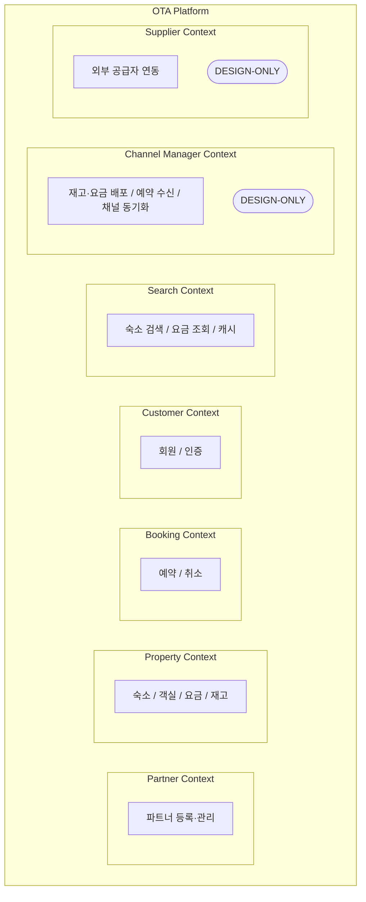

# 도메인 모델 설계

> 작성일: 2026-03-28

---

## 1. Bounded Context 식별

OTA 숙박 플랫폼을 분석하면 자연스럽게 책임의 경계가 드러나는 영역들이 있다. 다음 7개의 Bounded Context를 식별했다.

---

## 2. 각 Context 분리 근거

### Partner Context — 파트너(사업자) 관리
- 파트너는 숙소를 소유하고 운영하는 사업자다.
- 사업자 등록번호, 대표자명, 정산 계좌 같은 법적·재무적 정보를 가진다.

### Property Context — 숙소·객실·요금·재고
- OTA의 핵심 상품 영역이다. 숙소(Property), 객실 유형(RoomType), 날짜별 요금(Rate), 날짜별 재고(Inventory)를 포함한다.
- 이 네 엔티티는 강하게 응집되어 있으며 함께 생성되고 함께 조회된다.
- 재고(Inventory)가 Property Context에 속하는 이유는, 재고의 생성 주체가 파트너(Extranet)이기 때문이다.
- 예약이 발생하면 Booking Context가 Property Context의 재고를 차감하는 방식으로 협력한다.

### Booking Context — 예약·취소
- 고객의 예약 요청을 처리하고 재고를 차감하는 핵심 트랜잭션 영역이다.
- 동시성 처리(비관적 락)가 이 Context에서 발생한다.
- 예약 상태 전이(CONFIRMED → CANCELLED)와 취소 정책 적용도 이 Context의 책임이다.

### Customer Context — 회원
- 고객 계정, 인증, 개인정보를 관리한다.
- 도메인 로직이 단순하지만, 인증 정보(이메일, 패스워드)는 예약이나 숙소 정보와 섞이면 안 된다는 점에서 독립 Context로 분리했다.

### Search Context — 검색 + 캐시 (읽기 전용)
- 고객이 숙소를 탐색하는 읽기 전용 영역이다.
- 별도 엔티티를 갖지 않고 Property Context의 데이터를 읽기 전용으로 조회한다.
- 이 Context의 핵심 관심사는 성능이다.
- 검색 쿼리는 수 백 개의 동시 요청이 발생할 수 있으며, 대부분 동일한 숙소 정보를 반복 조회한다.
- Caffeine 로컬 캐시를 이 Context 안에 두고, 캐시 키 전략을 하위 단위(property:id, rate:roomTypeId:date)로 설계해 높은 히트율을 확보한다.

### Channel Manager Context — 타 OTA 재고·요금 동기화 (DESIGN-ONLY)
- 자사 플랫폼의 재고·요금을 Booking.com, Expedia, Agoda 같은 외부 채널에 배포하고, 그 채널에서 발생한 예약을 수신하는 영역이다.
- 실제 OTA 운영에서 매우 중요한 컴포넌트라고 생각한다.
- 이번 구현에서는 인터페이스와 Mock만 제공한다.

### Supplier Context — 외부 공급자 연동 (DESIGN-ONLY)
- 외부 숙소 데이터 공급자(예: 글로벌 숙소 DB 제공사)로부터 숙소 정보를 배치로 동기화하고 자사 숙소에 매핑하는 영역이다. 
- Channel Manager와 같은 이유로 설계만 완성했다.

---

## 3. 설계 고민: Extranet 기능 범위 선정

- Booking.com Extranet을 직접 살펴보니 파트너 등록 플로우만 해도 아래 정보들이 필요했다.
  - `기본 정보(숙소 이름)` → `숙소 설정(유형, 객실 수, 아침 식사, 주차, 반려동물, 편의시설, 체크인/아웃)` → `사진` → `요금과 캘린더` → `법적 정보`까지 다양한 단계가 있다.

핵심만 추려야 한다는 기준을 "파트너가 숙소를 처음 등록하고 첫 예약을 받기까지 반드시 필요한 기능"으로 잡았다.

| 포함 (BUILD) | 제외 (DESIGN or 생략) | 제외 이유 |
|-------------|----------------------|----------|
| 파트너 등록·인증 | 프로모션, 할인 코드 | 핵심 흐름에 불필요 |
| 숙소 등록·수정 (이름, 유형, 주소, 체크인/아웃) | 아동 정책, 흡연 정책 | 세부 정책은 추후 확장 |
| 객실 유형 등록 (인원, 침대 유형, 편의시설) | 부가 요금(조식, 주차 별도 과금) | 요금 모델 복잡화 방지 |
| 날짜별 요금 설정 | 정산 내역 | 결제/정산은 별도 도메인 |
| 날짜별 재고 설정 | 파트너 수동 예약 확정 | 자동 확정 채택 (ADR-004) |
| 숙소 사진 등록 | | |
| 예약 조회 | | |

- 재고가 없으면 예약이 불가능하고, 요금이 없으면 무엇을 팔고 있는지 알 수 없다
- 이 두 가지가 Property Context에서 가장 중요한 엔티티인 Rate와 Inventory의 존재 이유다

---

## 4. 설계 고민: Supplier 상품 통합 전략

외부 공급자(Supplier) 상품을 자사 플랫폼에서 Extranet 상품과 함께 검색 결과에 노출해야 한다. 이를 위한 선택지를 검토했다.

| 방식 | 장점 | 단점 |
|------|------|------|
| 동일 property 테이블에 저장 (채택) | 검색 쿼리 변경 없음, 통합 검색 자연스러움 | Supplier 상품 업데이트 시 property 테이블 write 발생 |
| Materialized View | 읽기 최적화 | 갱신 비용, MV 관리 복잡도, 본 프로젝트에 과함 |
| 별도 테이블 + UNION 검색 | 원본 분리 명확 | 검색 쿼리 복잡, 정렬/페이징 어려움 |

- 결정
  - Supplier 상품을 배치 동기화 시 `property` 테이블에 정규화하여 저장한다. 
  - Supplier 원본 데이터는 `supplier_property.raw_data`(JSON)에 보존하고, 매핑이 완료된 상품만 property 테이블에 반영한다.
  - 검색 시 `Extranet 상품과 Supplier 상품을 구분 없이 동일한 쿼리로 조회`할 수 있다.

---

## 5. 설계 고민: 편의시설(amenity) JSON vs 별도 테이블

객실의 편의시설(WiFi, TV, 에어컨 등)을 어떻게 저장할 것인가.

| 방식 | 장점 | 단점 |
|------|------|------|
| JSON 배열 (채택) | 스키마 변경 없이 추가/삭제 가능, 구현 단순 | `JSON_CONTAINS` 검색 비효율, 인덱스 불가 |
| 별도 테이블 (amenity + room_type_amenity) | 정규화, 편의시설별 필터링 가능, 인덱스 활용 | 테이블 2개 추가, JOIN 필요 |

- 결정
  - 현재 검색 API에 편의시설 기반 필터링을 제외하고, 숙소 상세 페이지에서 목록으로 보여주기만 하면 되므로 JSON 배열로 충분하다.
  - 편의시설 필터 기능이 도입되면 별도 테이블로 마이그레이션을 검토한다.
