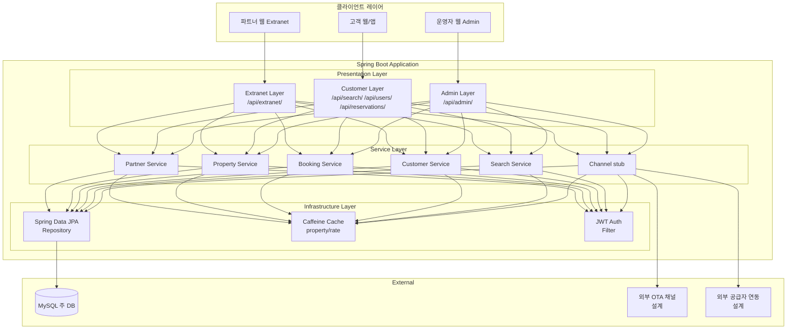

# 프로젝트 개요 및 아키텍처

> 작성일: 2026-03-28

---

## 1. 프로젝트 배경

### OTA 숙박 플랫폼이란

OTA(Online Travel Agency)는 숙소, 항공, 패키지 등 여행 상품을 온라인으로 중개하는 플랫폼이다.

- 본 프로젝트는 그 중 숙박 도메인에 집중한다
- 숙소 파트너(사업자)가 자신의 숙소를 등록하고 요금과 재고를 관리하면, 고객이 플랫폼을 통해 숙소를 검색하고 예약하는 구조다

Booking.com, 에어비앤비, 익스피디아 같은 글로벌 OTA나 국내 플랫폼들이 이 모델을 따른다. 공통적으로 다음 세 가지 관심사가 교차한다.

1. 파트너 관리: 누가 숙소를 올릴 수 있는가 (사업자 인증, 정산)
2. 상품 관리: 어떤 숙소를, 어떤 요금으로, 얼마나 판매할 수 있는가 (재고)
3. 예약 처리: 고객이 선택한 날짜에 실제로 방을 확보할 수 있는가 (동시성)

### 이해관계자

| 이해관계자 | 주요 기능 |
|-----------|----------|
| 파트너 (사업자) | 숙소 등록·수정 / 요금·재고 설정 / 예약 현황 확인 |
| 고객 | 숙소 검색·조회 / 예약·취소 / 예약 내역 확인 |
| 운영자 (Admin) | 파트너 승인·정지 / 전체 예약 조회 / 채널·공급자 관리 |
| 외부 채널 (Booking.com 등) | 재고·요금 수신 / 예약 웹훅 발송 |
| 외부 공급자 (숙소 데이터 제공사) | 숙소 원본 데이터 동기화 |

---

## 2. 시스템 구성

시스템은 다섯 개의 논리적 서비스 영역으로 구성된다.

- 물리적으로는 단일 애플리케이션이지만, 각 영역은 독립적인 패키지 경계를 가진다

### Extranet (파트너센터)

파트너가 숙소를 등록·관리하고 예약 현황을 확인하는 B2B 인터페이스다.

- Booking.com의 Extranet, 야놀자의 파트너센터와 동일한 개념이다
- 파트너 인증(JWT)을 통해 접근하며, 자신이 소유한 숙소에 대해서만 조작할 수 있다

- 파트너 등록 및 인증
- 숙소·객실 등록 및 수정
- 날짜별 요금·재고 설정
- 예약 조회

### Customer Service (고객 서비스)

일반 사용자가 숙소를 검색하고 예약하는 B2C 인터페이스다.

- 검색 성능이 중요하며, 예약 처리 시 동시성 제어가 핵심 관심사다

- 회원가입·로그인
- 숙소 검색 (지역, 날짜, 인원)
- 숙소 상세 조회 및 요금 확인
- 예약 생성·취소

### Admin

운영자가 파트너·숙소·예약·채널을 통합 관리하는 내부 인터페이스다. 현재 구현 범위에서는 설계 수준으로 유지한다.

### Channel Manager

자사 플랫폼의 재고·요금을 외부 OTA(Booking.com, Expedia 등)에 동기화하고, 외부 OTA에서 들어오는 예약을 수신하는 컴포넌트다. 복잡한 외부 API 연동을 포함하므로 이번 구현에서는 인터페이스 + Mock 수준으로 설계만 완성한다.

### Supplier Integration

외부 공급자(숙소 데이터 제공사)로부터 숙소 정보를 배치 동기화하는 컴포넌트다. Channel Manager와 마찬가지로 설계만 완성하고 구현은 스텁으로 처리한다.

---

## 3. 아키텍처 결정

### 왜 모놀리식 + 패키지 분리인가

아키텍처를 결정할 때 세 가지 선택지를 검토했다.

Option A: 모놀리식 + 패키지 분리 (채택)

- 단일 Spring Boot 애플리케이션 안에서 Bounded Context별로 패키지를 분리한다
- 트랜잭션 관리가 단순하고, 배포 단위가 하나이며, 7일이라는 기한 안에 핵심 기능을 완성할 수 있다

Option B: 멀티 모듈 Gradle

- 물리적으로 모듈을 분리하면 컴파일 타임에 의존성 방향을 강제할 수 있다는 장점이 있다
- 그러나 모듈 간 공유 DTO 처리, 빌드 설정 관리에 상당한 초기 비용이 든다
- 단기간에 설계 완성도를 높이는 것이 더 중요하다고 판단해 불채택했다

Option C: MSA (마이크로서비스)

- 독립 배포와 개별 확장이 가능하다는 장점이 있지만, 서비스 간 네트워크 통신, 분산 트랜잭션, 서비스 메시 등 인프라 복잡도가 폭증한다
- 본 프로젝트의 목적은 OTA 도메인의 설계 사고를 보여주는 것이지, 인프라 운영 능력을 증명하는 것이 아니다
- 무효로 판정했다

> 결론: Option A 채택. 단, 패키지 경계를 엄격히 유지함으로써 향후 멀티 모듈 또는 MSA로의 전환 비용을 최소화하는 구조로 설계한다. Context 간 직접 의존은 금지하고, 필요한 경우 이벤트(ApplicationEvent) 또는 공개 서비스 인터페이스를 통해 소통한다.

이 결정에서 한 가지 트레이드오프를 의식했다.

- 패키지 분리만으로는 개발자가 실수로 Context 경계를 넘는 직접 참조를 추가할 수 있다
- 이를 방지하기 위해 ArchUnit 기반의 아키텍처 테스트를 도입해 "booking 패키지가 property 패키지의 내부 클래스를 직접 참조하면 빌드 실패" 규칙을 적용한다

---

## 4. 기술 스택 선정 근거

| 기술 | 버전 | 선정 근거 |
|------|------|----------|
| Java | 21 | LTS 버전. Virtual Threads(Project Loom)로 I/O 블로킹 비용 절감 가능. Record, Pattern Matching 등 현대적 문법 활용 |
| Spring Boot | 3.4 | Spring 6 기반. `@TransactionalEventListener`로 이벤트 기반 Context 간 통신 |
| Gradle | Kotlin DSL | 타입 안전한 빌드 스크립트. IDE 자동완성 지원. Groovy DSL 대비 가독성 향상 |
| MySQL | 8.0+ | `SELECT ... FOR UPDATE`(비관적 락), JSON 타입 지원. 숙박 도메인의 날짜별 재고 쿼리에 적합한 인덱스 설계 가능 |
| Spring Data JPA | - | Repository 패턴. `@Lock(PESSIMISTIC_WRITE)`으로 비관적 락을 선언적으로 표현 |
| Caffeine | - | 로컬 인메모리 캐시. Redis 없이 단일 인스턴스에서 높은 히트율 달성. property/roomType/rate 단위 하위 캐시 설계 |
| Spring Security + JWT | - | Stateless 인증. 파트너용(Extranet)과 고객용(Customer) 토큰을 역할(role)로 구분 |
| Testcontainers + MySQL | - | 실제 MySQL 환경에서 비관적 락 동시성 테스트. H2 인메모리 DB는 `FOR UPDATE` 동작이 다르므로 배제 |

Caffeine을 선택한 배경을 부연한다.

- Redis를 도입하면 분산 캐시, 캐시 무효화 구독(Pub/Sub) 등 더 강력한 기능을 쓸 수 있다
- 하지만 단일 인스턴스 배포 환경에서 네트워크 홉이 추가되는 Redis는 오히려 레이턴시를 높인다
- 캐시 무효화는 `@TransactionalEventListener`로 이벤트 기반 처리가 가능하므로, 별도 인프라 없이 Caffeine으로 충분하다고 판단했다

---

## 5. 전체 시스템 아키텍처



### 패키지 구조

```
com.jemini.stayhost
├── partner/                  ← Partner Context
│   ├── domain/               ← model, component(Reader/Manager 인터페이스), event
│   ├── application/          ← Service
│   ├── infrastructure/       ← persistence(JPA), component(Reader/Manager 구현체)
│   └── presentation/         ← controller, docs(Swagger), dto
├── property/                 ← Property Context
│   ├── domain/
│   ├── application/
│   ├── infrastructure/
│   └── presentation/
├── booking/                  ← Booking Context
│   ├── domain/
│   ├── application/          ← Service + Facade (cross-context 조합 시)
│   ├── infrastructure/
│   └── presentation/
├── user/                     ← Customer Context
│   ├── domain/
│   ├── application/
│   ├── infrastructure/
│   └── presentation/
├── search/                   ← Search Context (읽기 전용)
│   ├── application/
│   └── presentation/
├── channel/                  ← Channel Manager Context (설계)
│   ├── domain/
│   └── service/
├── supplier/                 ← Supplier Context (설계)
│   ├── domain/
│   └── service/
└── common/                   ← 공통: ApiResponse, Exception, Security
    ├── response/
    ├── exception/
    └── security/
```

---

## 6. 고민 포인트: 설계와 구현의 경계

7일이라는 제약은 단순한 시간 압박이 아니라 설계 사고의 범위와 구현의 깊이 사이에서 어디에 선을 그을 것인가라는 질문을 강제한다.

설계는 전체 시스템을 다뤄야 한다.

- Channel Manager와 Supplier Integration이 빠진 OTA 플랫폼은 절반짜리 설계다
- 실제 OTA의 수익 모델과 운영 복잡도의 상당 부분이 이 두 영역에서 나오기 때문이다
- ERD, API 명세, 아키텍처 다이어그램에는 두 Context를 모두 포함시켰다

구현은 핵심에 집중해야 한다. "핵심"의 기준을 두 가지로 잡았다.

첫째, 동시성 처리가 실제로 작동하는가.

- 비관적 락을 통한 재고 차감은 코드로 증명되어야 하며, Testcontainers 기반의 동시성 테스트로 검증한다

둘째, Extranet → Property → Search → Booking으로 이어지는 핵심 흐름이 완결되는가.

- 파트너가 숙소를 등록하고, 요금과 재고를 설정하고, 고객이 검색해서 예약하는 전체 흐름이 실제로 실행되어야 한다

이 두 기준에 해당하지 않는 것(Admin 상세 기능, Channel Manager 실제 연동, Supplier 배치 처리)은 설계와 인터페이스 수준에서 멈추고, 구현 시간을 핵심에 집중했다.
