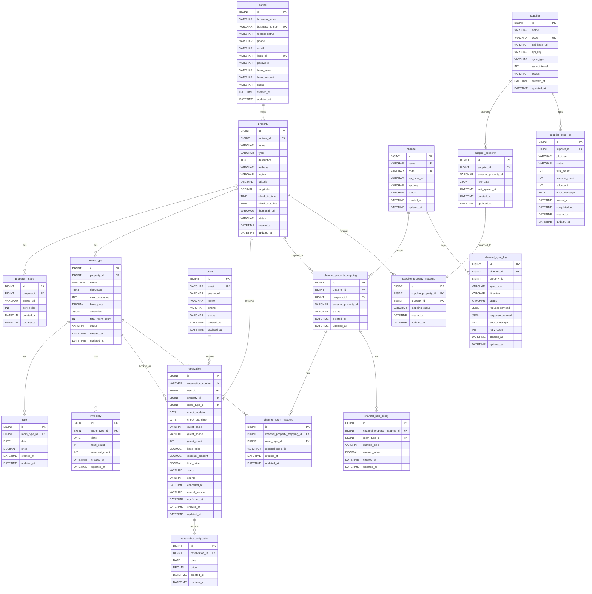

# ERD 및 데이터 모델

> 작성일: 2026-03-28

---

## 1. 설계 원칙 및 고민 포인트

### 1.1 rate와 inventory를 별도 테이블로 분리한 이유

처음에는 rate와 inventory를 하나의 테이블로 통합하는 방안을 고려했다.

- 장점
  - 같은 날짜(date)와 room_type_id를 공유하므로 JOIN을 줄일 수 있다
- 단점
  - 개념의 변경 주체와 변경 빈도, 그리고 락 경합 범위가 본질적으로 다르다는 점을 발견
  - rate(요금): 파트너가 설정한다. 시즌 요금, 프로모션, 요일별 차등 등으로 변경되나, 실시간 예약 트래픽과는 직접 연관이 없다.
  - inventory(재고): 예약 생성·취소 시마다 `reserved_count`가 차감·복원된다. 초당 수십 건의 예약이 몰릴 때 이 행에 `SELECT ... FOR UPDATE` 비관적 락이 걸린다.
- 결과
  - 두 테이블을 합치면 요금 조회(읽기)와 재고 차감(쓰기)이 같은 행을 경쟁하게 되어 락 경합 범위가 불필요하게 넓어진다.
  - 분리함으로써 inventory 테이블만 비관적 락 대상으로 좁혔다
  - rate 테이블은 읽기 전용 쿼리 최적화(커버링 인덱스 + Caffeine 캐시)에 집중할 수 있었다

### 1.2 reservation_daily_rate를 별도 테이블로 두는 이유

예약을 생성하는 시점에 요금이 확정된다.

- 이후 파트너가 해당 날짜의 rate(요금)를 수정하더라도, 이미 완료된 예약의 금액은 변해서는 안 된다.
- 이를 위해 `예약 시점의 날짜별 요금을 스냅샷`으로 보존하는 `reservation_daily_rate` 테이블을 설계했다.
- `3박 예약`이라면 `3개의 reservation_daily_rate 행(row)`이 생성되어 각 날짜의 실제 적용 요금을 기록한다.
- 이 구조는 환불 계산, 정산, 감사 추적 시에도 정확한 근거 자료가 된다

### 1.3 inventory의 reserved_count 방식 선택

재고 관리 방식으로 두 가지를 비교했다.

| 방식 | 구조 | 장점 | 단점 |
|------|------|------|------|
| available_count (직접 관리) | 예약 시 available_count - 1 | 조회 시 컬럼값 그대로 사용 | 취소 시 복원 로직 필요, 초기값 설정 번거로움 |
| reserved_count (차감 방식, 선택) | 예약 시 reserved_count + 1 | 가용 수량 = total_count - reserved_count 로 명확 | 조회 시 계산 필요 |

reserved_count 방식을 선택했다.

- `total_count`(전체 재고)는 객실 자체의 물리적 수량으로 변경 빈도가 낮고, `reserved_count`만 예약/취소 때 증감한다
---

## 2. ERD 다이어그램



---

## 3. 테이블 상세

### 3.1 Partner Context

#### partner

파트너는 숙소를 등록·운영하는 사업자 단위다. 사업자번호를 UNIQUE 제약으로 관리해 중복 등록을 방지했다. Extranet 로그인 계정(login_id, password)을 partner 테이블에 직접 포함한다. 파트너 1개 = 로그인 계정 1개다.

| 컬럼 | 타입 | 제약 | 설명 |
|------|------|------|------|
| id | BIGINT | PK, AUTO_INCREMENT | 내부 식별자 |
| business_name | VARCHAR(200) | NOT NULL | 사업자명 |
| business_number | VARCHAR(20) | NOT NULL, UNIQUE | 사업자등록번호 |
| representative | VARCHAR(100) | NOT NULL | 대표자명 |
| phone | VARCHAR(20) | - | 연락처 |
| email | VARCHAR(200) | - | 이메일 |
| login_id | VARCHAR(100) | NOT NULL, UNIQUE | Extranet 로그인 아이디 |
| password | VARCHAR(255) | NOT NULL | BCrypt 해시 |
| bank_name | VARCHAR(50) | - | 정산 은행명 |
| bank_account | VARCHAR(50) | - | 정산 계좌번호 |
| status | VARCHAR(20) | NOT NULL, DEFAULT 'PENDING' | PENDING / ACTIVE / SUSPENDED |
| created_at | DATETIME | NOT NULL, DEFAULT CURRENT_TIMESTAMP | 생성일시 |
| updated_at | DATETIME | NOT NULL, ON UPDATE CURRENT_TIMESTAMP | 수정일시 |

인덱스
- `idx_partner_status (status)` — 관리자의 파트너 상태별 조회
- `idx_partner_login_id (login_id)` — 로그인 조회

---

### 3.2 Property Context

#### property

숙소 기본 정보를 담는다.

- `region` 컬럼은 검색 필터의 핵심으로, `(region, status)` 복합 인덱스를 통해 검색 쿼리 성능을 보장한다
- `name`에 단독 인덱스를 두어 이름 LIKE 검색도 지원한다

| 컬럼 | 타입 | 제약 | 설명 |
|------|------|------|------|
| id | BIGINT | PK, AUTO_INCREMENT | 내부 식별자 |
| partner_id | BIGINT | NOT NULL, FK → partner | 소유 파트너 |
| name | VARCHAR(200) | NOT NULL | 숙소명 |
| type | VARCHAR(30) | NOT NULL | HOTEL / MOTEL / PENSION / RESORT / GUESTHOUSE |
| description | TEXT | - | 상세 설명 |
| address | VARCHAR(500) | - | 주소 |
| region | VARCHAR(100) | NOT NULL | 지역 (서울, 부산 등) |
| latitude | DECIMAL(10,7) | - | 위도 |
| longitude | DECIMAL(10,7) | - | 경도 |
| check_in_time | TIME | - | 체크인 시간 |
| check_out_time | TIME | - | 체크아웃 시간 |
| thumbnail_url | VARCHAR(500) | - | 대표 이미지 URL |
| status | VARCHAR(20) | NOT NULL, DEFAULT 'DRAFT' | DRAFT / ACTIVE / INACTIVE |
| created_at | DATETIME | NOT NULL | 생성일시 |
| updated_at | DATETIME | NOT NULL | 수정일시 |

인덱스
- `idx_property_partner (partner_id)` — 파트너별 숙소 목록
- `idx_property_region_status (region, status)` — 커버링 인덱스: 지역+상태 검색 (검색 쿼리의 핵심)
- `idx_property_name (name)` — 숙소명 검색 (LIKE '%키워드%'는 풀스캔이나 prefix 검색 활용)
- `idx_property_status (status)` — 상태별 조회

#### property_image

숙소 이미지 목록이다. `sort_order`로 노출 순서를 관리하며, thumbnail_url과 별개로 다수의 이미지를 저장한다.

| 컬럼 | 타입 | 제약 | 설명 |
|------|------|------|------|
| id | BIGINT | PK, AUTO_INCREMENT | 내부 식별자 |
| property_id | BIGINT | NOT NULL, FK → property | 소속 숙소 |
| image_url | VARCHAR(500) | NOT NULL | 이미지 URL |
| sort_order | INT | NOT NULL, DEFAULT 0 | 노출 순서 |
| created_at | DATETIME | NOT NULL | 생성일시 |
| updated_at | DATETIME | NOT NULL | 수정일시 |

인덱스
- `idx_property_image_property (property_id)` — 숙소별 이미지 목록

#### room_type

객실 유형이다.

- 동일 숙소 내 스탠다드, 디럭스, 스위트 등을 구분한다
- `amenities`는 JSON 배열로 저장해 유연성을 확보했다. 현재 편의시설 기반 필터링 요구사항이 없어 JSON으로 유지하며, 편의시설 필터 도입 시 별도 테이블(amenity + room_type_amenity)로 마이그레이션을 검토한다
- `total_room_count`는 inventory 테이블의 `total_count` 초기화 기준이 된다

| 컬럼 | 타입 | 제약 | 설명 |
|------|------|------|------|
| id | BIGINT | PK, AUTO_INCREMENT | 내부 식별자 |
| property_id | BIGINT | NOT NULL, FK → property | 소속 숙소 |
| name | VARCHAR(200) | NOT NULL | 객실명 |
| description | TEXT | - | 설명 |
| max_occupancy | INT | NOT NULL | 최대 인원 |
| base_price | DECIMAL(12,2) | NOT NULL | 기본 요금 (rate 없는 날짜의 폴백) |
| amenities | JSON | - | ["WiFi", "TV", "에어컨"] |
| total_room_count | INT | NOT NULL | 해당 타입 전체 객실 수 |
| status | VARCHAR(20) | NOT NULL, DEFAULT 'ACTIVE' | 상태 |
| created_at | DATETIME | NOT NULL | 생성일시 |
| updated_at | DATETIME | NOT NULL | 수정일시 |

인덱스
- `idx_room_type_property (property_id)` — 숙소별 객실 유형 목록

#### rate

날짜별 요금 테이블이다.

- `(room_type_id, date)` UNIQUE KEY로 중복 설정을 방지한다
- 파트너가 날짜 범위로 bulk 등록하면 UPSERT 처리된다
- rate와 inventory를 분리한 핵심 이유는 앞서 설명했다
- 요금 조회는 읽기 전용으로 Caffeine 캐시(`rate:{roomTypeId}:{date}`, TTL 3분)를 통해 DB 부하를 줄인다

| 컬럼 | 타입 | 제약 | 설명 |
|------|------|------|------|
| id | BIGINT | PK, AUTO_INCREMENT | 내부 식별자 |
| room_type_id | BIGINT | NOT NULL, FK → room_type | 객실 유형 |
| date | DATE | NOT NULL | 적용 날짜 |
| price | DECIMAL(12,2) | NOT NULL | 해당 날짜 요금 |
| created_at | DATETIME | NOT NULL | 생성일시 |
| updated_at | DATETIME | NOT NULL | 수정일시 |

인덱스
- `uk_rate_roomtype_date (room_type_id, date)` — UNIQUE KEY (중복 방지 + 조회 커버링)
- `idx_rate_date (date)` — 날짜 범위 조회

#### inventory

비관적 락의 핵심 대상 테이블이다.

- 예약 생성 시 해당 날짜 범위의 모든 inventory 행에 `SELECT ... FOR UPDATE`가 걸린다
- `ORDER BY room_type_id, date`로 항상 동일한 순서로 락을 획득해 데드락을 방지한다
- 낙관적 락(`@Version`)은 "충돌 빈도가 낮다"는 전제를 요구하나, 인기 숙소의 특가 시즌처럼 동시 요청이 폭증하는 환경에서는 재시도 비용이 커진다
- 비관적 락은 DB가 순서를 보장하므로 재시도 로직이 불필요하며 코드도 단순하다

| 컬럼 | 타입 | 제약 | 설명 |
|------|------|------|------|
| id | BIGINT | PK, AUTO_INCREMENT | 내부 식별자 |
| room_type_id | BIGINT | NOT NULL, FK → room_type | 객실 유형 |
| date | DATE | NOT NULL | 해당 날짜 |
| total_count | INT | NOT NULL | 전체 재고 수 |
| reserved_count | INT | NOT NULL, DEFAULT 0 | 예약된 수량 |
| created_at | DATETIME | NOT NULL | 생성일시 |
| updated_at | DATETIME | NOT NULL | 수정일시 |

인덱스
- `uk_inventory_roomtype_date (room_type_id, date)` — UNIQUE KEY (비관적 락 시 행 특정)
- `idx_inventory_date (date)` — 날짜 범위 조회

---

### 3.3 Customer Context

#### users

고객 회원 정보다. `user`는 MySQL 예약어이므로 테이블명을 `users`로 지정했다.

- `email`이 로그인 ID 역할을 한다
- 파트너 계정(partner)과 테이블을 분리해 Customer Context와 Partner Context의 인증 경계를 명확히 했다

| 컬럼 | 타입 | 제약 | 설명 |
|------|------|------|------|
| id | BIGINT | PK, AUTO_INCREMENT | 내부 식별자 |
| email | VARCHAR(200) | NOT NULL, UNIQUE | 이메일 (로그인 ID) |
| password | VARCHAR(255) | NOT NULL | BCrypt 해시 |
| name | VARCHAR(100) | NOT NULL | 이름 |
| phone | VARCHAR(20) | - | 전화번호 |
| status | VARCHAR(20) | NOT NULL, DEFAULT 'ACTIVE' | 계정 상태 |
| created_at | DATETIME | NOT NULL | 생성일시 |
| updated_at | DATETIME | NOT NULL | 수정일시 |

인덱스
- `idx_user_email (email)` — 로그인 조회

---

### 3.4 Booking Context

#### reservation

예약 레코드다.

- `reservation_number`는 외부에 노출되는 예약번호로, 내부 PK와 분리해 보안성을 높였다
- `status`는 자동 확정 모드에서 CONFIRMED / CANCELLED / FAILED 세 가지만 존재한다
- `source` 컬럼은 직접 예약(DIRECT)과 채널 통해 들어온 예약(CHANNEL:BOOKING 등)을 구분한다
- 채널 매니저 연동 시 이 컬럼으로 출처를 추적할 수 있다

| 컬럼 | 타입 | 제약 | 설명 |
|------|------|------|------|
| id | BIGINT | PK, AUTO_INCREMENT | 내부 식별자 |
| reservation_number | VARCHAR(50) | NOT NULL, UNIQUE | 외부 노출용 예약번호 |
| user_id | BIGINT | NOT NULL, FK → users | 예약 회원 |
| property_id | BIGINT | NOT NULL, FK → property | 숙소 |
| room_type_id | BIGINT | NOT NULL, FK → room_type | 객실 유형 |
| check_in_date | DATE | NOT NULL | 체크인 날짜 |
| check_out_date | DATE | NOT NULL | 체크아웃 날짜 |
| guest_name | VARCHAR(100) | NOT NULL | 투숙객명 |
| guest_phone | VARCHAR(20) | - | 투숙객 연락처 |
| guest_count | INT | NOT NULL, DEFAULT 1 | 투숙 인원 |
| base_price | DECIMAL(12,2) | NOT NULL | 일별 요금 합산 |
| discount_amount | DECIMAL(12,2) | NOT NULL, DEFAULT 0 | 할인 총액 |
| final_price | DECIMAL(12,2) | NOT NULL | 최종 금액 (base_price - discount_amount) |
| status | VARCHAR(20) | NOT NULL, DEFAULT 'CONFIRMED' | CONFIRMED / CANCELLED / FAILED |
| source | VARCHAR(20) | NOT NULL, DEFAULT 'DIRECT' | DIRECT / CHANNEL:{channelName} |
| cancelled_at | DATETIME | - | 취소 일시 |
| cancel_reason | VARCHAR(500) | - | 취소 사유 |
| confirmed_at | DATETIME | - | 확정 일시 |
| created_at | DATETIME | NOT NULL | 생성일시 |
| updated_at | DATETIME | NOT NULL | 수정일시 |

인덱스
- `idx_reservation_user (user_id)` — 회원별 예약 목록
- `idx_reservation_property (property_id)` — 숙소별 예약 목록
- `idx_reservation_status (status)` — 상태별 필터
- `idx_reservation_number (reservation_number)` — 예약번호 단건 조회
- `idx_reservation_checkin (check_in_date)` — 날짜별 예약 조회

#### reservation_daily_rate

예약 시점의 날짜별 요금 스냅샷이다.

- 3박 예약이면 3개 행이 생성된다
- 이 테이블이 있으므로 이후 rate 테이블의 값이 변경되어도 예약 당시 가격을 정확하게 추적할 수 있다
- 환불 정책 계산, 정산, 분쟁 해결의 근거 자료로 활용된다

| 컬럼 | 타입 | 제약 | 설명 |
|------|------|------|------|
| id | BIGINT | PK, AUTO_INCREMENT | 내부 식별자 |
| reservation_id | BIGINT | NOT NULL, FK → reservation | 예약 |
| date | DATE | NOT NULL | 날짜 |
| price | DECIMAL(12,2) | NOT NULL | 해당 날짜 요금 (스냅샷) |
| created_at | DATETIME | NOT NULL | 생성일시 |
| updated_at | DATETIME | NOT NULL | 수정일시 |

인덱스
- `idx_reservation_daily_reservation (reservation_id)` — 예약별 날짜 요금 목록

---

### 3.5 Channel Manager Context (DESIGN-ONLY)

채널 매니저는 Booking.com, Expedia 등 외부 OTA와의 재고·요금·예약 동기화를 담당한다.

- 현재 설계만 완료하고, 구현은 인터페이스와 Mock으로 제공한다

#### channel

| 컬럼 | 타입 | 제약 | 설명 |
|------|------|------|------|
| id | BIGINT | PK, AUTO_INCREMENT | 내부 식별자 |
| name | VARCHAR(100) | NOT NULL, UNIQUE | 채널명 (Booking.com 등) |
| code | VARCHAR(30) | NOT NULL, UNIQUE | 채널 코드 (BOOKING, EXPEDIA, AGODA) |
| api_base_url | VARCHAR(500) | - | 채널 API 엔드포인트 |
| api_key | VARCHAR(255) | - | 인증키 (암호화 저장 권장) |
| status | VARCHAR(20) | NOT NULL, DEFAULT 'ACTIVE' | 상태 |
| created_at | DATETIME | NOT NULL | 생성일시 |
| updated_at | DATETIME | NOT NULL | 수정일시 |

#### channel_property_mapping

자사 숙소와 외부 채널의 숙소 ID를 연결한다. `(channel_id, property_id)` UNIQUE로 중복 매핑을 방지한다.

| 컬럼 | 타입 | 제약 | 설명 |
|------|------|------|------|
| id | BIGINT | PK, AUTO_INCREMENT | 내부 식별자 |
| channel_id | BIGINT | NOT NULL, FK → channel | 채널 |
| property_id | BIGINT | NOT NULL, FK → property | 자사 숙소 |
| external_property_id | VARCHAR(100) | NOT NULL | 채널 측 숙소 ID |
| status | VARCHAR(20) | NOT NULL, DEFAULT 'ACTIVE' | 매핑 상태 |
| created_at | DATETIME | NOT NULL | 생성일시 |
| updated_at | DATETIME | NOT NULL | 수정일시 |

인덱스
- `uk_channel_property (channel_id, property_id)` — UNIQUE KEY

#### channel_room_mapping

객실 유형 레벨의 매핑이다.

- channel_property_mapping과 별도로 분리한 이유는, 하나의 숙소 매핑 아래 객실 유형이 여럿 존재하기 때문이다

| 컬럼 | 타입 | 제약 | 설명 |
|------|------|------|------|
| id | BIGINT | PK, AUTO_INCREMENT | 내부 식별자 |
| channel_property_mapping_id | BIGINT | NOT NULL, FK | 상위 숙소 매핑 |
| room_type_id | BIGINT | NOT NULL, FK → room_type | 자사 객실 유형 |
| external_room_id | VARCHAR(100) | NOT NULL | 채널 측 객실 ID |
| created_at | DATETIME | NOT NULL | 생성일시 |
| updated_at | DATETIME | NOT NULL | 수정일시 |

#### channel_rate_policy

채널별 요금 마진 정책이다. PERCENTAGE(비율) 또는 FIXED(고정금액) 마진을 설정한다.

| 컬럼 | 타입 | 제약 | 설명 |
|------|------|------|------|
| id | BIGINT | PK, AUTO_INCREMENT | 내부 식별자 |
| channel_property_mapping_id | BIGINT | NOT NULL, FK | 숙소 채널 매핑 |
| room_type_id | BIGINT | NOT NULL, FK → room_type | 객실 유형 |
| markup_type | VARCHAR(20) | NOT NULL, DEFAULT 'PERCENTAGE' | PERCENTAGE / FIXED |
| markup_value | DECIMAL(10,2) | NOT NULL, DEFAULT 0 | 마진율 또는 고정금액 |
| created_at | DATETIME | NOT NULL | 생성일시 |
| updated_at | DATETIME | NOT NULL | 수정일시 |

#### channel_sync_log

동기화 이력을 기록한다.

- 방향(OUTBOUND/INBOUND), 유형(INVENTORY/RATE/RESERVATION), 결과(SUCCESS/FAILED/PARTIAL)를 기록한다
- request/response payload를 JSON으로 보존해 재시도 및 디버깅에 활용한다

| 컬럼 | 타입 | 제약 | 설명 |
|------|------|------|------|
| id | BIGINT | PK, AUTO_INCREMENT | 내부 식별자 |
| channel_id | BIGINT | NOT NULL, FK → channel | 채널 |
| property_id | BIGINT | - | 대상 숙소 (전체 동기화 시 NULL) |
| sync_type | VARCHAR(30) | NOT NULL | INVENTORY / RATE / RESERVATION |
| direction | VARCHAR(10) | NOT NULL | OUTBOUND / INBOUND |
| status | VARCHAR(20) | NOT NULL | SUCCESS / FAILED / PARTIAL |
| request_payload | JSON | - | 요청 데이터 |
| response_payload | JSON | - | 응답 데이터 |
| error_message | TEXT | - | 실패 메시지 |
| retry_count | INT | NOT NULL, DEFAULT 0 | 재시도 횟수 |
| created_at | DATETIME | NOT NULL | 기록 일시 |
| updated_at | DATETIME | NOT NULL | 수정일시 |

인덱스
- `idx_sync_log_channel_type (channel_id, sync_type)` — 채널별 타입 조회
- `idx_sync_log_status (status)` — 실패 건 모니터링
- `idx_sync_log_created (created_at)` — 기간별 이력 조회

---

### 3.6 Supplier Context (DESIGN-ONLY)

외부 공급자(예: 글로벌 GDS, 숙박 데이터 제공업체)로부터 숙소 데이터를 수집하고 자사 숙소에 매핑하는 구조다. 설계만 완료하며 구현은 인터페이스 수준으로 제공한다.

#### supplier

| 컬럼 | 타입 | 제약 | 설명 |
|------|------|------|------|
| id | BIGINT | PK, AUTO_INCREMENT | 내부 식별자 |
| name | VARCHAR(200) | NOT NULL | 공급자명 |
| code | VARCHAR(30) | NOT NULL, UNIQUE | 공급자 코드 |
| api_base_url | VARCHAR(500) | - | API 엔드포인트 |
| api_key | VARCHAR(255) | - | 인증키 |
| sync_type | VARCHAR(20) | NOT NULL, DEFAULT 'PULL' | PULL(배치) / PUSH(웹훅) |
| sync_interval | INT | - | 동기화 주기(초), PULL 방식에서 사용 |
| status | VARCHAR(20) | NOT NULL, DEFAULT 'ACTIVE' | 상태 |
| created_at | DATETIME | NOT NULL | 생성일시 |
| updated_at | DATETIME | NOT NULL | 수정일시 |

#### supplier_property

공급자로부터 수집한 숙소 원본 데이터다. `raw_data` JSON으로 공급자별 다양한 스키마를 수용한다.

| 컬럼 | 타입 | 제약 | 설명 |
|------|------|------|------|
| id | BIGINT | PK, AUTO_INCREMENT | 내부 식별자 |
| supplier_id | BIGINT | NOT NULL, FK → supplier | 공급자 |
| external_property_id | VARCHAR(100) | NOT NULL | 공급자 측 숙소 ID |
| raw_data | JSON | NOT NULL | 공급자 원본 데이터 |
| last_synced_at | DATETIME | - | 마지막 동기화 일시 |
| created_at | DATETIME | NOT NULL | 생성일시 |
| updated_at | DATETIME | NOT NULL | 수정일시 |

인덱스
- `uk_supplier_property (supplier_id, external_property_id)` — UNIQUE KEY

#### supplier_property_mapping

공급자 숙소와 자사 숙소를 연결하는 매핑 테이블이다. `mapping_status`로 매핑 상태(MAPPED/UNMAPPED/CONFLICT)를 관리한다.

| 컬럼 | 타입 | 제약 | 설명 |
|------|------|------|------|
| id | BIGINT | PK, AUTO_INCREMENT | 내부 식별자 |
| supplier_property_id | BIGINT | NOT NULL, FK → supplier_property | 공급자 숙소 |
| property_id | BIGINT | NOT NULL, FK → property | 자사 숙소 |
| mapping_status | VARCHAR(20) | NOT NULL, DEFAULT 'MAPPED' | MAPPED / UNMAPPED / CONFLICT |
| created_at | DATETIME | NOT NULL | 생성일시 |
| updated_at | DATETIME | NOT NULL | 수정일시 |

인덱스
- `uk_supplier_mapping (supplier_property_id)` — UNIQUE KEY (1:1 매핑)

#### supplier_sync_job

배치 동기화 작업 이력이다. FULL_SYNC, INCREMENTAL 등 작업 유형과 성공/실패 건수를 기록해 운영 모니터링에 활용한다.

| 컬럼 | 타입 | 제약 | 설명 |
|------|------|------|------|
| id | BIGINT | PK, AUTO_INCREMENT | 내부 식별자 |
| supplier_id | BIGINT | NOT NULL, FK → supplier | 공급자 |
| job_type | VARCHAR(30) | NOT NULL | FULL_SYNC / INCREMENTAL / RATE_UPDATE / INVENTORY_UPDATE |
| status | VARCHAR(20) | NOT NULL | RUNNING / COMPLETED / FAILED |
| total_count | INT | DEFAULT 0 | 전체 처리 건수 |
| success_count | INT | DEFAULT 0 | 성공 건수 |
| fail_count | INT | DEFAULT 0 | 실패 건수 |
| error_message | TEXT | - | 오류 메시지 |
| started_at | DATETIME | NOT NULL | 시작 일시 |
| completed_at | DATETIME | - | 완료 일시 |
| created_at | DATETIME | NOT NULL | 생성일시 |
| updated_at | DATETIME | NOT NULL | 수정일시 |

인덱스
- `idx_sync_job_supplier (supplier_id)` — 공급자별 이력 조회
- `idx_sync_job_status (status)` — 상태별 조회

---

## 4. 인덱스 전략 정리

### 4.1 검색 쿼리 커버링 인덱스

숙소 검색(`GET /api/public/search/properties`)의 핵심 쿼리는 다음과 같다.

```sql
-- 검색: 지역 + 상태 필터 → 숙소 ID 목록 추출
SELECT p.id
FROM property p
WHERE p.region = :region
  AND p.status = 'ACTIVE'
ORDER BY p.id
LIMIT :size OFFSET :offset;
```

`idx_property_region_status (region, status)` 인덱스는 이 쿼리에서 테이블 풀스캔 없이 인덱스만으로 조건을 평가하는 커버링 인덱스 역할을 한다. 반환된 숙소 ID는 이후 Caffeine 캐시(`property:{id}`)에서 상세 정보를 가져오므로 DB 조회가 최소화된다.

검색 파라미터(지역 x 날짜 x 인원 x 정렬 x 페이지)의 조합 폭발로 인해 검색 결과 자체를 캐시하면 히트율이 극히 낮다. 따라서 검색 결과 캐시는 두지 않고, 하위 단위(property, roomType, rate)별 캐시로 대응하는 전략을 선택했다.

### 4.2 요금 조회 커버링 인덱스

```sql
-- 날짜 범위 요금 조회
SELECT date, price
FROM rate
WHERE room_type_id = :roomTypeId
  AND date BETWEEN :startDate AND :endDate;
```

`uk_rate_roomtype_date (room_type_id, date)` UNIQUE KEY가 `(room_type_id, date, price)`를 포함하는 커버링 인덱스 역할을 한다. 이 쿼리는 인덱스 스캔만으로 결과를 반환하며, 추가로 Caffeine 캐시(`rate:{roomTypeId}:{date}`, TTL 3분)로 반복 조회를 흡수한다.

### 4.3 비관적 락 인덱스

```sql
-- 재고 차감 시 비관적 락
SELECT *
FROM inventory
WHERE room_type_id = :roomTypeId
  AND date BETWEEN :checkIn AND :checkOutMinus1
ORDER BY room_type_id, date
FOR UPDATE;
```

`uk_inventory_roomtype_date (room_type_id, date)` UNIQUE KEY로 각 날짜의 행을 정확히 특정한다. `ORDER BY room_type_id, date`로 락 획득 순서를 고정해 데드락을 방지한다.

---

## 5. DDL (MySQL 기준)

> 보조 인덱스는 DDL에 포함하지 않았다. 개발 완료 후 실제 쿼리 패턴과 실행 계획을 분석하여 추가한다. 인덱스 전략은 섹션 4에서 별도로 기술한다.

```sql
-- =============================================
-- Partner Context
-- =============================================

CREATE TABLE partner (
    id              BIGINT AUTO_INCREMENT PRIMARY KEY COMMENT '파트너 고유 식별자',
    business_name   VARCHAR(200) NOT NULL COMMENT '사업자명 (상호)',
    business_number VARCHAR(20)  NOT NULL UNIQUE COMMENT '사업자등록번호 (10자리, 중복 불가)',
    representative  VARCHAR(100) NOT NULL COMMENT '대표자명',
    phone           VARCHAR(20) COMMENT '대표 연락처',
    email           VARCHAR(200) COMMENT '대표 이메일',
    login_id        VARCHAR(100) NOT NULL UNIQUE COMMENT 'Extranet 로그인 아이디 (플랫폼 전체 유일)',
    password        VARCHAR(255) NOT NULL COMMENT 'BCrypt 해시 비밀번호',
    bank_name       VARCHAR(50) COMMENT '정산 은행명',
    bank_account    VARCHAR(50) COMMENT '정산 계좌번호',
    status          VARCHAR(20) NOT NULL DEFAULT 'PENDING' COMMENT '파트너 상태 — PENDING(승인 대기), ACTIVE(활성), SUSPENDED(정지)',
    created_at      DATETIME NOT NULL DEFAULT CURRENT_TIMESTAMP COMMENT '등록일시',
    updated_at      DATETIME NOT NULL DEFAULT CURRENT_TIMESTAMP ON UPDATE CURRENT_TIMESTAMP COMMENT '최종 수정일시'
);

-- =============================================
-- Property Context
-- =============================================

CREATE TABLE property (
    id              BIGINT AUTO_INCREMENT PRIMARY KEY COMMENT '숙소 고유 식별자',
    partner_id      BIGINT NOT NULL COMMENT '소유 파트너 ID (FK)',
    name            VARCHAR(200) NOT NULL COMMENT '숙소명',
    type            VARCHAR(30) NOT NULL COMMENT '숙소 유형 — HOTEL, MOTEL, PENSION, RESORT, GUESTHOUSE',
    description     TEXT COMMENT '숙소 상세 설명 (HTML 또는 텍스트)',
    address         VARCHAR(500) NOT NULL COMMENT '전체 주소',
    region          VARCHAR(100) NOT NULL COMMENT '지역 분류 (서울, 부산, 제주 등 — 검색 필터 핵심)',
    latitude        DECIMAL(10,7) COMMENT '위도 (지도 표시용)',
    longitude       DECIMAL(10,7) COMMENT '경도 (지도 표시용)',
    check_in_time   TIME NOT NULL DEFAULT '15:00:00' COMMENT '체크인 가능 시간 (기본 15:00)',
    check_out_time  TIME NOT NULL DEFAULT '11:00:00' COMMENT '체크아웃 시간 (기본 11:00)',
    thumbnail_url   VARCHAR(500) COMMENT '대표 이미지 URL (검색 결과 노출용)',
    status          VARCHAR(20) NOT NULL DEFAULT 'DRAFT' COMMENT '숙소 상태 — DRAFT(작성중), ACTIVE(공개), INACTIVE(비공개)',
    created_at      DATETIME NOT NULL DEFAULT CURRENT_TIMESTAMP COMMENT '등록일시',
    updated_at      DATETIME NOT NULL DEFAULT CURRENT_TIMESTAMP ON UPDATE CURRENT_TIMESTAMP COMMENT '최종 수정일시',
    FOREIGN KEY (partner_id) REFERENCES partner(id)
);

CREATE TABLE property_image (
    id          BIGINT AUTO_INCREMENT PRIMARY KEY COMMENT '이미지 고유 식별자',
    property_id BIGINT NOT NULL COMMENT '소속 숙소 ID (FK)',
    image_url   VARCHAR(500) NOT NULL COMMENT '이미지 URL (S3 또는 CDN 경로)',
    sort_order  INT NOT NULL DEFAULT 0 COMMENT '노출 순서 (0부터 시작, 낮을수록 먼저 표시)',
    created_at  DATETIME NOT NULL DEFAULT CURRENT_TIMESTAMP COMMENT '등록일시',
    updated_at  DATETIME NOT NULL DEFAULT CURRENT_TIMESTAMP ON UPDATE CURRENT_TIMESTAMP COMMENT '최종 수정일시',
    FOREIGN KEY (property_id) REFERENCES property(id)
);

CREATE TABLE room_type (
    id                BIGINT AUTO_INCREMENT PRIMARY KEY COMMENT '객실 유형 고유 식별자',
    property_id       BIGINT NOT NULL COMMENT '소속 숙소 ID (FK)',
    name              VARCHAR(200) NOT NULL COMMENT '객실 유형명 (스탠다드 더블, 디럭스 트윈 등)',
    description       TEXT COMMENT '객실 상세 설명',
    max_occupancy     INT NOT NULL COMMENT '최대 수용 인원',
    base_price        DECIMAL(12,2) NOT NULL COMMENT '기본 1박 요금 (rate 미설정 날짜의 폴백 가격)',
    amenities         JSON COMMENT '편의시설 목록 (JSON 배열, 예: ["WiFi", "TV", "에어컨", "미니바"])',
    total_room_count  INT NOT NULL COMMENT '해당 유형의 전체 객실 수 (inventory.total_count 초기값 기준)',
    status            VARCHAR(20) NOT NULL DEFAULT 'ACTIVE' COMMENT '객실 상태 — ACTIVE(판매중), INACTIVE(판매중지)',
    created_at        DATETIME NOT NULL DEFAULT CURRENT_TIMESTAMP COMMENT '등록일시',
    updated_at        DATETIME NOT NULL DEFAULT CURRENT_TIMESTAMP ON UPDATE CURRENT_TIMESTAMP COMMENT '최종 수정일시',
    FOREIGN KEY (property_id) REFERENCES property(id)
);

CREATE TABLE rate (
    id              BIGINT AUTO_INCREMENT PRIMARY KEY COMMENT '요금 고유 식별자',
    room_type_id    BIGINT NOT NULL COMMENT '객실 유형 ID (FK)',
    date            DATE NOT NULL COMMENT '적용 날짜 (하루 단위)',
    price           DECIMAL(12,2) NOT NULL COMMENT '해당 날짜 1박 요금 (파트너가 Extranet에서 설정)',
    created_at      DATETIME NOT NULL DEFAULT CURRENT_TIMESTAMP COMMENT '등록일시',
    updated_at      DATETIME NOT NULL DEFAULT CURRENT_TIMESTAMP ON UPDATE CURRENT_TIMESTAMP COMMENT '최종 수정일시',
    FOREIGN KEY (room_type_id) REFERENCES room_type(id),
    UNIQUE KEY uk_rate_roomtype_date (room_type_id, date)
);

CREATE TABLE inventory (
    id              BIGINT AUTO_INCREMENT PRIMARY KEY COMMENT '재고 고유 식별자',
    room_type_id    BIGINT NOT NULL COMMENT '객실 유형 ID (FK)',
    date            DATE NOT NULL COMMENT '해당 날짜 (하루 단위)',
    total_count     INT NOT NULL COMMENT '전체 판매 가능 객실 수 (파트너가 설정)',
    reserved_count  INT NOT NULL DEFAULT 0 COMMENT '예약된 객실 수 (예약 시 +1, 취소 시 -1). 가용 재고 = total_count - reserved_count',
    created_at      DATETIME NOT NULL DEFAULT CURRENT_TIMESTAMP COMMENT '등록일시',
    updated_at      DATETIME NOT NULL DEFAULT CURRENT_TIMESTAMP ON UPDATE CURRENT_TIMESTAMP COMMENT '최종 수정일시',
    FOREIGN KEY (room_type_id) REFERENCES room_type(id),
    UNIQUE KEY uk_inventory_roomtype_date (room_type_id, date)
);

-- =============================================
-- Customer Context
-- =============================================

CREATE TABLE user (
    id          BIGINT AUTO_INCREMENT PRIMARY KEY COMMENT '회원 고유 식별자',
    email       VARCHAR(200) NOT NULL UNIQUE COMMENT '이메일 (로그인 ID, 플랫폼 전체 유일)',
    password    VARCHAR(255) NOT NULL COMMENT 'BCrypt 해시 비밀번호',
    name        VARCHAR(100) NOT NULL COMMENT '회원명',
    phone       VARCHAR(20) COMMENT '연락처',
    status      VARCHAR(20) NOT NULL DEFAULT 'ACTIVE' COMMENT '계정 상태 — ACTIVE(활성), SUSPENDED(정지)',
    created_at  DATETIME NOT NULL DEFAULT CURRENT_TIMESTAMP COMMENT '등록일시',
    updated_at  DATETIME NOT NULL DEFAULT CURRENT_TIMESTAMP ON UPDATE CURRENT_TIMESTAMP COMMENT '최종 수정일시'
);

-- =============================================
-- Booking Context
-- =============================================

CREATE TABLE reservation (
    id                  BIGINT AUTO_INCREMENT PRIMARY KEY COMMENT '예약 고유 식별자',
    reservation_number  VARCHAR(30) NOT NULL UNIQUE COMMENT '외부 노출용 예약번호 (고객에게 전달, PK 노출 방지)',
    user_id             BIGINT NOT NULL COMMENT '예약 회원 ID (FK)',
    property_id         BIGINT NOT NULL COMMENT '숙소 ID (FK, 반정규화 — room_type→property JOIN 절약)',
    room_type_id        BIGINT NOT NULL COMMENT '객실 유형 ID (FK)',
    check_in_date       DATE NOT NULL COMMENT '체크인 날짜',
    check_out_date      DATE NOT NULL COMMENT '체크아웃 날짜',
    guest_name          VARCHAR(100) NOT NULL COMMENT '투숙객명 (예약자와 다를 수 있음)',
    guest_phone         VARCHAR(20) COMMENT '투숙객 연락처',
    guest_count         INT NOT NULL DEFAULT 1 COMMENT '투숙 인원수',
    base_price          DECIMAL(12,2) NOT NULL COMMENT '일별 요금 합산 (reservation_daily_rate의 price 총합)',
    discount_amount     DECIMAL(12,2) NOT NULL DEFAULT 0 COMMENT '할인 총액 (쿠폰/프로모션 등, 기본 0)',
    final_price         DECIMAL(12,2) NOT NULL COMMENT '최종 결제 금액 (base_price - discount_amount)',
    status              VARCHAR(20) NOT NULL DEFAULT 'CONFIRMED' COMMENT '예약 상태 — CONFIRMED(확정), CANCELLED(취소), FAILED(실패)',
    source              VARCHAR(30) NOT NULL DEFAULT 'DIRECT' COMMENT '예약 출처 — DIRECT(자사 직접 예약), CHANNEL:BOOKING(Booking.com 경유) 등',
    cancelled_at        DATETIME COMMENT '취소 처리 일시 (취소되지 않은 경우 NULL)',
    cancel_reason       VARCHAR(500) COMMENT '취소 사유',
    confirmed_at        DATETIME COMMENT '확정 처리 일시 (자동 확정 시 예약 생성과 동시)',
    created_at          DATETIME NOT NULL DEFAULT CURRENT_TIMESTAMP COMMENT '등록일시',
    updated_at          DATETIME NOT NULL DEFAULT CURRENT_TIMESTAMP ON UPDATE CURRENT_TIMESTAMP COMMENT '최종 수정일시',
    FOREIGN KEY (user_id) REFERENCES user(id),
    FOREIGN KEY (property_id) REFERENCES property(id),
    FOREIGN KEY (room_type_id) REFERENCES room_type(id)
);

CREATE TABLE reservation_daily_rate (
    id              BIGINT AUTO_INCREMENT PRIMARY KEY COMMENT '일별 요금 스냅샷 고유 식별자',
    reservation_id  BIGINT NOT NULL COMMENT '예약 ID (FK)',
    date            DATE NOT NULL COMMENT '해당 날짜',
    price           DECIMAL(12,2) NOT NULL COMMENT '해당 날짜 적용 요금 (예약 시점의 스냅샷, 이후 rate 변경에 영향받지 않음)',
    created_at      DATETIME NOT NULL DEFAULT CURRENT_TIMESTAMP COMMENT '등록일시',
    updated_at      DATETIME NOT NULL DEFAULT CURRENT_TIMESTAMP ON UPDATE CURRENT_TIMESTAMP COMMENT '최종 수정일시',
    FOREIGN KEY (reservation_id) REFERENCES reservation(id)
);

-- =============================================
-- Channel Manager Context (DESIGN-ONLY)
-- =============================================

CREATE TABLE channel (
    id              BIGINT AUTO_INCREMENT PRIMARY KEY COMMENT '채널 고유 식별자',
    name            VARCHAR(100) NOT NULL UNIQUE COMMENT '채널명 (Booking.com, Expedia, Agoda 등)',
    code            VARCHAR(30) NOT NULL UNIQUE COMMENT '채널 코드 (BOOKING, EXPEDIA, AGODA — 시스템 내부 식별용)',
    api_base_url    VARCHAR(500) COMMENT '채널 API 기본 URL',
    api_key         VARCHAR(255) COMMENT '채널 API 인증키 (암호화 저장 권장)',
    status          VARCHAR(20) NOT NULL DEFAULT 'ACTIVE' COMMENT '채널 상태 — ACTIVE(활성), INACTIVE(비활성)',
    created_at      DATETIME NOT NULL DEFAULT CURRENT_TIMESTAMP COMMENT '등록일시',
    updated_at      DATETIME NOT NULL DEFAULT CURRENT_TIMESTAMP ON UPDATE CURRENT_TIMESTAMP COMMENT '최종 수정일시'
);

CREATE TABLE channel_property_mapping (
    id                      BIGINT AUTO_INCREMENT PRIMARY KEY COMMENT '매핑 고유 식별자',
    channel_id              BIGINT NOT NULL COMMENT '채널 ID (FK)',
    property_id             BIGINT NOT NULL COMMENT '자사 숙소 ID (FK)',
    external_property_id    VARCHAR(100) NOT NULL COMMENT '해당 채널에서 사용하는 숙소 ID',
    status                  VARCHAR(20) NOT NULL DEFAULT 'ACTIVE' COMMENT '매핑 상태 — ACTIVE(활성), INACTIVE(비활성)',
    created_at              DATETIME NOT NULL DEFAULT CURRENT_TIMESTAMP COMMENT '등록일시',
    updated_at              DATETIME NOT NULL DEFAULT CURRENT_TIMESTAMP ON UPDATE CURRENT_TIMESTAMP COMMENT '최종 수정일시',
    FOREIGN KEY (channel_id) REFERENCES channel(id),
    FOREIGN KEY (property_id) REFERENCES property(id),
    UNIQUE KEY uk_channel_property (channel_id, property_id)
);

CREATE TABLE channel_room_mapping (
    id                          BIGINT AUTO_INCREMENT PRIMARY KEY COMMENT '매핑 고유 식별자',
    channel_property_mapping_id BIGINT NOT NULL COMMENT '상위 숙소 매핑 ID (FK)',
    room_type_id                BIGINT NOT NULL COMMENT '자사 객실 유형 ID (FK)',
    external_room_id            VARCHAR(100) NOT NULL COMMENT '해당 채널에서 사용하는 객실 ID',
    created_at                  DATETIME NOT NULL DEFAULT CURRENT_TIMESTAMP COMMENT '등록일시',
    updated_at                  DATETIME NOT NULL DEFAULT CURRENT_TIMESTAMP ON UPDATE CURRENT_TIMESTAMP COMMENT '최종 수정일시',
    FOREIGN KEY (channel_property_mapping_id) REFERENCES channel_property_mapping(id),
    FOREIGN KEY (room_type_id) REFERENCES room_type(id)
);

CREATE TABLE channel_rate_policy (
    id                          BIGINT AUTO_INCREMENT PRIMARY KEY COMMENT '정책 고유 식별자',
    channel_property_mapping_id BIGINT NOT NULL COMMENT '숙소 채널 매핑 ID (FK)',
    room_type_id                BIGINT NOT NULL COMMENT '객실 유형 ID (FK)',
    markup_type                 VARCHAR(20) NOT NULL DEFAULT 'PERCENTAGE' COMMENT '마진 유형 — PERCENTAGE(비율), FIXED(고정금액)',
    markup_value                DECIMAL(10,2) NOT NULL DEFAULT 0 COMMENT '마진값 (PERCENTAGE: 10.00 = 10%, FIXED: 5000 = 5,000원 추가)',
    created_at                  DATETIME NOT NULL DEFAULT CURRENT_TIMESTAMP COMMENT '등록일시',
    updated_at                  DATETIME NOT NULL DEFAULT CURRENT_TIMESTAMP ON UPDATE CURRENT_TIMESTAMP COMMENT '최종 수정일시',
    FOREIGN KEY (channel_property_mapping_id) REFERENCES channel_property_mapping(id),
    FOREIGN KEY (room_type_id) REFERENCES room_type(id)
);

CREATE TABLE channel_sync_log (
    id               BIGINT AUTO_INCREMENT PRIMARY KEY COMMENT '로그 고유 식별자',
    channel_id       BIGINT NOT NULL COMMENT '채널 ID (FK)',
    property_id      BIGINT COMMENT '대상 숙소 ID (전체 동기화 시 NULL 가능)',
    sync_type        VARCHAR(30) NOT NULL COMMENT '동기화 유형 — INVENTORY(재고), RATE(요금), RESERVATION(예약)',
    direction        VARCHAR(10) NOT NULL COMMENT '방향 — OUTBOUND(자사→채널), INBOUND(채널→자사)',
    status           VARCHAR(20) NOT NULL COMMENT '결과 — SUCCESS(성공), FAILED(실패), PARTIAL(부분 성공)',
    request_payload  JSON COMMENT '요청 데이터 원본 (JSON, 디버깅/재시도용)',
    response_payload JSON COMMENT '응답 데이터 원본 (JSON, 디버깅용)',
    error_message    TEXT COMMENT '실패 시 에러 메시지',
    retry_count      INT NOT NULL DEFAULT 0 COMMENT '누적 재시도 횟수',
    created_at       DATETIME NOT NULL DEFAULT CURRENT_TIMESTAMP COMMENT '등록일시',
    updated_at       DATETIME NOT NULL DEFAULT CURRENT_TIMESTAMP ON UPDATE CURRENT_TIMESTAMP COMMENT '최종 수정일시',
    FOREIGN KEY (channel_id) REFERENCES channel(id)
);

-- =============================================
-- Supplier Context (DESIGN-ONLY)
-- =============================================

CREATE TABLE supplier (
    id              BIGINT AUTO_INCREMENT PRIMARY KEY COMMENT '공급자 고유 식별자',
    name            VARCHAR(200) NOT NULL COMMENT '공급자명',
    code            VARCHAR(30) NOT NULL UNIQUE COMMENT '공급자 코드 (시스템 내부 식별용)',
    api_base_url    VARCHAR(500) COMMENT '공급자 API 기본 URL',
    api_key         VARCHAR(255) COMMENT '공급자 API 인증키',
    sync_type       VARCHAR(20) NOT NULL DEFAULT 'PULL' COMMENT '동기화 방식 — PULL(주기적 배치 조회), PUSH(변경 시 웹훅 수신)',
    sync_interval   INT DEFAULT 3600 COMMENT '동기화 주기 (초 단위, PULL 방식에서 사용. 기본 3600 = 1시간)',
    status          VARCHAR(20) NOT NULL DEFAULT 'ACTIVE' COMMENT '공급자 상태 — ACTIVE(활성), INACTIVE(비활성)',
    created_at      DATETIME NOT NULL DEFAULT CURRENT_TIMESTAMP COMMENT '등록일시',
    updated_at      DATETIME NOT NULL DEFAULT CURRENT_TIMESTAMP ON UPDATE CURRENT_TIMESTAMP COMMENT '최종 수정일시'
);

CREATE TABLE supplier_property (
    id                      BIGINT AUTO_INCREMENT PRIMARY KEY COMMENT '공급자 숙소 고유 식별자',
    supplier_id             BIGINT NOT NULL COMMENT '공급자 ID (FK)',
    external_property_id    VARCHAR(100) NOT NULL COMMENT '공급자 측 숙소 ID (공급자+외부ID 조합으로 유일)',
    raw_data                JSON NOT NULL COMMENT '공급자 원본 데이터 (JSON — 공급자별 스키마가 다르므로 비정형 보존)',
    last_synced_at          DATETIME COMMENT '마지막 동기화 일시',
    created_at              DATETIME NOT NULL DEFAULT CURRENT_TIMESTAMP COMMENT '등록일시',
    updated_at              DATETIME NOT NULL DEFAULT CURRENT_TIMESTAMP ON UPDATE CURRENT_TIMESTAMP COMMENT '최종 수정일시',
    FOREIGN KEY (supplier_id) REFERENCES supplier(id),
    UNIQUE KEY uk_supplier_property (supplier_id, external_property_id)
);

CREATE TABLE supplier_property_mapping (
    id                      BIGINT AUTO_INCREMENT PRIMARY KEY COMMENT '매핑 고유 식별자',
    supplier_property_id    BIGINT NOT NULL COMMENT '공급자 숙소 ID (FK, 1:1)',
    property_id             BIGINT NOT NULL COMMENT '자사 숙소 ID (FK)',
    mapping_status          VARCHAR(20) NOT NULL DEFAULT 'MAPPED' COMMENT '매핑 상태 — MAPPED(매핑 완료), UNMAPPED(미매핑 대기), CONFLICT(충돌)',
    created_at              DATETIME NOT NULL DEFAULT CURRENT_TIMESTAMP COMMENT '등록일시',
    updated_at              DATETIME NOT NULL DEFAULT CURRENT_TIMESTAMP ON UPDATE CURRENT_TIMESTAMP COMMENT '최종 수정일시',
    FOREIGN KEY (supplier_property_id) REFERENCES supplier_property(id),
    FOREIGN KEY (property_id) REFERENCES property(id),
    UNIQUE KEY uk_supplier_mapping (supplier_property_id)
);

CREATE TABLE supplier_sync_job (
    id              BIGINT AUTO_INCREMENT PRIMARY KEY COMMENT '작업 고유 식별자',
    supplier_id     BIGINT NOT NULL COMMENT '공급자 ID (FK)',
    job_type        VARCHAR(30) NOT NULL COMMENT '작업 유형 — FULL_SYNC(전체), INCREMENTAL(증분), RATE_UPDATE(요금), INVENTORY_UPDATE(재고)',
    status          VARCHAR(20) NOT NULL COMMENT '작업 상태 — RUNNING(진행중), COMPLETED(완료), FAILED(실패)',
    total_count     INT DEFAULT 0 COMMENT '전체 처리 대상 건수',
    success_count   INT DEFAULT 0 COMMENT '성공 건수',
    fail_count      INT DEFAULT 0 COMMENT '실패 건수',
    error_message   TEXT COMMENT '실패 시 에러 메시지 (다건 실패 시 요약)',
    started_at      DATETIME NOT NULL COMMENT '작업 시작 일시',
    completed_at    DATETIME COMMENT '작업 완료 일시 (진행중이면 NULL)',
    created_at      DATETIME NOT NULL DEFAULT CURRENT_TIMESTAMP COMMENT '등록일시',
    updated_at      DATETIME NOT NULL DEFAULT CURRENT_TIMESTAMP ON UPDATE CURRENT_TIMESTAMP COMMENT '최종 수정일시',
    FOREIGN KEY (supplier_id) REFERENCES supplier(id)
);
```
