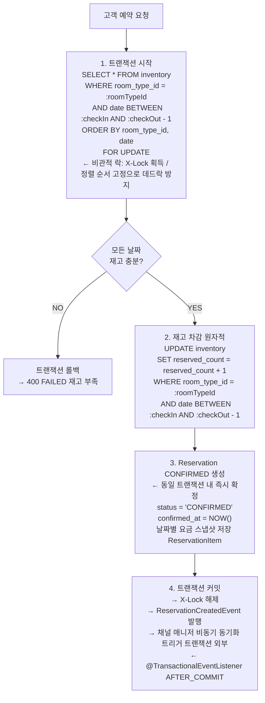
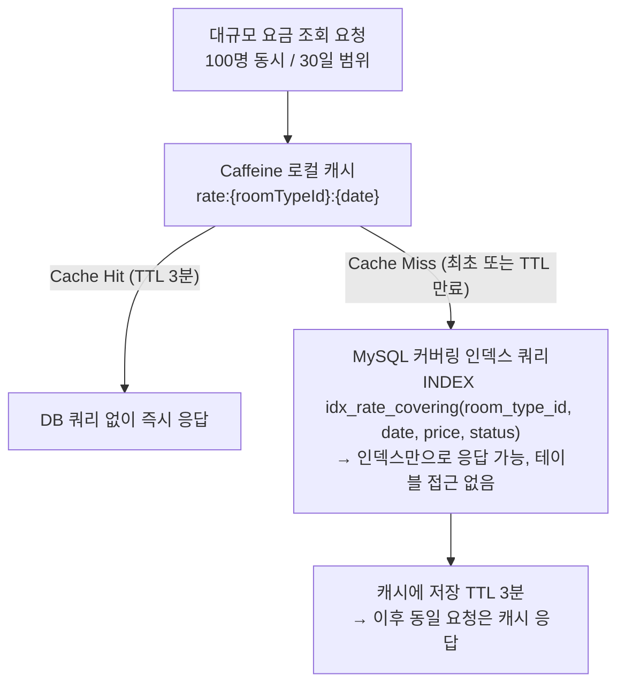
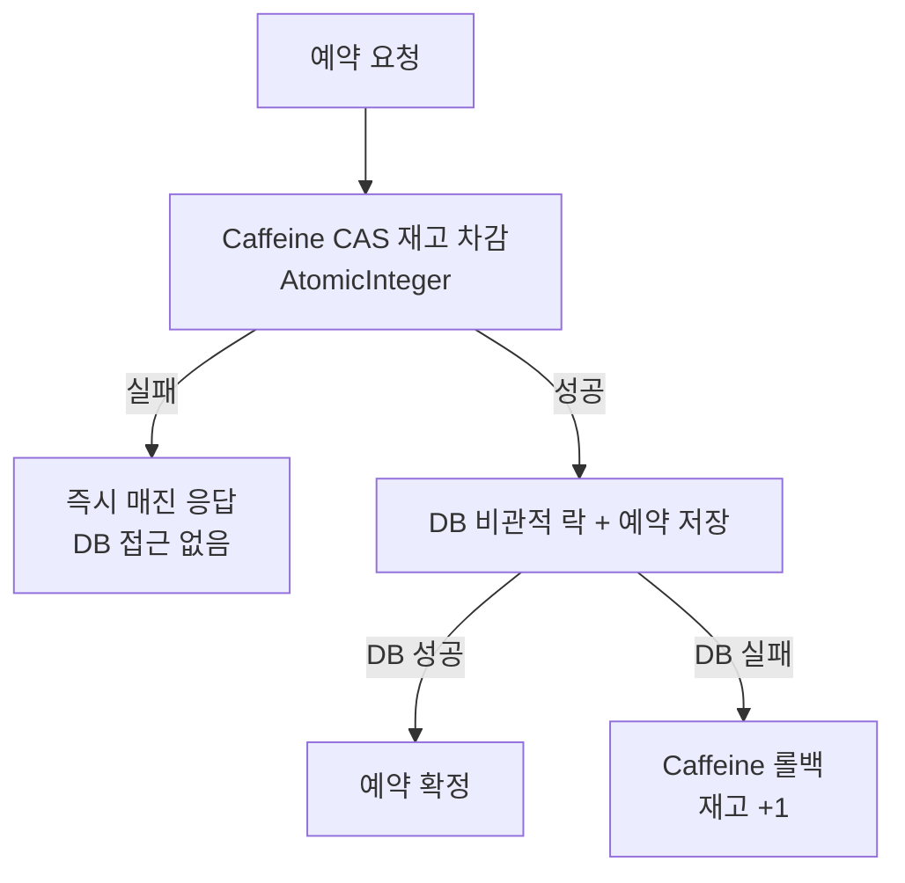

# 04. 동시성 처리 전략

> 관련 문서: [05-cache-strategy.md](./05-cache-strategy.md), [06-event-architecture.md](./06-event-architecture.md)

---

## 1. 문제 정의

숙박 플랫폼에서 동시성 문제는 두 가지 축으로 발생한다.

### 1.1 동일 재고에 대한 동시 예약 (쓰기 경합)

인기 숙소의 특가 시즌이나 마감 임박 상황에서는 동일한 날짜, 동일한 객실 유형에 대해 수십 ~ 수백 건의 예약 요청이 동시에 들어온다.

- 재고가 1개인 객실에 100명이 동시에 예약을 시도하는 경우, 재고 확인과 차감이 원자적으로 처리되지 않으면 초과 예약(overbooking)이 발생한다

핵심 불변식: `reserved_count <= total_count`

이 불변식이 깨지는 순간:

- 파트너 신뢰도 손상
- 고객 경험 저하
- 환불 처리 비용 등 실제 비즈니스 손실로 직결된다

### 1.2 대규모 요금 조회 동시 요청 (읽기 부하)

검색 페이지에서 여러 숙소의 날짜별 요금을 동시에 조회할 때, 각 요청이 DB에 직접 날짜별 요금 쿼리를 날리면 DB 커넥션 풀이 순식간에 고갈된다.

- 100명이 동시에 30일치 요금을 조회하면 최소 3,000개의 쿼리가 동시에 실행될 수 있다

두 문제의 성격이 다르므로 해결책도 다르다.

- 쓰기 경합 → 비관적 락으로 대응
- 읽기 부하 → 캐시 + 커버링 인덱스로 대응

---

## 2. 예약 동시성 전략: 비관적 락 (SELECT ... FOR UPDATE)

### 2.1 설계 결정의 배경

처음에는 낙관적 락을 고려했다. 숙박 도메인은 평시에는 충돌이 적기 때문이다.

- 체크인 날짜가 다르거나 객실 유형이 다른 예약끼리는 아무런 경합이 없으며, 이 경우 낙관적 락의 "충돌이 드물다"는 전제가 성립한다

그러나 이 플랫폼에서 요구하는 핵심 시나리오는 "동일 재고에 동시 예약" 이라는 높은 경합 상황이다.

- 인기 숙소의 특가 오픈, 연휴 전날 마감 임박 객실, 채널 매니저를 통해 여러 OTA에서 동시에 들어오는 예약 등은 모두 동일 inventory 행에 대한 집중적인 경합을 만들어낸다

이 경우 낙관적 락은 재시도 비용이 폭발한다.

- 100개 동시 요청, 재고 1개 시나리오에서 낙관적 락은 99번의 `OptimisticLockException`과 최대 297회의 재시도 UPDATE를 발생시킨다
- 반면 비관적 락은 100번의 순차 처리로 1번 성공, 99번 즉시 FAILED를 만들어내며 불필요한 재시도가 전혀 없다

비관적 락의 단점으로 흔히 거론되는 "커넥션 점유 시간"은, 재고 차감이라는 매우 짧은 트랜잭션(수 밀리초)에서는 문제가 되지 않는다.

- 이 트랜잭션의 핵심 구간은 `SELECT FOR UPDATE` → 재고 확인 → `UPDATE` → `INSERT` 예약 생성이며 외부 I/O가 전혀 없어 트랜잭션이 극히 짧다

분산 락(Redis Redisson)도 고려했으나 채택하지 않았다.

- 단일 DB 환경에서 DB 자체의 락 메커니즘이 가장 확정적이고 추가 인프라가 필요 없다
- Redis를 별도로 운영하면 Redis 장애 시 예약 자체가 불가능해지는 단일 장애점이 생긴다
- MySQL InnoDB의 행 수준 락은 이미 충분히 성숙한 메커니즘이다

### 2.2 MySQL InnoDB 행 수준 락 동작

InnoDB는 `SELECT ... FOR UPDATE` 실행 시 해당 행에 Exclusive Lock (X-Lock) 을 획득한다. X-Lock이 걸린 행에 대해 다른 트랜잭션은 읽기(Shared Lock)와 쓰기(Exclusive Lock) 모두 대기해야 한다.

```
트랜잭션 A: SELECT * FROM inventory WHERE room_type_id=1 AND date='2026-04-01' FOR UPDATE
           → X-Lock 획득

트랜잭션 B: SELECT * FROM inventory WHERE room_type_id=1 AND date='2026-04-01' FOR UPDATE
           → 트랜잭션 A 커밋/롤백까지 대기

트랜잭션 A: 재고 확인 → UPDATE → INSERT 예약 → COMMIT → X-Lock 해제

트랜잭션 B: X-Lock 획득 → 재고 확인 (이미 0개) → 트랜잭션 롤백 → FAILED 반환
```

중요한 점은 InnoDB의 락이 행 수준(row-level) 이라는 것이다.

- `room_type_id=1, date=2026-04-01`에 락이 걸려도 `room_type_id=2`나 `date=2026-04-02`의 예약은 전혀 영향을 받지 않는다
- 다른 객실, 다른 날짜의 예약은 완전히 병렬로 처리된다
- 락 대기 타임아웃은 MySQL `innodb_lock_wait_timeout`(기본 50초)에 의해 제어되며, 애플리케이션 레벨에서 별도 타임아웃을 설정해 사용자 경험을 보호한다

### 2.3 예약 처리 플로우 (단일 트랜잭션)



자동 확정 정책: 재고 차감 성공 = 즉시 CONFIRMED. PENDING 단계가 없다. 파트너 수동 확정 흐름은 별도 DESIGN-ONLY 문서에서 다루며, 기본 구현은 자동 확정이다. PENDING 상태가 없으므로 만료 스케줄러도 불필요하다.

### 2.4 멀티 나이트 예약의 데드락 방지

2박 이상의 예약은 여러 inventory 행을 동시에 잠근다. 두 트랜잭션이 서로 다른 순서로 행을 잠그면 순환 대기(circular wait)로 데드락이 발생할 수 있다.

```
트랜잭션 A (3/28 체크인, 3/30 체크아웃):
  잠금 순서: 3/28 행 → 3/29 행

트랜잭션 B (3/29 체크인, 3/31 체크아웃):
  잠금 순서: 3/29 행 → 3/30 행

→ A가 3/28 잠금 후 3/29를 기다리는 동안
  B가 3/29 잠금 후 3/30을 기다리면 → 데드락
```

해결: `ORDER BY room_type_id, date`로 항상 동일한 오름차순 순서로 행을 잠근다. 모든 트랜잭션이 같은 순서로 락을 획득하므로 순환 대기가 원천 차단된다.

```sql
-- 3박 예약 (3/28 체크인, 3/31 체크아웃) 시 잠금 순서: 항상 날짜 오름차순
SELECT * FROM inventory
WHERE room_type_id = 1
  AND date IN ('2026-03-28', '2026-03-29', '2026-03-30')
ORDER BY room_type_id, date
FOR UPDATE;
-- 잠금 순서: 3/28 → 3/29 → 3/30 (모든 트랜잭션 동일하게 적용)
```

Spring Data JPA에서는 `@Lock(LockModeType.PESSIMISTIC_WRITE)`와 `@Query`에 `ORDER BY` 절을 명시적으로 포함시켜야 한다.

### 2.5 외부 채널 통신과 트랜잭션 경계

예약 생성 시 OTA 채널들에도 재고 변경을 알려야 한다. 그런데 채널 API 호출을 트랜잭션 내부에 포함시키면 심각한 문제가 생긴다.

- 채널 API 응답 시간이 수백 ms ~ 수 초에 달할 수 있다
- 이 시간 동안 inventory 행의 X-Lock이 유지되어 다른 예약 요청이 전부 대기한다
- 채널 API 실패 시 트랜잭션 롤백이 일어나 재고 차감 자체가 취소되는 불일치가 생긴다

따라서 외부 채널 통신은 트랜잭션 밖에서 이벤트 기반으로 처리한다.

- `ReservationCreatedEvent`는 `@TransactionalEventListener(phase = AFTER_COMMIT)`으로 등록되어 DB 커밋이 완료된 후에만 발행된다
- 재고 차감이라는 핵심 정합성 구간의 트랜잭션을 최대한 짧게 유지하기 위함이다

채널 동기화 실패는 예약 성공에 영향을 주지 않는다. 실패한 채널은 재시도 큐에서 비동기로 처리된다. 

---

## 3. 낙관적 락 vs 비관적 락: 정량적 비교

### 3.1 시나리오: 100 동시 요청, 재고 1개

| 항목 | 낙관적 락 | 비관적 락 (선택) |
|------|----------|----------------|
| 성공 건수 | 1건 | 1건 |
| 실패 건수 | 99건 (재시도 포함) | 99건 (즉시 실패) |
| 총 UPDATE 시도 | 최대 297회 (99건 × 최대 3회 재시도) | 100회 (순차 실행) |
| 재시도 비용 | 높음 (충돌 시마다 재조회 + UPDATE) | 없음 (DB가 대기열 관리) |
| 코드 복잡도 | `@Version` + `@Retryable` + 재시도 로직 | `@Lock` 어노테이션 1줄 |
| 데드락 위험 | 없음 | `ORDER BY`로 해결 |
| 대기 시간 | 재시도 간 경쟁, 결과 불확정 | 짧은 대기 후 확정적 결과 |
| 결과 예측성 | 낮음 (재시도 횟수 불확정) | 높음 (순서가 DB 보장) |

### 3.2 시나리오: 50 동시 요청, 재고 10개

| 항목 | 낙관적 락 | 비관적 락 (선택) |
|------|----------|----------------|
| 성공 건수 | 10건 | 10건 |
| 실패 건수 | 40건 | 40건 |
| 총 UPDATE 시도 | 최대 120회 (40건 × 최대 3회) | 50회 |
| 충돌 빈도 | 중간 (일부 요청은 성공) | 없음 (순차 처리) |

재고가 충분히 있을 때는 낙관적 락도 나쁘지 않다.

- 하지만 재고 소진에 가까워질수록, 즉 플랫폼이 가장 바쁜 순간에 낙관적 락의 충돌 빈도가 급증한다
- 과부하 상황에서 더 나쁜 동작을 보이는 전략은 채택하기 어렵다

### 3.3 판단 근거 요약

낙관적 락이 유리한 경우: 읽기 > 쓰기, 충돌 빈도 낮음, 재시도 비용 낮음
비관적 락이 유리한 경우: 쓰기 경합 높음, 재시도 비용 높음, 결과 확정성 중요

숙박 예약은 재고가 유한하고 수요가 집중되는 특성상 쓰기 경합이 높으며, 초과 예약은 비즈니스적으로 치명적이다. 비관적 락이 이 도메인의 요구사항에 완전히 부합한다.

---

## 4. 대규모 요금 조회: 캐시 + 커버링 인덱스

요금 조회는 읽기 전용이므로 재고와 달리 캐싱이 가능하다. 상세 캐시 전략은 [05-cache-strategy.md](./05-cache-strategy.md)에서 다루며, 여기서는 동시성 관점에서의 핵심만 정리한다.



재고(inventory)는 캐싱하지 않는다. 예약 가능 여부는 항상 실시간으로 확인해야 하므로 정합성을 캐시 히트율보다 우선한다.

---

## 5. 테스트 전략

동시성 테스트 시나리오와 부하 테스트 계획은 [12-test-strategy.md](12-test-strategy.md)에서 별도로 다룬다.

---

## 6. 구현 핵심 코드 패턴

### 6.1 Repository: 비관적 락 쿼리

```java
public interface InventoryRepository extends JpaRepository<Inventory, Long> {

    @Lock(LockModeType.PESSIMISTIC_WRITE)
    @Query("""
        SELECT i FROM Inventory i
        WHERE i.roomTypeId = :roomTypeId
          AND i.date BETWEEN :checkIn AND :checkOut
        ORDER BY i.roomTypeId, i.date
        """)
    List<Inventory> findAndLockByRoomTypeIdAndDateRange(
        @Param("roomTypeId") Long roomTypeId,
        @Param("checkIn") LocalDate checkIn,
        @Param("checkOut") LocalDate checkOut
    );
}
```

### 6.2 Service: 단일 트랜잭션 예약 처리

```java
@Service
@RequiredArgsConstructor
public class ReservationService {

    private final InventoryRepository inventoryRepository;
    private final ReservationRepository reservationRepository;
    private final ApplicationEventPublisher eventPublisher;

    @Transactional
    public Reservation createReservation(ReservationCreateCommand command) {
        LocalDate checkOut = command.checkOutDate().minusDays(1); // 체크아웃 전날까지 차감

        // 1. 비관적 락으로 재고 행 잠금 (ORDER BY 보장됨)
        List<Inventory> inventories = inventoryRepository
            .findAndLockByRoomTypeIdAndDateRange(
                command.roomTypeId(),
                command.checkInDate(),
                checkOut
            );

        // 2. 재고 충분성 검증 (하나라도 부족하면 예외)
        inventories.forEach(inv -> {
            if (inv.getAvailableCount() <= 0) {
                throw new InsufficientInventoryException(
                    "재고 부족: roomTypeId=" + inv.getRoomTypeId()
                    + ", date=" + inv.getDate()
                );
            }
        });

        // 3. 재고 차감
        inventories.forEach(Inventory::decreaseAvailable);

        // 4. 예약 CONFIRMED 생성 (동일 트랜잭션)
        Reservation reservation = Reservation.createConfirmed(command, inventories);
        reservationRepository.save(reservation);

        // 5. 트랜잭션 커밋 후 이벤트 발행 (AFTER_COMMIT)
        eventPublisher.publishEvent(new ReservationCreatedEvent(reservation.getId()));

        return reservation;
    }
}
```

---

## 7. 고민 포인트 정리

### 7.1 왜 낙관적 락을 버렸는가

처음에는 낙관적 락을 고려했다. 숙박 도메인은 평시에는 충돌이 적기 때문이다.

- 하지만 이 플랫폼에서 요구하는 핵심 시나리오가 "동일 재고에 동시 예약"이라는 높은 경합 상황이다
- 이 경우 낙관적 락은 재시도 비용이 폭발한다
- 낙관적 락의 "충돌이 드물다"는 전제는 평시 트래픽에서는 맞지만, 인기 숙소의 마감 임박 시나리오나 이벤트성 특가 오픈에서는 전혀 성립하지 않는다
- 플랫폼이 가장 중요하게 보호해야 하는 순간이 바로 이 고부하 시점이다

### 7.2 비관적 락의 단점을 어떻게 완화했는가

비관적 락의 가장 큰 단점은 락을 오래 잡을수록 다른 트랜잭션의 대기 시간이 길어진다는 것이다.

- 이를 완화하기 위해 트랜잭션 내부에서 외부 통신을 완전히 제거했다
- 채널 동기화, 알림 발송 등 외부 I/O가 필요한 모든 처리는 `@TransactionalEventListener(AFTER_COMMIT)`을 통해 트랜잭션 외부에서 비동기로 처리한다
- 이를 통해 락 보유 시간을 순수 DB 작업(수 밀리초)으로 최소화한다

### 7.3 Caffeine CAS + DB 비관적 락 2단계 전략

단일 서버 환경에서 Caffeine의 CAS(Compare-And-Swap) 연산을 1차 필터로 활용하고, DB 비관적 락을 최종 방어선으로 유지하는 2단계 전략을 채택했다.

#### 플로우



#### 왜 2단계인가

100명이 마지막 1개 객실에 동시에 예약하면, DB 비관적 락만으로는 100개 요청이 모두 DB에 도달하여 순차 대기한다. Caffeine CAS를 1차 필터로 두면 99명이 JVM 레벨에서 즉시 걸러지고, DB에는 1명만 도달한다.

| 항목 | DB 비관적 락만 | Caffeine CAS + DB |
|------|--------------|-------------------|
| DB 도달 요청 수 (100 동시, 재고 1) | 100건 | 1건 |
| 매진 응답 속도 | DB round-trip 필요 | 즉시 (JVM 내) |
| 커넥션 풀 사용 | 100건 점유 | 1건 점유 |
| 비관적 락 대기 시간 | 99건 순차 대기 | 대기 없음 |

#### 워밍업 및 정합성

- 서버 시작: `@PostConstruct`에서 DB의 inventory 테이블을 읽어 Caffeine에 로드
- Extranet 재고 변경: 재고 변경 이벤트(`InventoryChangedEvent`)로 Caffeine 동기화
- 서버 크래시: DB가 source of truth. 재시작 시 DB 기준으로 Caffeine 복원
- Caffeine 차감 후 DB 실패: catch 블록에서 Caffeine 롤백 (`AtomicInteger.incrementAndGet()`)

#### 멀티 나이트 예약 시

3박 예약이면 3개 날짜의 Caffeine CAS를 모두 시도한다. 하나라도 실패하면 성공한 날짜들을 모두 롤백한 후 매진 응답한다. 모두 성공한 경우에만 DB로 진행한다.

#### 단일 서버 전제

이 전략은 단일 JVM에서만 유효하다. 멀티 인스턴스 환경에서는 각 JVM의 AtomicInteger가 독립적이므로, Redis 기반 분산 카운터로 교체해야 한다. 현재 본 프로젝트는 단일 서버를 전제하므로 Caffeine CAS가 최적이다.

### 7.4 Facade에 @Transactional을 걸지 않는 이유

예약 플로우에서 Facade는 읽기/검증 후 Service에 원자적 쓰기를 위임한다.

Facade에 `@Transactional`을 거는 방식과 비교하면:

| 방식 | 트랜잭션 범위 | 락 점유 시간 | 커넥션 점유 |
|------|-------------|-------------|------------|
| Facade에 @Transactional | 읽기 + 검증 + 쓰기 전체 | 길다 (검증 포함) | 전체 구간 |
| Service에만 @Transactional | 쓰기(락 + 차감 + 생성)만 | 최소 (수 ms) | 쓰기 구간만 |

Facade에 트랜잭션을 걸면 `propertyService.getRoomType()` 같은 읽기/검증 구간까지 트랜잭션에 포함된다.

- 이 구간에서 DB 커넥션을 점유하고 있으므로, 대량 요청 시 커넥션 풀이 빠르게 고갈된다
- 비관적 락과 결합하면 락 점유 시간도 불필요하게 늘어난다

Service에만 `@Transactional`을 걸면 트랜잭션 경계가 "SELECT FOR UPDATE → 재고 차감 → 예약 생성 → 이벤트 발행"이라는 최소 구간으로 한정된다.

- 읽기/검증은 트랜잭션 밖에서 수행되므로 커넥션 점유 시간이 짧고, 동시 처리 능력이 높아진다

이 선택의 제약은 원자적 쓰기가 하나의 Service 메서드에 모여야 한다는 것이다.

- 하지만 이는 오히려 "어디서 커밋되는지"를 추적하기 쉽게 만드는 장점이 된다

### 7.5 분산 락을 선택하지 않은 이유

Redis Redisson 기반 분산 락도 검토했다. 분산 락은 DB에 부하를 주지 않고 락을 관리할 수 있으며, 미래 멀티 인스턴스 환경에서도 유효하다.

그러나 현재 단일 DB 환경에서는 DB 자체의 락 메커니즘이 가장 확정적이다. Redis를 추가하면 Redis 가용성이 예약 가용성과 직결되는 새로운 단일 장애점이 생긴다. 또한 네트워크를 통한 Redis 락 획득은 로컬 DB 락보다 레이턴시가 높다. 단일 인스턴스 + 단일 DB 환경에서 인프라 복잡도를 높이는 선택은 본 프로젝트 범위에서 정당화되기 어렵다.

---

## 8. 프로덕션 확장 고려사항

현재 설계는 단일 인스턴스를 전제로 한다. 멀티 인스턴스 환경으로 확장 시:

| 항목 | 현재 (단일 인스턴스) | 확장 (멀티 인스턴스) |
|------|---------------------|---------------------|
| 재고 락 | DB 비관적 락 (충분) | DB 비관적 락 (동일하게 유효 — 모든 인스턴스가 같은 DB 공유) |
| 캐시 정합성 | ApplicationEvent (충분) | Redis Pub/Sub 또는 메시지 큐 필요 |
| 이벤트 처리 | Spring ApplicationEvent | Kafka / RabbitMQ 전환 |
| 세션 | JWT Stateless (이미 확장 가능) | 변경 없음 |

DB 비관적 락은 멀티 인스턴스에서도 유효하다. 모든 인스턴스가 동일한 MySQL을 바라보므로 InnoDB의 행 수준 락이 인스턴스 간 조율을 담당한다. 캐시와 이벤트 처리만 분산 환경에 맞게 교체하면 된다.

---

## DB 커넥션 풀 분리 (Read/Write Splitting)

검색/요금 조회(읽기)와 예약/Extranet(쓰기)의 커넥션 풀을 분리한다. 단일 MySQL이지만 HikariCP 풀을 2개로 나누면, 쓰기 트랜잭션의 비관적 락이 읽기 커넥션을 블로킹하지 않는다.

### 구성

| 풀 | 용도 | 대상 API | 설정 |
|----|------|----------|------|
| `primary` | 쓰기 (INSERT/UPDATE/DELETE) | 예약 생성/취소, Extranet CRUD | maxPoolSize: 10 |
| `read` | 읽기 (SELECT) | 검색, 상세 조회, 요금 조회 | maxPoolSize: 20 |

### 라우팅 방식

`@Transactional(readOnly = true)` 어노테이션 기반으로 DataSource를 자동 라우팅한다.

```java
// 읽기 전용 → read 풀 사용
@Transactional(readOnly = true)
public List<PropertySearchResult> search(SearchCondition condition) { ... }

// 쓰기 → primary 풀 사용
@Transactional
public Reservation createReservation(CreateReservationCommand command) { ... }
```

### 구현 방식

Spring의 `AbstractRoutingDataSource`를 활용하여 `TransactionSynchronizationManager.isCurrentTransactionReadOnly()` 값에 따라 DataSource를 선택한다.

### 고민 포인트

단일 DB 환경에서 커넥션 풀을 분리하는 것이 의미가 있는가? 있다. 비관적 락으로 재고 행을 잠그는 쓰기 트랜잭션이 길어지면, 같은 풀의 커넥션을 점유하여 읽기 요청까지 대기하게 된다. 풀을 분리하면 쓰기 부하가 읽기 성능에 영향을 주지 않는다. 향후 Read Replica를 도입하면 read 풀만 Replica를 바라보도록 DataSource만 변경하면 된다.

---

## 프로모션 대기열 처리 (DESIGN-ONLY)

인기 숙소 프로모션 시 동시 예약 요청이 폭주하는 상황에 대비한 설계이다. 현재는 비관적 락으로 순차 처리하지만, 트래픽이 극도로 집중되면 커넥션 풀이 고갈될 수 있다.

### 설계 방안

```
[대량 예약 요청] → [Redis Queue (대기열)] → [Worker가 순차 소비] → [비관적 락 예약 처리]
```

- 고객에게 "대기 순번"을 발급하고, 순차적으로 예약 처리
- WebSocket 또는 SSE로 대기 상태를 실시간 전달
- 대기열 TTL 설정으로 일정 시간 초과 시 자동 만료

### 현재 프로젝트 적용

현 단계에서는 비관적 락의 순차 처리로 충분하다. 대기열은 프로모션/이벤트 트래픽이 예상될 때 도입을 검토한다.

---

## 서킷 브레이커 (DESIGN-ONLY)

Channel Manager, Supplier 등 외부 API 호출 시 장애 전파를 방지하기 위한 설계이다.

### 적용 대상

| 대상 | 이유 |
|------|------|
| ChannelAdapter (OUTBOUND) | 외부 OTA API 장애 시 자사 예약 처리에 영향 방지 |
| SupplierAdapter (동기화) | 외부 공급자 API 장애 시 배치 실패 격리 |

### 설계 방안 (Resilience4j)

```
CLOSED (정상) → 실패율 > 50% → OPEN (차단, fallback 응답)
                                    ↓ 30초 후
                              HALF_OPEN (일부 허용)
                                    ↓ 성공 시
                              CLOSED (복구)
```

- OPEN 상태에서는 외부 호출을 차단하고, sync_log에 CIRCUIT_OPEN 상태를 기록
- 채널 동기화 실패는 재시도 큐에 적재하여 복구 후 재시도

### 현재 프로젝트 적용

외부 API가 Mock이므로 서킷 브레이커는 구현하지 않는다. 인터페이스 설계에 fallback 메서드를 포함하여 향후 도입이 용이하도록 준비한다.
