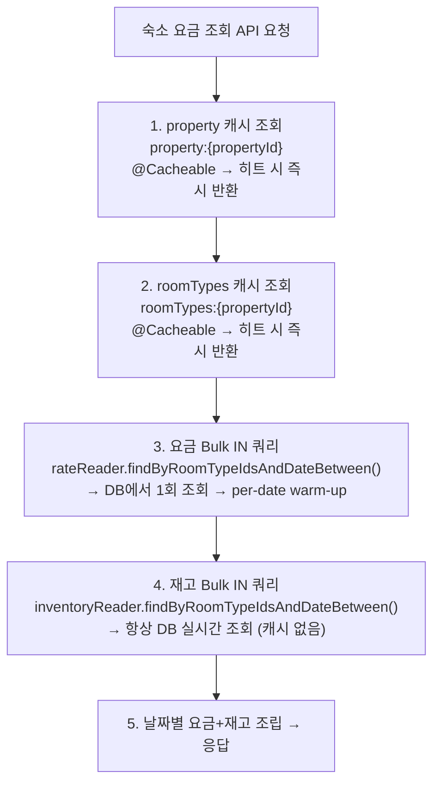
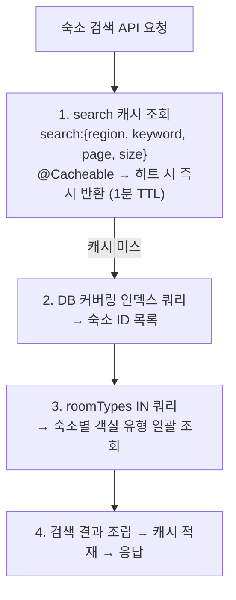
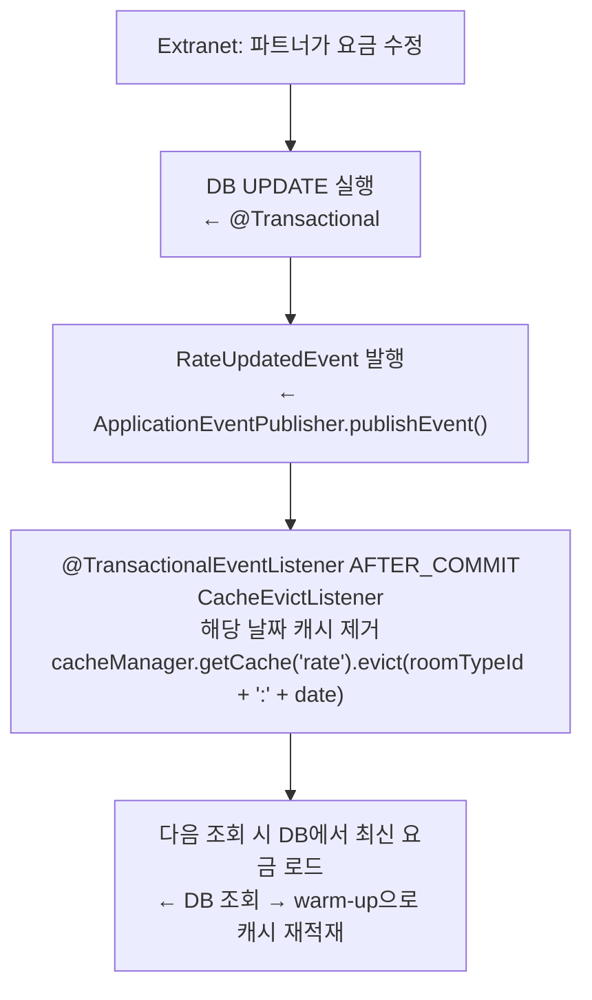
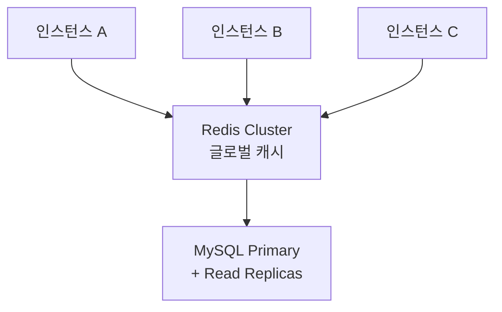

# 05. 캐시 전략

> 관련 문서: [04-concurrency.md](./04-concurrency.md), [06-event-architecture.md](./06-event-architecture.md)

---

## 1. 왜 캐시가 필요한가

### 1.1 대규모 요금 조회의 특성

숙소 검색 페이지에서 고객은 날짜 범위를 선택하고 여러 숙소의 요금을 동시에 확인한다. 이 패턴은 다음과 같은 읽기 부하를 만들어낸다.

- 한 페이지에 숙소 20개 표시 → 숙소당 평균 3개 객실 유형 → 30일 요금 조회 → 1회 페이지 로드 = 최대 1,800개 rate 행 조회
- 동시 사용자 100명이면 초당 수만 건의 SELECT가 DB로 몰린다
- 요금 데이터는 자주 변경되지 않는다 (파트너가 수동으로 설정, 일 단위 갱신이 일반적)

요금 데이터의 특성(낮은 변경 빈도, 높은 읽기 빈도)은 캐싱의 전형적인 적용 시나리오다.

### 1.2 재고는 캐싱하지 않는다

반면 재고(inventory)는 캐싱하지 않는다.

- 예약 가능 여부를 잘못 표시하는 것은 요금을 잠시 stale하게 보여주는 것보다 비즈니스 영향이 훨씬 크다
- 캐시에서 "예약 가능"으로 표시되었다가 실제 예약 시 실패하면 고객 경험이 크게 저하된다
- 재고는 예약 생성/취소 시마다 즉시 변하며 예측이 어렵다
- 재고는 비관적 락으로 보호되는 정합성 핵심 데이터다

따라서 재고는 항상 DB에서 실시간 조회한다. 정합성 우선 원칙을 캐시 히트율보다 우선한다.

---

## 2. 로컬 캐시 선택: Caffeine

### 2.1 선택 근거

이 프로젝트는 단일 인스턴스 애플리케이션을 전제로 한다.

- 단일 인스턴스에서는 JVM 내 로컬 캐시(Caffeine)로 충분하며, Redis 같은 외부 캐시 서버는 불필요한 인프라 복잡도를 추가한다

| 항목 | Caffeine (선택) | Redis |
|------|----------------|-------|
| 구성 복잡도 | Spring Boot 자동 구성, 의존성 추가만으로 동작 | 별도 서버 운영 필요 |
| 응답 속도 | 나노초 (JVM 내 메모리 접근) | 수백 마이크로초 ~ 수 밀리초 (네트워크 I/O) |
| 단일 장애점 | 없음 (JVM과 동일 프로세스) | Redis 장애 시 캐시 전체 불능 |
| 멀티 인스턴스 정합성 | 인스턴스 간 캐시 불일치 발생 | 모든 인스턴스가 동일 캐시 공유 |
| 본 프로젝트 환경 적합성 | 최적 | 본 프로젝트 범위 초과 |

글로벌 캐시(Redis)로 Extranet / Admin 서버와 캐시 정합성을 유지하는 것이 이상적인 아키텍처이지만, 단일 인스턴스 환경이므로 로컬 캐시 + 이벤트 기반 무효화로 충분히 대응 가능하다.

### [2.2 CacheConfig 구성](../../backend/src/main/java/com/jemini/stayhost/common/config/CacheConfig.java)

`SimpleCacheManager`에 캐시별 개별 `CaffeineCache`를 등록한다. 각 캐시는 용도에 맞는 TTL과 최대 크기를 갖는다.

---

## 3. 캐시 대상: 하위 단위 설계

### 3.1 캐시 구성 전체 개요

| 캐시명 | 키 패턴 | TTL | 최대 크기 | 대상 데이터 | 캐싱 방식 | 무효화 트리거 |
|--------|---------|-----|----------|-------------|-----------|--------------|
| `search` | `{region, keyword, page, size}` | 1분 | 1,000 | 검색 결과 페이지 | `@Cacheable` | `PropertyUpdatedEvent`, `RoomTypeUpdatedEvent` 시 전체 clear |
| `property` | `{propertyId}` | 30분 | 5,000 | 숙소 기본 정보 | `@Cacheable` | `PropertyUpdatedEvent`, `RoomTypeUpdatedEvent` |
| `roomTypes` | `{propertyId}` | 10분 | 5,000 | 숙소별 객실 유형 목록 | `@Cacheable` | `RoomTypeUpdatedEvent` |
| `rate` | `{roomTypeId}:{date}` | 3분 | 30,000 | 날짜별 요금 단가 | 수동 warm-up | `RateUpdatedEvent` |

### 3.2 search 캐시

검색 결과를 단기간(1분) 캐시하여 동일 검색 조건의 반복 요청을 흡수한다.

```java
@Cacheable(value = "search", key = "{#region, #keyword, #pageable.pageNumber, #pageable.pageSize}")
@Transactional(readOnly = true)
public PageResult<PropertySearchResult> searchProperties(
    final String region,
    final String keyword,
    final Pageable pageable
) { ... }
```

TTL을 1분으로 짧게 잡은 이유:

- 검색 파라미터 조합이 다양하므로(지역 x 키워드 x 페이지) 캐시 히트율이 높지 않다
- 숙소/객실 변경 시 전체 무효화(clear)하므로 TTL이 길면 메모리만 낭비된다
- 1분이라도 동시 접속자의 동일 검색을 흡수하면 DB 부하가 크게 줄어든다

검색 자체의 DB 성능은 커버링 인덱스로 보장한다.

```sql
-- 커버링 인덱스: (region, status, id)
-- SELECT 절의 모든 컬럼이 인덱스에 포함 → 테이블 접근 없이 인덱스만으로 결과 반환
CREATE INDEX idx_property_search ON property (region, status, id);
```

### 3.3 property 캐시

숙소 기본 정보(이름, 주소, 지역, 설명, 체크인/아웃 시간, 이미지 URL 등)는 파트너가 수정하지 않는 한 변경이 없다.

- TTL 30분은 수정 반영 지연을 허용하는 대신 높은 캐시 히트율을 얻는 트레이드오프다
- 이벤트 기반 무효화가 1차 방어이므로, 변경 시에는 즉시 evict된다

```java
@Cacheable(value = "property", key = "#id")
@Override
public Property getActiveById(final Long id) {
    return propertyRepository.findByIdAndStatus(id, PropertyStatus.ACTIVE)
        .orElseThrow(() -> new NotFoundException(ErrorCode.PROPERTY_NOT_FOUND));
}
```

### 3.4 roomTypes 캐시

한 숙소의 객실 유형 목록은 검색 결과 조립과 요금 조회에서 반복적으로 필요하다. 숙소 ID를 키로 객실 목록 전체를 캐시하면 여러 날짜 요금 조회에서 재사용된다.

```java
@Cacheable(value = "roomTypes", key = "#propertyId")
@Override
public List<RoomType> findActiveByPropertyId(final Long propertyId) {
    return roomTypeRepository.findByPropertyIdAndStatus(propertyId, RoomTypeStatus.ACTIVE);
}
```

### 3.5 rate 캐시: 수동 warm-up 방식

날짜별 요금은 가장 세분화된 캐시 단위다. `@Cacheable`이 아닌 수동 warm-up 방식을 사용한다.

`@Cacheable`을 사용하지 않는 이유:

- 요금 조회는 날짜 범위 단위로 요청되지만, 캐시 키는 `{roomTypeId}:{date}` 단일 날짜 단위다
- `@Cacheable`로 범위 쿼리를 캐싱하면 키가 `startDate:endDate`가 되어, 날짜 하나만 변경되어도 전체 범위 캐시를 무효화해야 한다
- per-date 키를 사용하면 변경된 날짜만 정밀하게 evict할 수 있다

따라서 DB에서 Bulk IN 쿼리로 일괄 조회한 뒤, 결과를 per-date 키로 분해하여 캐시에 적재(warm-up)한다.

```java
@Component
@RequiredArgsConstructor
public class RateReaderImpl implements RateReader {

    private static final String RATE_CACHE_NAME = "rate";

    private final RateRepository rateRepository;
    private final CacheManager cacheManager;

    @Override
    public List<Rate> findByRoomTypeIdsAndDateBetween(
        final List<Long> roomTypeIds,
        final LocalDate startDate,
        final LocalDate endDate
    ) {
        if (roomTypeIds.isEmpty()) {
            return List.of();
        }
        final List<Rate> rates = rateRepository.findByRoomTypeIdInAndDateBetween(
            roomTypeIds, startDate, endDate);
        warmRatesIntoCache(rates);
        return rates;
    }

    private void warmRatesIntoCache(final List<Rate> rates) {
        final Cache cache = cacheManager.getCache(RATE_CACHE_NAME);
        if (cache != null) {
            rates.forEach(rate -> {
                final String key = rate.getRoomTypeId() + ":" + rate.getDate();
                cache.put(key, rate);
            });
        }
    }
}
```

이 방식의 장점:

- N+1 쿼리 제거: roomType별 개별 쿼리 대신 IN절 Bulk 쿼리 1회로 전환
- 정밀 eviction: 요금 변경 시 `affectedDates` 기반으로 해당 날짜만 evict (O(k), k = 변경된 날짜 수)
- TTL 3분: 파트너 요금 수정 시 빠르게 반영되어야 하므로 짧게 설정

### 3.6 재고는 캐싱하지 않는다

```java
// 재고 조회는 항상 DB에서 실시간으로
public List<Inventory> findByRoomTypeIdsAndDateBetween(
    final List<Long> roomTypeIds,
    final LocalDate startDate,
    final LocalDate endDate
) {
    // @Cacheable 없음 - 의도적
    return inventoryRepository.findByRoomTypeIdInAndDateBetween(roomTypeIds, startDate, endDate);
}
```

---

## 4. 요금 조회 흐름: Bulk IN 쿼리 + per-date 캐시

### 4.1 전체 흐름



### 4.2 검색 결과 조립 흐름



### 4.3 N+1 → Bulk 전환 효과

k6 부하 테스트(280 VUs, 80초, 숙소당 객실 5개) 결과, Bulk IN 쿼리 전환 후 p(99) tail latency가 전 시나리오에서 85~91% 감소했다.

| 시나리오 | p(99) 전환 전 | p(99) 전환 후 | 개선율 |
|---------|-------------|-------------|--------|
| 검색 | 109.77ms | 9.97ms | -91% |
| 상세 | 119.83ms | 10.42ms | -91% |
| 요금 | 172.17ms | 26.03ms | -85% |
| 예약 | 188.21ms | 26.81ms | -86% |

상세 결과는 [부하 테스트 결과 보고서](../test/k6-load-test-report.md) 참조.

---

## 5. 캐시 정합성: 이벤트 기반 무효화

### 5.1 정합성 전략의 선택

TTL만으로 캐시를 관리하면, 파트너가 요금을 수정했을 때 최대 TTL 시간(rate는 3분) 동안 stale 데이터가 고객에게 노출된다. 이는 요금 오표시로 이어질 수 있다.

이벤트 기반 무효화가 1차 방어선이다. 파트너가 Extranet에서 요금을 수정하는 순간 캐시를 즉시 제거한다. TTL은 이벤트 무효화가 실패하거나 누락된 경우를 대비한 2차 안전망 역할이다.

### 5.2 무효화 흐름



### 5.3 이벤트별 캐시 무효화 대상

| 이벤트 | 무효화 캐시 | 무효화 방식 | 비고 |
|--------|-----------|-----------|------|
| `PropertyUpdatedEvent` | `property:{propertyId}` + `search` 전체 | evict + clear | 숙소 정보 변경 시 검색 결과에도 영향 |
| `RoomTypeUpdatedEvent` | `roomTypes:{propertyId}` + `property:{propertyId}` + `search` 전체 | evict + clear | 객실 수정 시 숙소/검색 캐시도 무효화 |
| `RateUpdatedEvent` | `rate:{roomTypeId}:{date}` (변경된 날짜만) | per-date evict | `affectedDates` 기반 정밀 무효화 |

### 5.4 CacheEvictListener 구현

```java
@Slf4j
@Component
@RequiredArgsConstructor
public class CacheEvictListener {

    private final CacheManager cacheManager;

    @TransactionalEventListener(phase = TransactionPhase.AFTER_COMMIT)
    public void onPropertyUpdated(final PropertyUpdatedEvent event) {
        evict("property", event.propertyId());
        clearCache("search");
    }

    @TransactionalEventListener(phase = TransactionPhase.AFTER_COMMIT)
    public void onRoomTypeUpdated(final RoomTypeUpdatedEvent event) {
        evict("roomTypes", event.propertyId());
        evict("property", event.propertyId());
        clearCache("search");
    }

    @TransactionalEventListener(phase = TransactionPhase.AFTER_COMMIT)
    public void onRateUpdated(final RateUpdatedEvent event) {
        event.affectedDates().forEach(date ->
            evict("rate", event.roomTypeId() + ":" + date)
        );
    }

    private void evict(final String cacheName, final Object key) {
        final Cache cache = cacheManager.getCache(cacheName);
        if (cache != null) {
            cache.evict(key);
        }
    }

    private void clearCache(final String cacheName) {
        final Cache cache = cacheManager.getCache(cacheName);
        if (cache != null) {
            cache.clear();
        }
    }
}
```

---

## 6. 고민 포인트

### 6.1 로컬 캐시의 한계와 수용 가능 범위

글로벌 캐시(Redis)로 Extranet/Admin과 정합성을 유지하는 것이 이상적이지만, 단일 인스턴스 환경이므로 로컬 캐시 + 이벤트 무효화로 충분하다.

- 단일 프로세스 내에서 이벤트를 발행하고 동일 프로세스 내 캐시를 무효화하는 것은 완전히 결정적이다
- 멀티 인스턴스 환경에서 로컬 캐시는 인스턴스 간 불일치 문제가 생긴다
- 인스턴스 A에서 요금을 변경하면 A의 캐시는 무효화되지만 B, C 인스턴스의 캐시는 TTL이 만료될 때까지 stale 상태다
- 이는 Redis Pub/Sub 또는 메시지 큐로 해결해야 하며, 프로덕션 확장 시 고려 사항으로 문서에 명시한다

### 6.2 TTL 설정의 트레이드오프

TTL만으로는 변경 후 최대 TTL만큼 stale 데이터가 노출된다.

- 이벤트 기반 무효화가 1차 방어, TTL은 2차 안전망이다
- TTL을 너무 짧게 설정하면 캐시 효과가 줄어든다
- 너무 길게 설정하면 stale 노출 시간이 늘어난다
- 현재 설정(property 30분, roomTypes 10분, rate 3분, search 1분)은 각 데이터의 변경 빈도를 고려한 균형점이다
- 이벤트 무효화가 정상 동작한다면 TTL은 사실상 안전망에 불과하므로 짧게 설정할 필요도 없다

### 6.3 캐시 워밍업 (선택적 최적화)

애플리케이션 재시작 직후에는 캐시가 비어있어 초기 요청들이 모두 DB를 타게 된다.

- 인기 숙소 상위 N개를 시작 시 미리 캐시에 적재(warm-up)하면 Cold Start 성능을 개선할 수 있다
- 현재 구현에서는 생략하고, 운영 환경에서 필요 시 `@EventListener(ApplicationReadyEvent.class)`로 구현한다

---

## 7. 프로덕션 확장 시 캐시 아키텍처

단일 인스턴스에서 멀티 인스턴스로 확장할 때의 전환 경로:

### 7.1 2단계: Redis + Cache-Aside 패턴



- Caffeine을 L1(로컬), Redis를 L2(글로벌)로 계층화
- 이벤트 무효화는 Redis Pub/Sub으로 전파 (모든 인스턴스에 동시 반영)
- Read Replica로 요금 조회 쿼리 분산

### 7.2 3단계: 검색 엔진 도입

대규모 트래픽에서 검색 쿼리 복잡도가 증가하면(다중 필터, 정렬, 위치 기반 검색 등) Elasticsearch 또는 OpenSearch를 검색 전용 레이어로 도입한다. 숙소/객실/요금 데이터를 비정규화하여 인덱싱하고, 검색은 전적으로 검색 엔진에서 처리한다. DB는 정합성 소스(Source of Truth)로만 사용한다.
