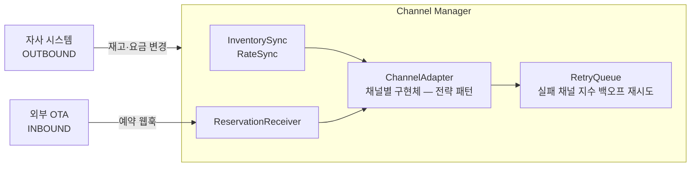
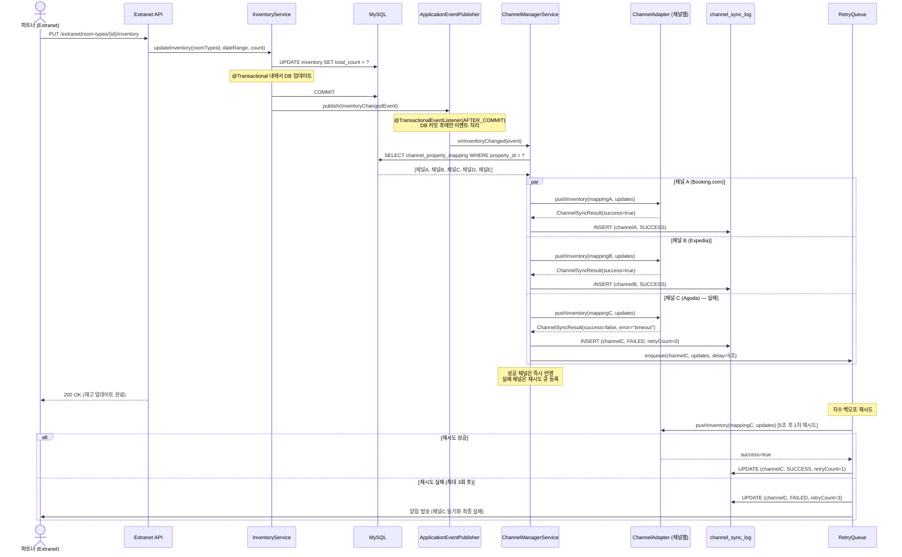
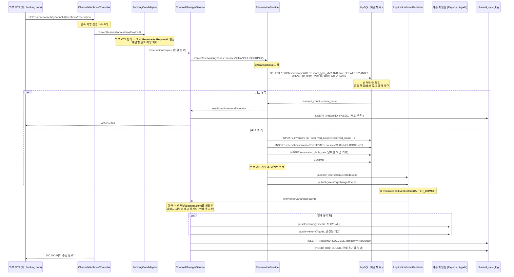
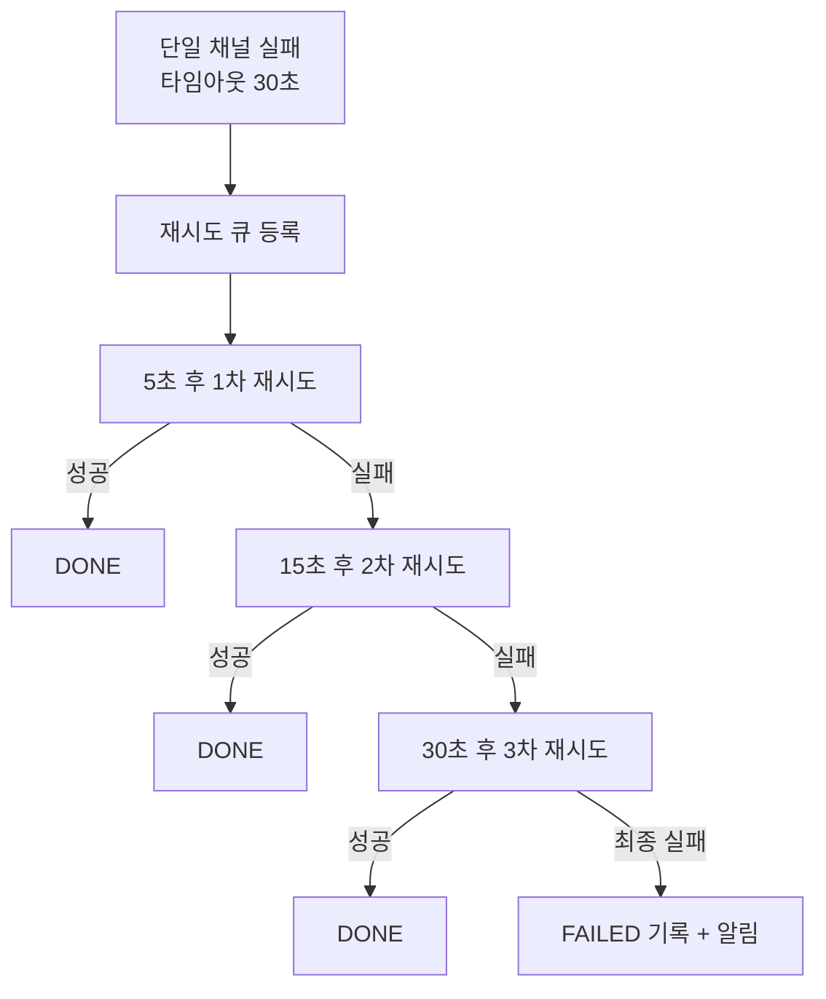

# 06. 채널 매니저 설계

> 상태: DESIGN-ONLY (인터페이스 + Mock 구현체만 BUILD)
> 범위: 자사 숙소를 외부 OTA에 배포하고, 재고/요금/예약을 양방향으로 동기화하는 시스템

---

## 1. 채널 매니저란?

채널 매니저(Channel Manager)는 자사 플랫폼에 등록된 숙소를 Booking.com, Expedia, Agoda 등 외부 OTA(Online Travel Agency)에 동시에 배포하고, 재고와 요금을 실시간으로 동기화하는 시스템이다.

핵심 역할은 두 가지다.

- OUTBOUND (내→외): 자사에서 재고나 요금이 변경되면 매핑된 모든 채널에 즉시 반영한다. 예를 들어 파트너가 Extranet에서 3월 28일 재고를 5개에서 4개로 줄이면, Booking.com과 Expedia의 동일 숙소에도 4개로 자동 업데이트된다
- INBOUND (외→내): 외부 OTA에서 예약이 발생하면 웹훅으로 수신하여, 자사 예약으로 변환하고 재고를 차감한 후 나머지 채널에도 변경된 재고를 동기화한다

채널 매니저가 없으면 같은 객실이 Booking.com과 자사 플랫폼에서 동시에 팔리는 더블 부킹(overbooking)이 발생할 수 있다.

- 채널 매니저는 이 문제를 해결하는 중앙 조율자 역할을 한다

---

## 2. 아키텍처 개요



설계 방향에 대한 고민

- 채널 매니저는 Supplier 연동과 방향이 반대다: Supplier는 외부→내부(상품 가져오기), 채널 매니저는 내부→외부(상품 배포)다
- 그런데 INBOUND 예약 수신처럼 채널 매니저도 양방향이 존재한다
- 따라서 단순히 "OUTBOUND 전용"으로 설계하면 안 되고, 채널별 어댑터가 양방향을 모두 처리할 수 있는 구조가 필요하다

---

## 3. OUTBOUND 흐름 (내→외): 재고/요금 동기화

자사에서 재고나 요금이 변경되면 해당 숙소가 매핑된 모든 채널에 변경 내용을 푸시한다.

### 시퀀스 다이어그램



### 흐름 요약

1. 파트너가 Extranet에서 재고를 수정하면 DB가 업데이트된다.
2. 트랜잭션 커밋 후 `InventoryChangedEvent`가 발행된다 (`@TransactionalEventListener(AFTER_COMMIT)`으로 DB 커밋 보장).
3. `ChannelManagerService`가 해당 숙소에 매핑된 채널 목록을 조회한다.
4. 각 채널의 `ChannelAdapter`에 병렬로 재고 업데이트를 푸시한다.
5. 성공한 채널은 즉시 반영, 실패한 채널은 재시도 큐에 등록하고 `channel_sync_log`에 FAILED 기록한다.
6. 재시도 큐는 지수 백오프(5초→15초→30초, 최대 3회)로 자동 재시도한다.

---

## 4. INBOUND 흐름 (외→내): 외부 예약 수신 및 연쇄 동기화

외부 OTA에서 예약이 발생하면 웹훅으로 수신하여 자사 예약을 생성하고, 변경된 재고를 다른 채널에도 즉시 반영한다.

### 시퀀스 다이어그램



### 연쇄 동기화 고민

INBOUND 예약 수신 후 다른 채널의 재고 동기화(연쇄 동기화)가 실패하면 어떻게 해야 하는가?

보상 트랜잭션 방식: 실패 시 자사 예약을 취소하고 재고를 복원하는 방법이 있다.

- 그러나 이미 외부 OTA에서 예약이 확정된 상태이므로 자사 예약을 되돌리면 오히려 데이터 불일치가 커진다

채택한 방식 — 재시도 큐 + 알림

- 자사 예약은 유지하되, 연쇄 동기화에 실패한 채널만 재시도 큐에 등록한다
- 최대 3회 재시도 후에도 실패하면 운영자에게 알림을 발송하고 수동으로 처리할 수 있는 엔드포인트를 제공한다
- 이것이 보상 트랜잭션보다 훨씬 현실적이다
- 연쇄 동기화 실패로 인해 일시적으로 다른 채널에 재고가 더 많이 보일 수 있지만, 재시도로 빠르게 정상화된다

---

## 5. ERD

채널 매니저 관련 테이블(channel, channel_property_mapping, channel_room_mapping, channel_rate_policy, channel_sync_log)의 상세 컬럼 정의와 DDL은 [03-erd.md](03-erd.md)를 참조한다.

---

## 6. ChannelAdapter 인터페이스 설계 (Java)

채널별로 API 스펙이 다르기 때문에 Strategy 패턴을 적용한다.

- `ChannelAdapter` 인터페이스를 정의하고 채널마다 구현체를 만든다
- 현재 BUILD 범위에서는 Mock 구현체만 제공한다

```java
package com.jaemini.stay.channel.adapter;

import com.fasterxml.jackson.databind.JsonNode;
import com.jaemini.stay.channel.domain.ChannelPropertyMapping;
import java.util.List;

/**
 * 외부 OTA 채널과의 통신을 담당하는 어댑터 인터페이스.
 *
 * 각 채널(Booking.com, Expedia, Agoda 등)은 이 인터페이스를 구현한다.
 * 현재 BUILD 범위: MockChannelAdapter만 구현 (실제 외부 API 호출 없음).
 */
public interface ChannelAdapter {

    /**
     * 이 어댑터가 담당하는 채널 코드.
     * channel 테이블의 code 컬럼과 일치해야 한다.
     * ex) "BOOKING", "EXPEDIA", "AGODA"
     */
    String getChannelCode();

    // ──────────────────────────────────────────
    // OUTBOUND: 자사 → 외부 채널
    // ──────────────────────────────────────────

    /**
     * 재고 변경을 채널에 푸시한다.
     *
     * @param mapping  자사 숙소 ↔ 채널 숙소 매핑 정보
     * @param updates  날짜별 재고 변경 내역
     * @return 동기화 결과 (성공 여부, 에러 메시지 포함)
     */
    ChannelSyncResult pushInventory(ChannelPropertyMapping mapping, List<InventoryUpdate> updates);

    /**
     * 요금 변경을 채널에 푸시한다.
     *
     * @param mapping  자사 숙소 ↔ 채널 숙소 매핑 정보
     * @param updates  날짜별 요금 변경 내역 (채널별 markup 적용 후)
     * @return 동기화 결과
     */
    ChannelSyncResult pushRates(ChannelPropertyMapping mapping, List<RateUpdate> updates);

    // ──────────────────────────────────────────
    // INBOUND: 외부 채널 → 자사
    // ──────────────────────────────────────────

    /**
     * 외부 채널의 예약 웹훅 payload를 자사 예약 요청 형식으로 변환한다.
     *
     * 채널마다 필드명, 날짜 형식, 금액 단위가 다르므로 어댑터에서 정규화한다.
     *
     * @param externalReservation 채널이 전송한 원본 JSON
     * @return 자사 예약 생성에 사용할 InboundReservationRequest
     * @throws ChannelDataConversionException 변환 실패 시 (원본은 sync_log에 보존)
     */
    InboundReservationRequest convertReservation(JsonNode externalReservation);

    // ──────────────────────────────────────────
    // 상태 조회
    // ──────────────────────────────────────────

    /**
     * 해당 채널의 현재 동기화 상태를 확인한다.
     * 채널 API가 살아있는지, 마지막 동기화 시각 등을 확인할 때 사용한다.
     */
    ChannelSyncStatus getSyncStatus(ChannelPropertyMapping mapping);
}
```

```java
package com.jaemini.stay.channel.adapter;

/**
 * 채널 동기화 결과.
 * 성공/실패 여부와 함께 에러 원인, 재시도 횟수를 담는다.
 */
public record ChannelSyncResult(
    boolean success,
    String  channelCode,
    String  errorMessage,   // 실패 시 에러 메시지
    int     retryCount      // 누적 재시도 횟수
) {
    public static ChannelSyncResult success(String channelCode) {
        return new ChannelSyncResult(true, channelCode, null, 0);
    }

    public static ChannelSyncResult failure(String channelCode, String errorMessage, int retryCount) {
        return new ChannelSyncResult(false, channelCode, errorMessage, retryCount);
    }
}
```

```java
package com.jaemini.stay.channel.adapter;

import java.time.LocalDate;

/** 날짜별 재고 변경 내역 */
public record InventoryUpdate(
    String    externalRoomId,  // 채널 측 객실 ID
    LocalDate date,
    int       availableCount   // 변경 후 가용 재고
) {}

/** 날짜별 요금 변경 내역 (markup 적용 완료 후 전달) */
public record RateUpdate(
    String    externalRoomId,
    LocalDate date,
    java.math.BigDecimal price  // 채널에 노출할 최종 요금
) {}
```

```java
package com.jaemini.stay.channel.adapter;

/**
 * Mock 구현체 — 실제 외부 API 호출 없이 성공 응답을 반환한다.
 * BUILD 범위: 이 구현체만 제공. 실제 채널 연동 시 교체.
 */
@Component
public class MockChannelAdapter implements ChannelAdapter {

    @Override
    public String getChannelCode() {
        return "MOCK";
    }

    @Override
    public ChannelSyncResult pushInventory(ChannelPropertyMapping mapping, List<InventoryUpdate> updates) {
        // 실제 API 호출 없이 로그만 남기고 성공 반환
        log.info("[MockChannelAdapter] pushInventory: property={}, updates={}",
                 mapping.getExternalPropertyId(), updates.size());
        return ChannelSyncResult.success(getChannelCode());
    }

    @Override
    public ChannelSyncResult pushRates(ChannelPropertyMapping mapping, List<RateUpdate> updates) {
        log.info("[MockChannelAdapter] pushRates: property={}, updates={}",
                 mapping.getExternalPropertyId(), updates.size());
        return ChannelSyncResult.success(getChannelCode());
    }

    @Override
    public InboundReservationRequest convertReservation(JsonNode externalReservation) {
        // Mock: 외부 payload를 그대로 매핑 (실제 구현 시 채널별 필드 매핑 필요)
        return InboundReservationRequest.fromMockPayload(externalReservation);
    }

    @Override
    public ChannelSyncStatus getSyncStatus(ChannelPropertyMapping mapping) {
        return ChannelSyncStatus.healthy(getChannelCode());
    }
}
```

### 채널 병렬 푸시 패턴 (CompletableFuture)

매핑된 채널이 여러 개일 때 순차 호출하면 채널 수에 비례하여 응답 시간이 늘어난다. `CompletableFuture`로 각 채널에 병렬 푸시하고 결과를 모아서 성공/실패를 판정한다.

```java
@Component
@RequiredArgsConstructor
public class ChannelManagerService {

    private final List<ChannelAdapter> adapters;
    private final Executor channelExecutor; // 채널 전용 스레드풀

    public List<ChannelSyncResult> pushInventoryToAll(
            List<ChannelPropertyMapping> mappings,
            List<InventoryUpdate> updates
    ) {
        List<CompletableFuture<ChannelSyncResult>> futures = mappings.stream()
            .map(mapping -> CompletableFuture.supplyAsync(
                () -> findAdapter(mapping.getChannelCode())
                        .pushInventory(mapping, updates),
                channelExecutor
            ))
            .toList();

        // 모든 채널 완료 대기 후 결과 수집
        CompletableFuture.allOf(futures.toArray(new CompletableFuture[0])).join();

        return futures.stream()
            .map(CompletableFuture::join)
            .toList();
    }
}
```

- `channelExecutor`: 채널 전용 스레드풀로 분리하여 예약/검색 스레드풀에 영향을 주지 않는다
- 각 채널의 타임아웃(30초)은 `ChannelAdapter` 내부에서 HTTP 클라이언트 레벨로 관리한다
- 결과 수집 후 실패한 채널만 재시도 큐에 등록한다

---

## 7. 에러 핸들링 정책

### 타임아웃 및 재시도

| 상황 | 처리 방식 |
|------|----------|
| 단일 채널 API 타임아웃 | 기본 타임아웃 30초. 재시도 큐에 등록 |
| 재시도 스케줄 | 지수 백오프: 5초 후 1차 → 15초 후 2차 → 30초 후 3차 (최대 3회) |
| 3회 재시도 후 최종 실패 | `channel_sync_log`에 FAILED 기록 + 파트너/운영자 알림 발송 |

### 부분 실패 (N개 채널 중 일부 실패)

5개 채널에 동기화할 때 3개는 성공하고 2개가 실패하면:
- 성공한 3개 채널은 즉시 반영한다. 되돌리지 않는다.
- 실패한 2개 채널만 재시도 큐에 등록한다.
- `channel_sync_log`에 전체 결과를 기록한다 (성공 3건 + 실패 2건 + 전체 상태 PARTIAL).

부분 실패를 허용하는 이유: 채널 A의 실패 때문에 채널 B에 이미 반영된 재고를 되돌리면 오히려 더 큰 불일치가 발생한다. 재시도로 최종 일관성(eventual consistency)을 달성하는 것이 현실적이다.

### 전체 실패

모든 채널이 실패하면:
- `channel_sync_log` 전체 FAILED 기록
- 파트너에게 "채널 동기화 실패" 알림
- 수동 재동기화 엔드포인트 제공: `POST /api/channels/{channelId}/push-inventory`

### INBOUND 데이터 변환 실패

외부 채널의 예약 웹훅 데이터 변환에 실패하면:
- 원본 payload를 `channel_sync_log.request_payload`에 그대로 보존한다.
- FAILED 상태로 기록하고 운영자에게 수동 확인 요청 알림을 발송한다.
- 변환 실패 시 자사 예약을 생성하지 않는다 (데이터 오염 방지).

### 에러 핸들링 정책 요약



---

## 8. 채널별 요금 정책 (markup)

자사 요금과 채널에 노출하는 요금이 다를 수 있다. OTA 수수료, 채널별 가격 전략 등을 반영하기 위해 `channel_rate_policy` 테이블에서 채널별 마진을 설정한다.

### PERCENTAGE 방식

```
채널 노출 요금 = 자사 요금 × (1 + markup_value / 100)
예) 자사 요금 100,000원, markup_value=10(%) → 채널 노출 요금 110,000원
```

### FIXED 방식

```
채널 노출 요금 = 자사 요금 + markup_value
예) 자사 요금 100,000원, markup_value=5000(원) → 채널 노출 요금 105,000원
```

요금을 채널에 푸시할 때 `ChannelManagerService`에서 markup을 적용한 후 `ChannelAdapter.pushRates()`를 호출한다. 어댑터 자체는 markup 계산을 알지 못한다.

---

## 9. BUILD 범위 정리

| 항목 | 상태 | 설명 |
|------|------|------|
| `ChannelAdapter` 인터페이스 | BUILD | 위 인터페이스 코드 그대로 구현 |
| `MockChannelAdapter` | BUILD | 실제 외부 호출 없이 성공 응답 반환 |
| `channel_*` 테이블 DDL | BUILD | Flyway 마이그레이션에 포함 |
| 실제 채널 API 호출 | DESIGN-ONLY | Booking.com / Expedia / Agoda 실제 연동 없음 |
| 재시도 큐 스케줄러 | DESIGN-ONLY | 인터페이스 설계만. 실제 스케줄러 없음 |
| 웹훅 수신 컨트롤러 | DESIGN-ONLY | API 명세만. 실제 엔드포인트 구현 없음 |

---

## 10. 연관 문서

- [03-erd.md](03-erd.md) — channel, channel_property_mapping 전체 DDL
- [09-event-architecture.md](09-event-architecture.md) — InventoryChangedEvent, ReservationCreatedEvent
- [10-sequence-diagrams.md](10-sequence-diagrams.md) — 채널 매니저 OUTBOUND/INBOUND 시퀀스 다이어그램 전체
