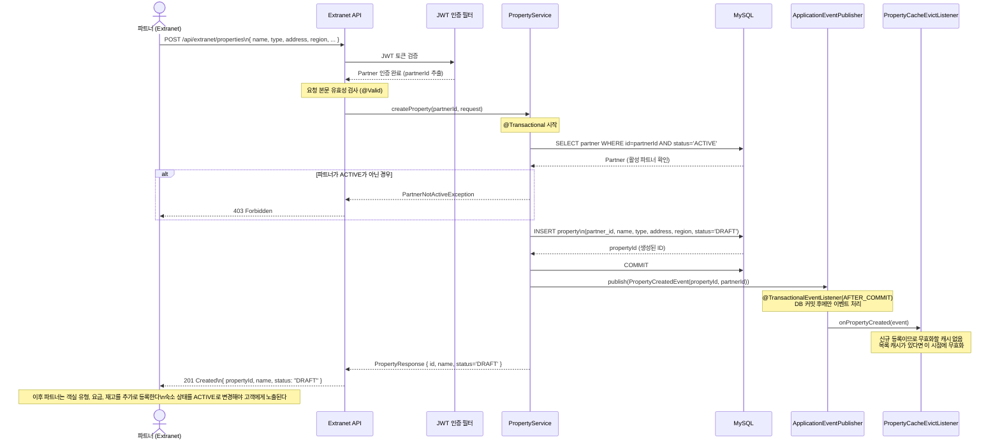
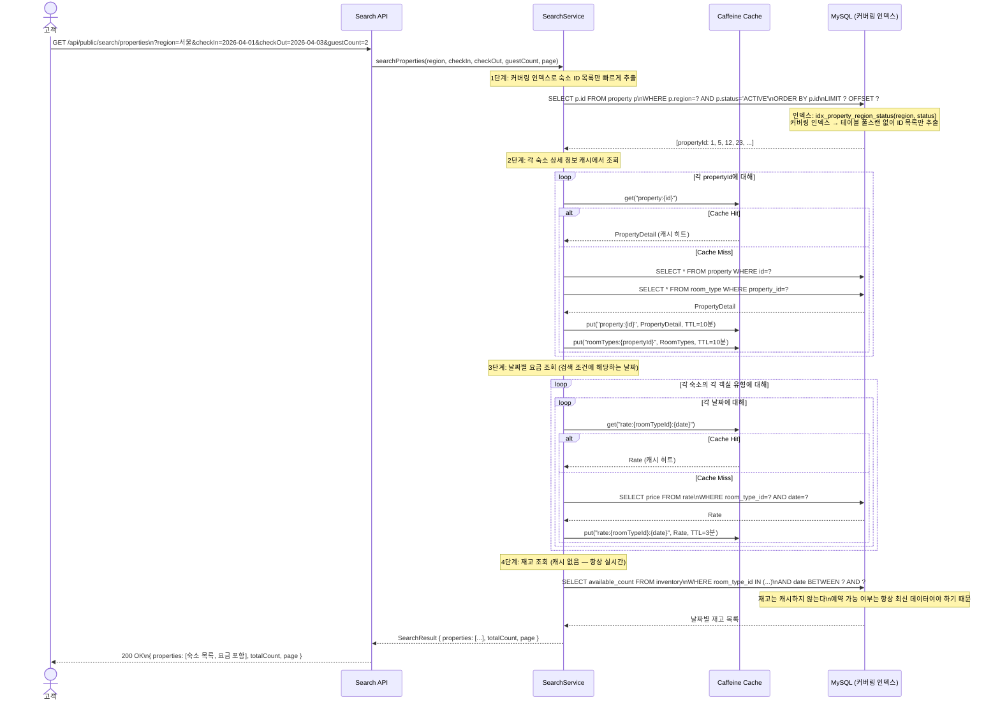
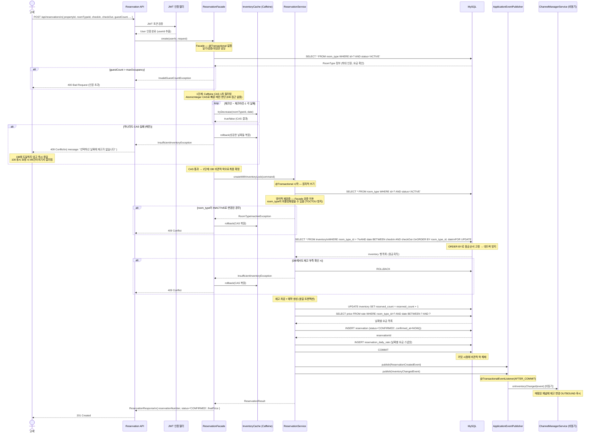
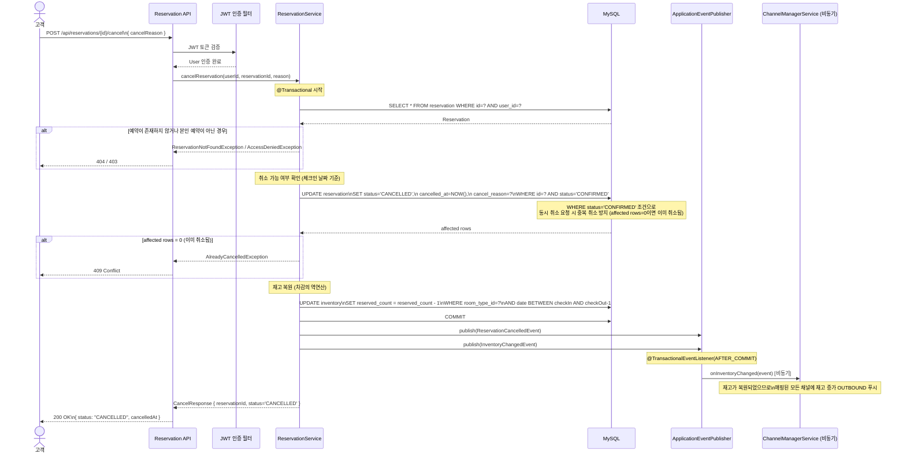
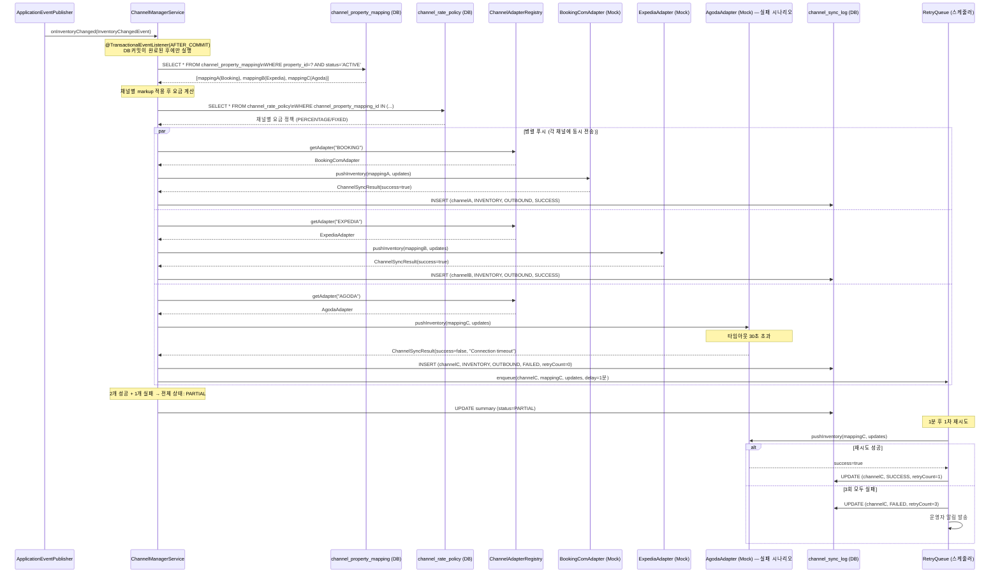
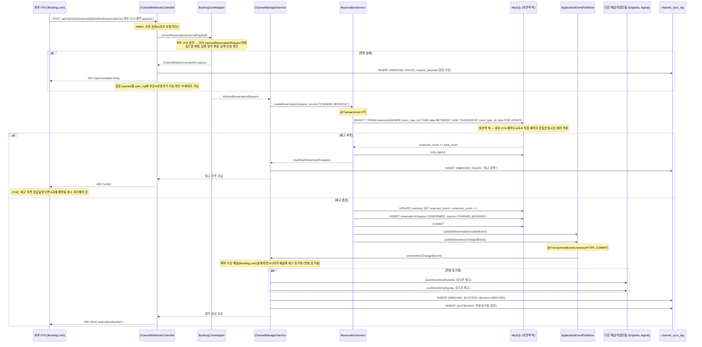
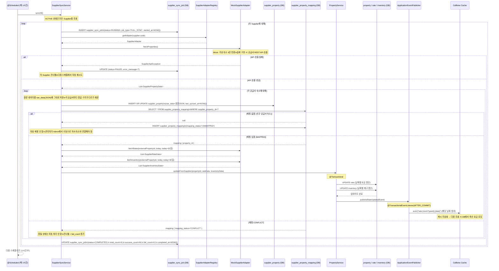

# 07. 주요 시퀀스 다이어그램

> 이 문서는 OTA 플랫폼의 핵심 플로우 7개를 Mermaid 시퀀스 다이어그램으로 정리한다.
> 각 다이어그램 아래에 설계 판단 근거와 주의사항을 함께 기술한다.

---

## 목차

1. [파트너 숙소 등록 플로우](#1-파트너-숙소-등록-플로우)
2. [고객 숙소 검색 플로우](#2-고객-숙소-검색-플로우)
3. [예약 생성 플로우 (핵심)](#3-예약-생성-플로우-핵심)
4. [예약 취소 플로우](#4-예약-취소-플로우)
5. [채널 매니저 OUTBOUND 플로우](#5-채널-매니저-outbound-플로우)
6. [채널 매니저 INBOUND 플로우](#6-채널-매니저-inbound-플로우)
7. [Supplier 배치 동기화 플로우](#7-supplier-배치-동기화-플로우)

---

## 1. 파트너 숙소 등록 플로우

파트너가 Extranet을 통해 숙소를 등록하는 전체 흐름이다. 숙소 등록 후 이벤트를 발행하여 관련 캐시를 무효화한다.

설계 포인트:
- 숙소는 등록 시 `DRAFT` 상태로 생성된다. 파트너가 객실/요금/재고까지 설정하고 `ACTIVE`로 상태를 변경해야 검색에 노출된다.
- JWT 인증 필터에서 `partnerId`를 추출하여 서비스 레이어에 전달한다. 파트너는 자신의 숙소만 등록/수정할 수 있다.
- `PropertyCreatedEvent`는 향후 채널 매니저 초기 배포나 알림에 활용할 수 있다.

---

## 2. 고객 숙소 검색 플로우

고객이 지역, 날짜, 인원으로 숙소를 검색하는 흐름이다. 검색 쿼리는 매번 DB를 호출하되, 개별 숙소/객실 데이터는 Caffeine 캐시에서 제공한다.

설계 포인트:
- `propertySearch` (검색 결과 전체) 캐시를 사용하지 않는 이유: 지역 x 날짜 x 인원 x 페이지 조합이 폭발적으로 늘어나 캐시 히트율이 매우 낮다. 대신 하위 단위(property, roomTypes, rate)로 분해하면 동일 숙소가 다양한 검색에서 재사용되어 히트율이 높아진다.
- 재고만 캐시에서 제외한다. 재고는 예약 발생 시 즉시 변하므로 stale 데이터를 보여주면 고객에게 잘못된 예약 가능 여부를 안내하게 된다.

---

## 3. 예약 생성 플로우 (핵심)

예약 생성은 Caffeine CAS 1차 필터링 → DB 비관적 락 2차 확정의 2단계로 처리된다. Caffeine CAS에서 매진 요청을 JVM 레벨에서 즉시 걸러내어 DB 부하를 최소화하고, 통과한 요청만 DB 비관적 락으로 최종 확정한다.

설계 포인트:
- Caffeine CAS 1차 필터링: `AtomicInteger`의 CAS 연산으로 DB 접근 없이 JVM 레벨에서 매진을 즉시 판단한다. 100 동시 요청 시 99건이 여기서 걸러져 DB에는 1건만 도달한다.
- DB 비관적 락 2차 확정: CAS를 통과한 요청만 `SELECT FOR UPDATE`로 최종 정합성을 보장한다. Caffeine은 pre-filter, DB가 source of truth다.
- Facade 트랜잭션 분리: Facade는 `@Transactional` 없이 읽기/검증/CAS를 처리하고, Service에만 `@Transactional`을 걸어 비관적 락 점유 시간을 최소화한다.
- DB 실패 시 Caffeine 롤백: DB 트랜잭션이 실패하면 Caffeine의 CAS 차감분을 `incrementAndGet()`으로 복원한다.
- ORDER BY 데드락 방지: 멀티 나이트 예약 시 `ORDER BY room_type_id, date`로 잠금 순서를 고정한다.

---

## 4. 예약 취소 플로우

고객이 예약을 취소하면 재고를 복원하고, 채널 매니저를 통해 외부 채널의 재고도 동기화한다.

설계 포인트:
- 취소 시 재고 복원도 트랜잭션 내에서 처리한다. 예약 상태 변경과 재고 복원이 원자적으로 이루어진다.
- 채널 매니저 동기화는 `AFTER_COMMIT` 이후 비동기로 처리한다. 취소 응답 속도에 영향을 주지 않는다.
- 재고 복원 후 `InventoryChangedEvent`를 발행하면 채널 매니저가 모든 외부 채널에 재고 증가를 알린다. 이를 통해 다른 채널에서도 다시 예약이 가능해진다.

---

## 5. 채널 매니저 OUTBOUND 플로우

자사 재고/요금 변경 시 매핑된 모든 외부 채널에 동기화하는 흐름이다.

설계 포인트:
- 채널별 어댑터를 `ChannelAdapterRegistry`(Map 기반)에서 코드로 조회하여 의존성을 느슨하게 유지한다.
- 채널별 markup을 `channel_rate_policy`에서 조회하여 적용한 후 어댑터에 전달한다. 어댑터는 markup 계산을 모른다.
- 모든 채널 푸시는 병렬로 실행한다. 한 채널의 실패가 다른 채널을 블로킹하지 않는다.

---

## 6. 채널 매니저 INBOUND 플로우

외부 OTA에서 예약이 발생하여 웹훅으로 수신하는 흐름이다. 자사 예약을 생성하고, 나머지 채널에 재고를 연쇄 동기화한다.

설계 포인트:
- 외부 OTA 예약도 자사 직접 예약과 완전히 동일한 비관적 락 + 재고 차감 로직을 거친다. 단, `source` 필드에 `CHANNEL:BOOKING` 등 채널 정보를 기록한다.
- 예약 수신 채널(Booking.com)은 연쇄 동기화에서 제외한다. 이미 Booking.com에서 예약이 완료되었으므로 다시 재고를 보낼 필요가 없다.
- 연쇄 동기화 실패는 재시도 큐로 처리한다. 자사 예약은 유지된다.

---

## 7. Supplier 배치 동기화 플로우

외부 공급사의 숙소/요금/재고를 주기적으로 가져와 자사 데이터에 동기화하는 배치 흐름이다.

설계 포인트:
- `supplier_sync_job`으로 모든 배치 실행 이력을 추적한다. 언제 실행되었는지, 몇 건 성공/실패했는지 관리자가 확인할 수 있다.
- 매핑 확인 → UNMAPPED(대기) → 관리자 수동 연결 → MAPPED → 동기화 활성화 순서로 진행된다. 자동 매핑을 하지 않는 이유는 공급사 숙소와 자사 숙소가 같다고 자동으로 판단할 수 없기 때문이다.
- Supplier 데이터 업데이트 후 `RateUpdatedEvent`를 발행하여 캐시를 무효화한다. 고객이 다음 요금 조회 시 최신 데이터를 받는다.
- CONFLICT 상태는 자동으로 해결하지 않는다. 잘못된 자동 처리가 데이터 오염을 일으킬 수 있으므로 반드시 관리자가 판단한다.

---

## 참고: 시퀀스 다이어그램 범례

| 표기 | 의미 |
|------|------|
| `[비동기]` | 메인 플로우와 독립적으로 실행. 응답 시간에 영향 없음 |
| `@TransactionalEventListener(AFTER_COMMIT)` | DB 커밋 완료 후에만 이벤트 처리 |
| `FOR UPDATE` | 비관적 락. 트랜잭션 커밋까지 해당 행 잠금 |
| `DESIGN-ONLY` | 설계 범위. 실제 구현 없음 |
| `Mock` | 외부 API 대신 가상 데이터 반환하는 테스트/개발용 구현체 |

---

## 연관 문서

- [04-concurrency.md](04-concurrency.md) — 비관적 락 상세 전략, 낙관적 락 vs 비관적 락 비교
- [05-cache-strategy.md](05-cache-strategy.md) — Caffeine 캐시 전략, 캐시 무효화 정책
- [06-event-architecture.md](06-event-architecture.md) — 도메인 이벤트 목록, 발행/구독 구조
