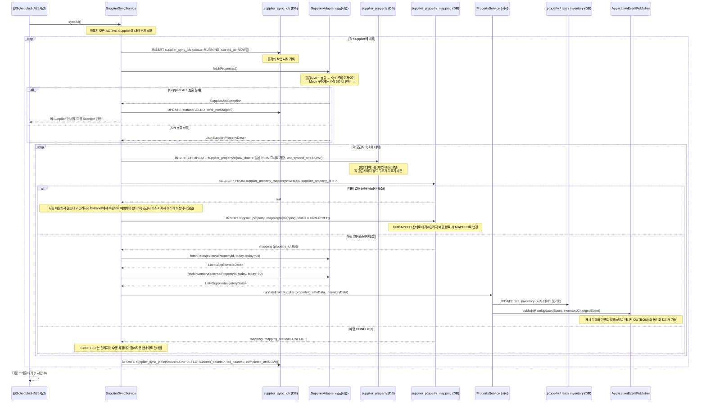
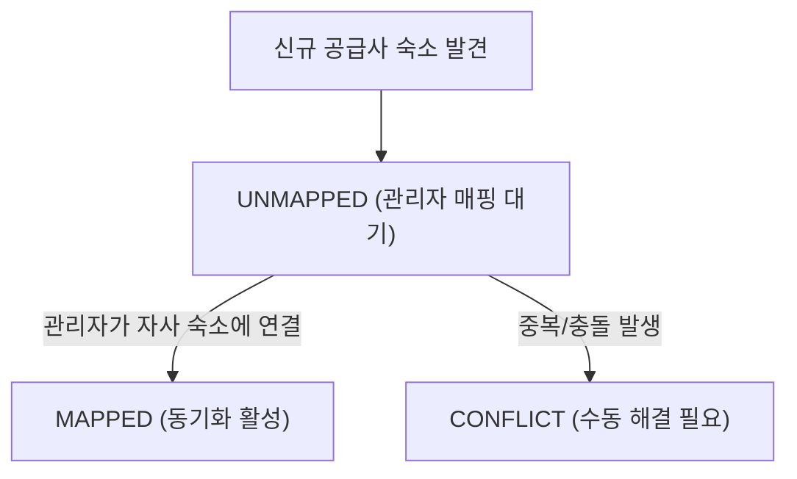

# 07. 외부 공급자(Supplier) 연동 설계

> 상태: PARTIAL BUILD (인터페이스 + Mock 구현체 + 수동 동기화 API + 매핑된 숙소의 요금/재고 동기화 구현. 실제 배치 및 외부 API 호출 없음)
> 범위: 외부 숙소 공급사의 상품을 가져와 자사 플랫폼에 통합하는 시스템

---

## 1. Supplier 연동이란?

Supplier 연동은 외부 숙소 공급사(Supplier)가 보유한 숙소/객실/요금/재고 데이터를 주기적으로 가져와 자사 플랫폼에 통합하는 시스템이다.

- 자사가 직접 파트너를 모집하지 않아도, 이미 다른 공급사에 등록된 숙소를 자사 플랫폼에서 판매할 수 있다
- 자사 플랫폼의 숙소 공급을 외부 공급사를 통해 확대하는 것이 목적이다

채널 매니저와의 방향 비교:

| 구분 | 방향 | 설명 |
|------|------|------|
| 채널 매니저 (OUTBOUND) | 내→외 | 자사 숙소를 외부 OTA에 배포 |
| Supplier 연동 (PULL) | 외→내 | 외부 공급사 숙소를 자사에 가져오기 |

방향이 반대지만 둘 다 "외부 시스템과 데이터를 동기화한다"는 본질은 같다. 그래서 어댑터 패턴을 공통으로 사용한다.

---

## 2. 동기화 방식

### PULL (배치) vs PUSH (웹훅)

| 방식 | 동작 | 장점 | 단점 | 적용 |
|------|------|------|------|------|
| PULL (배치) | 자사 스케줄러가 주기적으로 Supplier API를 호출해 데이터를 가져옴 | 자사가 타이밍을 제어할 수 있음. 구현 단순 | 실시간 반영 불가 (최대 동기화 주기만큼 지연) | 숙소 정보, 요금 (시간 단위 배치) |
| PUSH (웹훅) | Supplier가 변경 발생 시 자사 웹훅 엔드포인트로 알림 | 변경 즉시 반영 가능. 불필요한 API 호출 없음 | Supplier 측 웹훅 지원 필요 | 재고 변경, 예약 상태 (지원 시) |

설계 결정: 본 프로젝트 범위에서는 PULL 배치 방식만 설계한다.

- PUSH 방식은 실시간성이 필요한 경우에 추가하면 되지만, 모든 Supplier가 웹훅을 지원하는 것은 아니다
- 배치는 어떤 Supplier든 API만 제공하면 동작하므로 범용성이 높다
- 실제 서비스에서는 PULL로 기본 동기화를 하고, 웹훅을 지원하는 Supplier는 PUSH를 추가로 활성화하는 하이브리드 방식이 일반적이다

---

## 3. 배치 동기화 플로우 (PULL)

### 시퀀스 다이어그램



### 플로우 단계별 설명

1단계 — 스케줄러 실행: `@Scheduled(fixedDelay = 3600000)` 또는 cron 표현식으로 매 1시간 실행된다. 각 Supplier의 `sync_interval` 설정을 참조하여 실행 여부를 결정할 수도 있다.

2단계 — Supplier API 호출: `SupplierAdapter.fetchProperties()`로 공급사의 숙소 목록을 가져온다. 실제 구현 시 공급사별 REST API, SOAP, FTP 등 다양한 방식을 지원해야 한다.

3단계 — raw_data 저장: 공급사 원본 데이터를 `supplier_property.raw_data(JSON)`에 그대로 저장한다.

원본을 저장하는 이유:

- 각 공급사마다 데이터 구조가 완전히 다르다 (공급사 A는 `hotel_name`, 공급사 B는 `propertyTitle`)
- 매핑 로직이 잘못되어 자사 데이터에 오염이 발생했을 때, 원본에서 다시 변환(재처리)할 수 있다
- 공급사 API 스펙 변경 시 디버깅에도 유리하다

4단계 — 매핑 확인: 기존 매핑이 있으면 자사 숙소 데이터를 업데이트하고, 없으면 UNMAPPED 상태로 대기한다.

5단계 — 자사 데이터 업데이트: 매핑된 숙소에 한해 rate, inventory를 업데이트한다. 이벤트를 발행하여 캐시 무효화와 채널 매니저 동기화를 트리거한다.

6단계 — 이력 기록: `supplier_sync_job`에 성공/실패 건수를 기록한다.

---

## 4. ERD

Supplier 관련 테이블(supplier, supplier_property, supplier_property_mapping, supplier_sync_job)의 상세 컬럼 정의와 DDL은 [03-erd.md](03-erd.md)를 참조한다.

### 매핑 상태 전이



---

## 5. SupplierAdapter 인터페이스 설계 (Java)

```java
package com.jaemini.stay.supplier.adapter;

import java.time.LocalDate;
import java.util.List;

/**
 * 외부 공급사와의 통신을 담당하는 어댑터 인터페이스.
 *
 * 각 공급사(Supplier A, B, C 등)는 이 인터페이스를 구현한다.
 * 현재 BUILD 범위: MockSupplierAdapter만 구현. 실제 외부 API 호출 없음.
 */
public interface SupplierAdapter {

    /**
     * 이 어댑터가 담당하는 공급사 코드.
     * supplier 테이블의 code 컬럼과 일치해야 한다.
     */
    String getSupplierCode();

    // ──────────────────────────────────────────
    // PULL: 공급사 → 자사 (데이터 가져오기)
    // ──────────────────────────────────────────

    /**
     * 공급사의 전체 숙소 목록을 가져온다.
     *
     * 반환값은 공급사 원본 데이터를 자사 DTO로 1차 변환한 것이다.
     * DB에 저장 시에는 raw_data(JSON)에 원본도 함께 저장한다.
     *
     * @return 공급사 숙소 데이터 목록
     * @throws SupplierApiException 공급사 API 호출 실패 시
     */
    List<SupplierPropertyData> fetchProperties();

    /**
     * 특정 숙소의 날짜별 요금을 가져온다.
     *
     * @param externalPropertyId  공급사 측 숙소 ID
     * @param from                조회 시작 날짜
     * @param to                  조회 종료 날짜
     * @return 날짜별 요금 데이터 목록
     */
    List<SupplierRateData> fetchRates(String externalPropertyId, LocalDate from, LocalDate to);

    /**
     * 특정 숙소의 날짜별 재고를 가져온다.
     *
     * @param externalPropertyId  공급사 측 숙소 ID
     * @param from                조회 시작 날짜
     * @param to                  조회 종료 날짜
     * @return 날짜별 재고 데이터 목록
     */
    List<SupplierInventoryData> fetchInventory(String externalPropertyId, LocalDate from, LocalDate to);

    // ──────────────────────────────────────────
    // 공급사 숙소 예약 (자사에서 공급사로 예약 전송)
    // 자사 고객이 공급사 숙소를 예약할 때 공급사 시스템에도 예약을 등록한다
    // ──────────────────────────────────────────

    /**
     * 공급사 시스템에 예약을 생성한다.
     *
     * @param request  예약 생성 요청 정보
     * @return 공급사 예약 번호 등 결과
     */
    SupplierBookingResult createBooking(SupplierBookingRequest request);

    /**
     * 공급사 시스템에서 예약을 취소한다.
     *
     * @param externalBookingId  공급사 측 예약 ID
     * @return 취소 결과
     */
    SupplierBookingResult cancelBooking(String externalBookingId);
}
```

```java
package com.jaemini.stay.supplier.adapter;

import java.math.BigDecimal;
import java.time.LocalDate;

/** 공급사에서 가져온 숙소 기본 정보 */
public record SupplierPropertyData(
    String       externalPropertyId,
    String       name,
    String       address,
    String       region,
    String       type,           // 숙소 유형 (공급사 기준)
    JsonNode     rawData         // 공급사 원본 응답 전체 (raw_data 저장용)
) {}

/** 공급사에서 가져온 날짜별 요금 */
public record SupplierRateData(
    String       externalRoomId,
    LocalDate    date,
    BigDecimal   price,
    String       currency        // KRW, USD 등 (환율 변환이 필요할 수 있음)
) {}

/** 공급사에서 가져온 날짜별 재고 */
public record SupplierInventoryData(
    String    externalRoomId,
    LocalDate date,
    int       availableCount
) {}

/** 공급사 예약 생성/취소 결과 */
public record SupplierBookingResult(
    boolean success,
    String  externalBookingId,   // 공급사 예약 번호
    String  errorMessage
) {}
```

```java
package com.jaemini.stay.supplier.adapter;

/**
 * Mock 구현체 — 실제 외부 API 호출 없이 가상 데이터를 반환한다.
 * BUILD 범위: 이 구현체만 제공. 실제 공급사 연동 시 교체.
 */
@Component
public class MockSupplierAdapter implements SupplierAdapter {

    @Override
    public String getSupplierCode() {
        return "MOCK_SUPPLIER";
    }

    @Override
    public List<SupplierPropertyData> fetchProperties() {
        log.info("[MockSupplierAdapter] fetchProperties 호출 — 가상 숙소 3건 반환");
        return List.of(
            new SupplierPropertyData("EXT-001", "목업 호텔 A", "서울 강남구", "서울", "HOTEL", mockRawData("EXT-001")),
            new SupplierPropertyData("EXT-002", "목업 펜션 B", "강원 속초시", "강원", "PENSION", mockRawData("EXT-002")),
            new SupplierPropertyData("EXT-003", "목업 리조트 C", "제주 서귀포시", "제주", "RESORT", mockRawData("EXT-003"))
        );
    }

    @Override
    public List<SupplierRateData> fetchRates(String externalPropertyId, LocalDate from, LocalDate to) {
        log.info("[MockSupplierAdapter] fetchRates: property={}, {}~{}", externalPropertyId, from, to);
        // 날짜 범위 전체에 대해 고정 요금 반환
        return from.datesUntil(to.plusDays(1))
            .map(date -> new SupplierRateData("EXT-ROOM-001", date, BigDecimal.valueOf(120000), "KRW"))
            .toList();
    }

    @Override
    public List<SupplierInventoryData> fetchInventory(String externalPropertyId, LocalDate from, LocalDate to) {
        log.info("[MockSupplierAdapter] fetchInventory: property={}", externalPropertyId);
        return from.datesUntil(to.plusDays(1))
            .map(date -> new SupplierInventoryData("EXT-ROOM-001", date, 5))
            .toList();
    }

    @Override
    public SupplierBookingResult createBooking(SupplierBookingRequest request) {
        String mockBookingId = "MOCK-BK-" + System.currentTimeMillis();
        log.info("[MockSupplierAdapter] createBooking → externalBookingId={}", mockBookingId);
        return new SupplierBookingResult(true, mockBookingId, null);
    }

    @Override
    public SupplierBookingResult cancelBooking(String externalBookingId) {
        log.info("[MockSupplierAdapter] cancelBooking: externalBookingId={}", externalBookingId);
        return new SupplierBookingResult(true, externalBookingId, null);
    }
}
```

---

## 6. 설계 고민 포인트

### 배치가 정말 필요한가?

처음에는 "굳이 별도의 배치 작업이 필요한가? 이벤트 기반으로 처리할 수 없나?"라는 의문이 있었다.

결론은 PULL 방식에서 배치는 필수다. 공급사가 먼저 데이터 변경을 알려주지 않는 이상, 자사가 주기적으로 끌어와야 한다. 이를 이벤트 기반으로 처리하려면 공급사가 웹훅(PUSH)을 지원해야 하는데, 모든 공급사가 지원하는 것은 아니다. 따라서 PULL 배치를 기본으로 하고, PUSH 웹훅을 지원하는 공급사에 대해서는 선택적으로 추가하는 구조가 현실적이다.

본 프로젝트 범위에서는 PULL 배치 설계만으로 충분하다.

### 왜 자동 매핑을 하지 않는가?

공급사 숙소를 가져올 때 자사 숙소와 자동으로 매핑하면 편리하지 않을까?

자동 매핑을 하지 않는 이유는 정확도다. 공급사 A의 "서울 강남 호텔"과 자사의 "강남 럭셔리 호텔"이 같은 숙소인지 이름만으로는 판단할 수 없다. 잘못 매핑되면 다른 숙소의 재고와 요금이 뒤섞이는 심각한 오류가 발생한다. 관리자가 직접 확인하고 연결하는 것이 안전하다. 자동 매핑 후보를 추천하는 기능(이름/주소 유사도 기반)은 UX 보조 도구로 제공할 수 있지만, 최종 확정은 사람이 한다.

### raw_data를 JSON으로 저장하는 이유

각 공급사마다 API 응답 구조가 완전히 다르다. 모든 공급사 데이터를 하나의 정규화된 스키마에 맞추려면 공급사가 늘어날수록 스키마 변경이 잦아진다. 대신 원본을 JSON으로 그대로 저장하고, 매핑 로직(`SupplierAdapter`)에서 자사 모델로 변환하면 다음과 같은 이점이 있다:

1. 공급사 API 스펙 변경 시 어댑터 코드만 수정하면 된다.
2. 재처리가 필요할 때 원본 데이터에서 다시 변환할 수 있다.
3. 공급사별 특수 필드를 잃지 않고 보존할 수 있다.

단점은 JSON 컬럼 검색이 느리다는 점이다. 하지만 `supplier_property`는 배치 처리용이므로 실시간 검색 성능이 중요하지 않다. 검색이 필요한 경우 정규화된 컬럼(`external_property_id`, `supplier_id`)으로 찾고, 상세 데이터는 JSON에서 꺼내는 패턴으로 충분하다.

---

## 7. 에러 핸들링

### 공급사 API 호출 실패

| 상황 | 처리 |
|------|------|
| 네트워크 오류 / 타임아웃 | `supplier_sync_job`에 FAILED 기록. 다음 스케줄에서 자동 재시도 |
| 인증 실패 (401/403) | FAILED 기록 + 운영자 알림 (API key 갱신 필요) |
| 공급사 API 일시 중단 | FAILED 기록. 다음 배치 주기에 자동 재시도 |
| 일부 숙소만 변환 실패 | 실패 건은 건너뛰고 계속 처리. `fail_count` 증가. 전체 job은 COMPLETED 또는 PARTIAL |

### 매핑 충돌

동일한 공급사 숙소가 두 개의 자사 숙소에 매핑되려는 경우 CONFLICT 상태로 설정하고 관리자 알림을 발송한다. 자동으로 해결하지 않는다.

### 재고/요금 업데이트 실패

자사 DB 업데이트 중 실패하면 해당 숙소만 `fail_count`에 반영하고 나머지는 계속 처리한다. 개별 실패는 로그에 기록하여 재처리가 가능하도록 한다.

---

## 8. API 명세 (DESIGN-ONLY)

| Method | Endpoint | 설명 |
|--------|----------|------|
| POST | `/api/suppliers/{supplierId}/sync` | 수동 동기화 트리거 (즉시 실행) |
| GET | `/api/suppliers/{supplierId}/properties` | 공급사 숙소 목록 (매핑 상태 포함) |
| POST | `/api/suppliers/{supplierId}/properties/{externalId}/map` | 자사 숙소에 수동 매핑 |
| DELETE | `/api/suppliers/{supplierId}/properties/{externalId}/map` | 매핑 해제 |
| GET | `/api/suppliers/{supplierId}/sync-jobs` | 동기화 이력 조회 |

---

## 9. BUILD 범위 정리

| 항목 | 상태 | 설명 |
|------|------|------|
| `SupplierAdapter` 인터페이스 | BUILD | 위 인터페이스 코드 그대로 구현 |
| `MockSupplierAdapter` | BUILD | 가상 데이터 반환 |
| `supplier_*` 테이블 DDL | BUILD | Flyway 마이그레이션에 포함 |
| 수동 동기화 API (`POST /suppliers/{id}/sync`) | BUILD | 즉시 실행 트리거 엔드포인트 구현 |
| 동기화 → property/rate/inventory 저장 로직 | BUILD | 매핑된 숙소의 요금·재고를 자사 테이블에 반영 |
| 통합 검색에 Supplier 상품 노출 | BUILD | 동일 property 테이블 저장 후 검색 API에서 노출 |
| 실제 공급사 API 호출 | DESIGN-ONLY | 실제 외부 API 없음 |
| `@Scheduled` 자동 배치 실행 | DESIGN-ONLY | 스케줄러 설계만. 실제 실행 없음 |
| 웹훅(PUSH) 수신 | DESIGN-ONLY | PUSH 방식 설계만. 엔드포인트 구현 없음 |

---

## 10. 연관 문서

- [03-erd.md](03-erd.md) — supplier, supplier_property, supplier_property_mapping, supplier_sync_job 전체 DDL
- [09-event-architecture.md](09-event-architecture.md) — SupplierSyncCompletedEvent, RateUpdatedEvent
- [10-sequence-diagrams.md](10-sequence-diagrams.md) — Supplier 배치 동기화 시퀀스 다이어그램 전체
