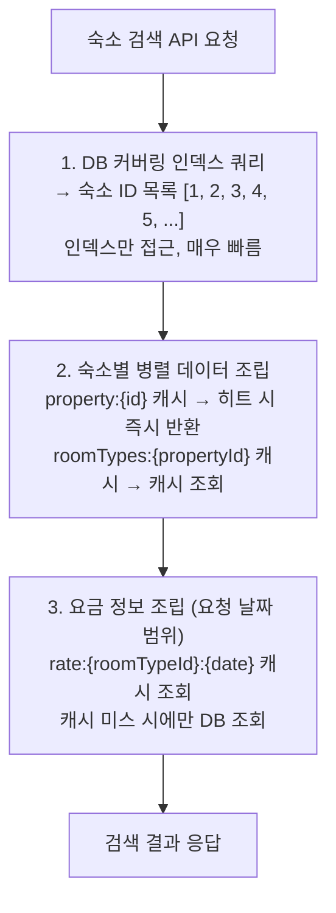
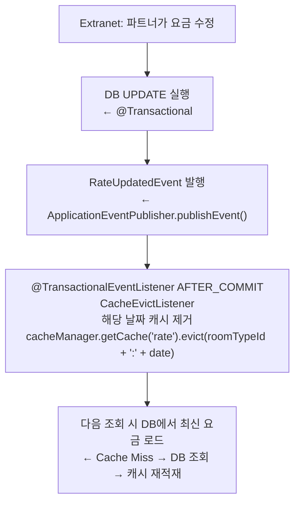
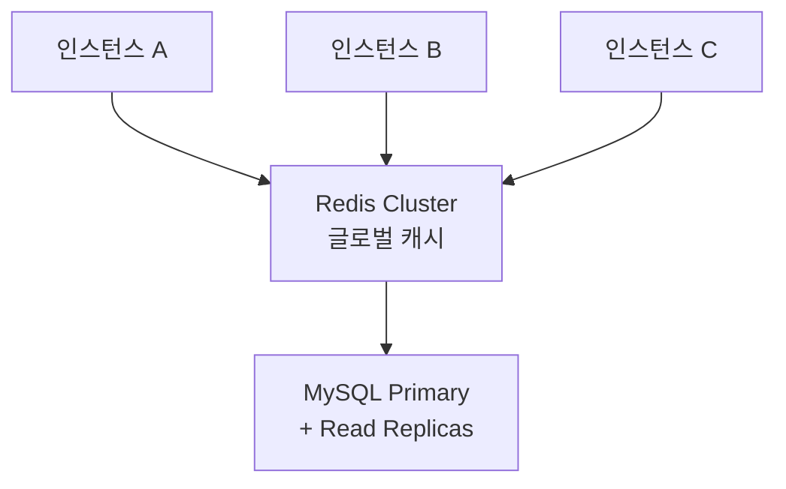

# 08. 캐시 전략

> 관련 문서: [05-concurrency.md](./05-concurrency.md), [09-event-architecture.md](./09-event-architecture.md)

---

## 1. 왜 캐시가 필요한가

### 1.1 대규모 요금 조회의 특성

숙소 검색 페이지에서 고객은 날짜 범위를 선택하고 여러 숙소의 요금을 동시에 확인한다. 이 패턴은 다음과 같은 읽기 부하를 만들어낸다.

- 한 페이지에 숙소 20개 표시 → 숙소당 평균 3개 객실 유형 → 30일 요금 조회 → 1회 페이지 로드 = 최대 1,800개 rate 행 조회
- 동시 사용자 100명이면 초당 수만 건의 SELECT가 DB로 몰린다
- 요금 데이터는 자주 변경되지 않는다 (파트너가 수동으로 설정, 일 단위 갱신이 일반적)

요금 데이터의 특성(낮은 변경 빈도, 높은 읽기 빈도)은 캐싱의 전형적인 적용 시나리오다.

### 1.2 재고는 캐싱하지 않는다

반면 재고(inventory)는 캐싱하지 않는다.

- 예약 가능 여부를 잘못 표시하는 것은 요금을 잠시 stale하게 보여주는 것보다 비즈니스 영향이 훨씬 크다
- 캐시에서 "예약 가능"으로 표시되었다가 실제 예약 시 실패하면 고객 경험이 크게 저하된다
- 재고는 예약 생성/취소 시마다 즉시 변하며 예측이 어렵다
- 재고는 비관적 락으로 보호되는 정합성 핵심 데이터다

따라서 재고는 항상 DB에서 실시간 조회한다. 정합성 우선 원칙을 캐시 히트율보다 우선한다.

---

## 2. 로컬 캐시 선택: Caffeine

### 2.1 선택 근거

이 프로젝트는 단일 인스턴스 애플리케이션을 전제로 한다.

- 단일 인스턴스에서는 JVM 내 로컬 캐시(Caffeine)로 충분하며, Redis 같은 외부 캐시 서버는 불필요한 인프라 복잡도를 추가한다

| 항목 | Caffeine (선택) | Redis |
|------|----------------|-------|
| 구성 복잡도 | Spring Boot 자동 구성, 의존성 추가만으로 동작 | 별도 서버 운영 필요 |
| 응답 속도 | 나노초 (JVM 내 메모리 접근) | 수백 마이크로초 ~ 수 밀리초 (네트워크 I/O) |
| 단일 장애점 | 없음 (JVM과 동일 프로세스) | Redis 장애 시 캐시 전체 불능 |
| 멀티 인스턴스 정합성 | 인스턴스 간 캐시 불일치 발생 | 모든 인스턴스가 동일 캐시 공유 |
| 본 프로젝트 환경 적합성 | 최적 | 본 프로젝트 범위 초과 |

글로벌 캐시(Redis)로 Extranet / Admin 서버와 캐시 정합성을 유지하는 것이 이상적인 아키텍처이지만, 단일 인스턴스 환경이므로 로컬 캐시 + 이벤트 기반 무효화로 충분히 대응 가능하다.


### 2.2 Spring Boot + Caffeine 구성

```yaml
# application.yml
spring:
  cache:
    type: caffeine
    caffeine:
      spec: maximumSize=100,expireAfterWrite=600s  # 기본값, 캐시별 오버라이드

cache:
  property:
    ttl-seconds: 600    # 10분
    max-size: 5000
  room-types:
    ttl-seconds: 600    # 10분
    max-size: 5000
  rate:
    ttl-seconds: 180    # 3분
    max-size: 30000
```

```java
@Configuration
@EnableCaching
public class CacheConfig {

    @Bean
    public CacheManager cacheManager() {
        CaffeineCacheManager manager = new CaffeineCacheManager();
        manager.setCacheNames(List.of("property", "roomTypes", "rate"));

        // 캐시별 개별 설정
        Map<String, Caffeine<Object, Object>> specs = Map.of(
            "property",  Caffeine.newBuilder().maximumSize(5_000).expireAfterWrite(10, MINUTES),
            "roomTypes", Caffeine.newBuilder().maximumSize(5_000).expireAfterWrite(10, MINUTES),
            "rate",      Caffeine.newBuilder().maximumSize(30_000).expireAfterWrite(3, MINUTES)
        );
        // 각 캐시 등록
        ...
        return manager;
    }
}
```

---

## 3. 캐시 대상: 하위 단위 설계

### 3.1 캐시 구성 전체 개요

| 캐시명 | 키 패턴 | TTL | 최대 크기 | 대상 데이터 | 무효화 트리거 |
|--------|---------|-----|----------|-------------|--------------|
| `property` | `property:{id}` | 10분 | 5,000 | 숙소 기본 정보 (이름, 주소, 설명, 이미지) | `PropertyUpdatedEvent` |
| `roomTypes` | `roomTypes:{propertyId}` | 10분 | 5,000 | 숙소별 객실 유형 목록 | `RoomTypeUpdatedEvent` |
| `rate` | `rate:{roomTypeId}:{date}` | 3분 | 30,000 | 날짜별 요금 단가 | `RateUpdatedEvent` |

### 3.2 property 캐시

숙소 기본 정보(이름, 주소, 지역, 설명, 체크인/아웃 시간, 이미지 URL 등)는 파트너가 수정하지 않는 한 변경이 없다.

- TTL 10분은 수정 반영 지연을 허용하는 대신 높은 캐시 히트율을 얻는 트레이드오프다

```java
@Cacheable(cacheNames = "property", key = "#propertyId")
public PropertyDto getProperty(Long propertyId) {
    return propertyRepository.findById(propertyId)
        .map(PropertyDto::from)
        .orElseThrow(() -> new PropertyNotFoundException(propertyId));
}
```

### 3.3 roomTypes 캐시

한 숙소의 객실 유형 목록은 검색 결과 조립 시 반복적으로 필요하다. 숙소 ID를 키로 객실 목록 전체를 캐시하면 여러 날짜 요금 조회에서 재사용된다.

```java
@Cacheable(cacheNames = "roomTypes", key = "#propertyId")
public List<RoomTypeDto> getRoomTypes(Long propertyId) {
    return roomTypeRepository.findByPropertyId(propertyId)
        .stream()
        .map(RoomTypeDto::from)
        .toList();
}
```

### 3.4 rate 캐시

날짜별 요금은 가장 세분화된 캐시 단위다.

- TTL을 3분으로 짧게 설정한 이유는 파트너가 즉시 요금을 변경했을 때 빠르게 반영되어야 하기 때문이다
- 키를 `{roomTypeId}:{date}` 단위로 설계했기 때문에 특정 날짜의 요금이 변경될 때 해당 날짜만 무효화하면 된다
- 예를 들어 3월 28일 요금만 변경해도 3월 29일, 30일 캐시는 유지된다

```java
@Cacheable(cacheNames = "rate", key = "#roomTypeId + ':' + #date")
public RateDto getRate(Long roomTypeId, LocalDate date) {
    return ratePolicyRepository.findByRoomTypeIdAndDate(roomTypeId, date)
        .map(RateDto::from)
        .orElse(RateDto.notAvailable());
}
```

### 3.5 재고는 캐싱하지 않는다

```java
// 재고 조회는 항상 DB에서 실시간으로
public InventoryDto getInventory(Long roomTypeId, LocalDate date) {
    // @Cacheable 없음 - 의도적
    return inventoryRepository.findByRoomTypeIdAndDate(roomTypeId, date)
        .map(InventoryDto::from)
        .orElseThrow();
}
```

### 재고 캐시 (InventoryCache) — 동시성 제어용

요금 조회용 캐시와 별도로, 예약 동시성 처리를 위한 재고 전용 캐시를 운영한다.

- 이 캐시는 단순 조회 캐시가 아니라, CAS(Compare-And-Swap) 연산으로 원자적 재고 차감을 수행하는 동시성 제어 도구이다

| 항목 | 값 |
|------|-----|
| 키 | `{roomTypeId}:{date}` |
| 값 | `AtomicInteger` (가용 재고 수) |
| 용도 | 예약 요청의 1차 필터 (DB 접근 전 빠른 매진 판단) |
| 워밍업 | `@PostConstruct`에서 DB inventory 테이블 로드 |
| 무효화 | Extranet 재고 변경 시 `InventoryChangedEvent`로 동기화 |

이 캐시는 TTL 기반이 아니라 이벤트 기반으로만 갱신된다. 재고는 실시간 정합성이 필수이므로 TTL 만료에 의한 stale 데이터를 허용하지 않는다.

상세 플로우는 [05-concurrency.md](05-concurrency.md)의 "Caffeine CAS + DB 비관적 락 2단계 전략" 참조.

---

## 4. 검색 결과를 통째로 캐시하지 않는 이유

### 4.1 조합 폭발 문제

검색 파라미터를 키로 검색 결과를 캐시하면 키의 경우의 수가 폭발한다.

```
지역 (시/도 단위): 17가지
체크인 날짜: 365가지
체크아웃 날짜: 체크인 기준 1~14박 = 14가지
인원: 1~8명 = 8가지
페이지: 1~N

→ 17 × 365 × 14 × 8 × N = 700,000 × N 가지
```

이 경우 캐시 히트율은 극히 낮다(동일한 지역 + 날짜 + 인원 + 페이지 조합이 반복될 가능성이 낮음). 캐시 공간만 낭비하고 실효성이 없다.

### 4.2 검색은 DB 커버링 인덱스로 대응

검색 자체의 성능은 DB 커버링 인덱스로 해결한다. 검색 쿼리는 인덱스만으로 숙소 ID 목록을 빠르게 추출하고, 상세 정보는 하위 캐시(property, roomTypes, rate)에서 조립한다.

```sql
-- 커버링 인덱스: (region, status, id)
-- SELECT 절의 모든 컬럼이 인덱스에 포함 → 테이블 접근 없이 인덱스만으로 결과 반환
CREATE INDEX idx_property_search ON property (region, status, id);

-- 검색 쿼리: 인덱스만으로 숙소 ID 목록 추출
SELECT p.id
FROM property p
WHERE p.region = :region
  AND p.status = 'ACTIVE'
ORDER BY p.id
LIMIT :size OFFSET :offset;
```

이후 각 숙소 ID로 `property:{id}` 캐시를 조회하면 대부분 캐시 히트가 발생한다. 동일 숙소는 다른 날짜/인원 검색에서도 반복 조회되기 때문이다.

### 4.3 검색 결과 조립 흐름



---

## 5. 캐시 정합성: 이벤트 기반 무효화

### 5.1 정합성 전략의 선택

TTL만으로 캐시를 관리하면, 파트너가 요금을 수정했을 때 최대 TTL 시간(rate는 3분) 동안 stale 데이터가 고객에게 노출된다. 이는 요금 오표시로 이어질 수 있다.

이벤트 기반 무효화가 1차 방어선이다. 파트너가 Extranet에서 요금을 수정하는 순간 캐시를 즉시 제거한다. TTL은 이벤트 무효화가 실패하거나 누락된 경우를 대비한 2차 안전망 역할이다.

### 5.2 무효화 흐름



### 5.3 이벤트별 캐시 무효화 대상

| 이벤트 | 무효화 캐시 키 | 비고 |
|--------|--------------|------|
| `PropertyUpdatedEvent` | `property:{propertyId}` | 숙소 기본 정보 변경 |
| `RoomTypeUpdatedEvent` | `roomTypes:{propertyId}` + `property:{propertyId}` | 객실 수정 시 숙소 캐시도 무효화 |
| `RateUpdatedEvent` | `rate:{roomTypeId}:{date}` (변경된 날짜 범위 전체) | 날짜 범위 일괄 무효화 |
| `InventoryChangedEvent` | 무효화 없음 | 재고는 캐싱하지 않음 |
| `SupplierSyncCompletedEvent` | 동기화된 숙소의 property + roomTypes + rate | 배치 동기화 후 전체 갱신 |

### 5.4 CacheEvictListener 구현 패턴

```java
@Component
@RequiredArgsConstructor
public class CacheEvictListener {

    private final CacheManager cacheManager;

    @TransactionalEventListener(phase = TransactionPhase.AFTER_COMMIT)
    public void onPropertyUpdated(PropertyUpdatedEvent event) {
        evict("property", "property:" + event.propertyId());
    }

    @TransactionalEventListener(phase = TransactionPhase.AFTER_COMMIT)
    public void onRoomTypeUpdated(RoomTypeUpdatedEvent event) {
        evict("roomTypes", "roomTypes:" + event.propertyId());
        evict("property", "property:" + event.propertyId());
    }

    @TransactionalEventListener(phase = TransactionPhase.AFTER_COMMIT)
    public void onRateUpdated(RateUpdatedEvent event) {
        // 변경된 날짜 범위 전체 무효화
        event.affectedDates().forEach(date ->
            evict("rate", event.roomTypeId() + ":" + date)
        );
    }

    private void evict(String cacheName, String key) {
        Cache cache = cacheManager.getCache(cacheName);
        if (cache != null) {
            cache.evict(key);
        }
    }
}
```

---

## 6. 고민 포인트

### 6.1 로컬 캐시의 한계와 수용 가능 범위

글로벌 캐시(Redis)로 Extranet/Admin과 정합성을 유지하는 것이 이상적이지만, 단일 인스턴스 환경이므로 로컬 캐시 + 이벤트 무효화로 충분하다.

- 단일 프로세스 내에서 이벤트를 발행하고 동일 프로세스 내 캐시를 무효화하는 것은 완전히 결정적이다
- 멀티 인스턴스 환경에서 로컬 캐시는 인스턴스 간 불일치 문제가 생긴다
- 인스턴스 A에서 요금을 변경하면 A의 캐시는 무효화되지만 B, C 인스턴스의 캐시는 TTL이 만료될 때까지 stale 상태다
- 이는 Redis Pub/Sub 또는 메시지 큐로 해결해야 하며, 프로덕션 확장 시 고려 사항으로 문서에 명시한다

### 6.2 TTL 설정의 트레이드오프

TTL만으로는 변경 후 최대 TTL만큼 stale 데이터가 노출된다.

- 이벤트 기반 무효화가 1차 방어, TTL은 2차 안전망이다
- TTL을 너무 짧게 설정하면 캐시 효과가 줄어든다
- 너무 길게 설정하면 stale 노출 시간이 늘어난다
- 현재 설정(property 10분, rate 3분)은 파트너의 일반적인 요금 수정 패턴(일 단위 수정)을 고려한 균형점이다
- 이벤트 무효화가 정상 동작한다면 TTL은 사실상 안전망에 불과하므로 짧게 설정할 필요도 없다

### 6.3 캐시 워밍업 (선택적 최적화)

애플리케이션 재시작 직후에는 캐시가 비어있어 초기 요청들이 모두 DB를 타게 된다.

- 인기 숙소 상위 N개를 시작 시 미리 캐시에 적재(warm-up)하면 Cold Start 성능을 개선할 수 있다
- 현재 구현에서는 생략하고, 운영 환경에서 필요 시 `@EventListener(ApplicationReadyEvent.class)`로 구현한다

---

## 7. 프로덕션 확장 시 캐시 아키텍처

단일 인스턴스에서 멀티 인스턴스로 확장할 때의 전환 경로:

### 7.1 2단계: Redis + Cache-Aside 패턴



- Caffeine을 L1(로컬), Redis를 L2(글로벌)로 계층화
- 이벤트 무효화는 Redis Pub/Sub으로 전파 (모든 인스턴스에 동시 반영)
- Read Replica로 요금 조회 쿼리 분산

### 7.2 3단계: 검색 엔진 도입

대규모 트래픽에서 검색 쿼리 복잡도가 증가하면(다중 필터, 정렬, 위치 기반 검색 등) Elasticsearch 또는 OpenSearch를 검색 전용 레이어로 도입한다. 숙소/객실/요금 데이터를 비정규화하여 인덱싱하고, 검색은 전적으로 검색 엔진에서 처리한다. DB는 정합성 소스(Source of Truth)로만 사용한다.
