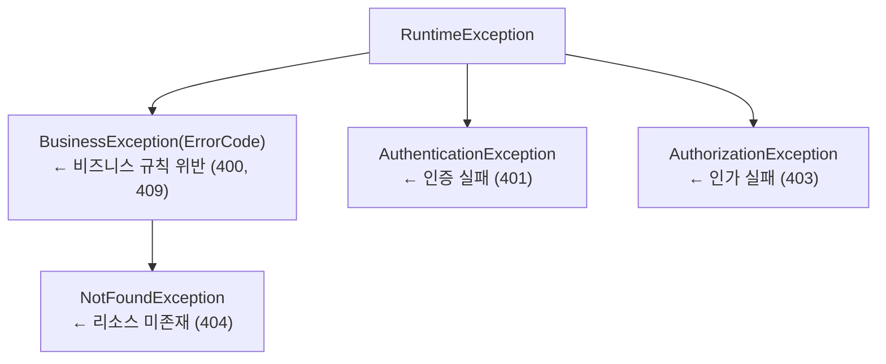

# 에러 처리 및 로깅 전략

> 작성일: 2026-03-28

---

## 1. 에러 처리 전략

### 설계 목표

에러 처리에서 가장 중요한 것은 일관성이다.

- 클라이언트가 어떤 API를 호출하든 응답 구조가 동일해야 한다
- 에러 코드만 보고도 어떤 상황인지 파악할 수 있어야 한다
- 서비스 계층에서 발생한 예외가 HTTP 상태 코드로 자연스럽게 매핑되어야 한다

---

### 1-1 예외 계층 구조

예외는 크게 "비즈니스 규칙 위반"과 "인증/인가 실패"로 나뉜다.

- 두 범주는 성격이 다르고 HTTP 상태 코드도 달라진다
- 별개의 계층으로 분리하여 `ApiControllerAdvice`에서 독립적으로 처리한다



#### BusinessException

비즈니스 규칙 위반의 최상위 예외다. `ErrorCode` enum을 필수로 받아, 에러 코드 없는 예외가 생성되는 것을 컴파일 타임에 방지한다.


####  NotFoundException

리소스가 존재하지 않는 경우는 `BusinessException`의 하위 타입으로 별도 분리한다.

- `ApiControllerAdvice`에서 이 타입을 먼저 매칭하여 404로 응답한다
- 상위 `BusinessException`은 400으로 떨어진다
- 상속 구조를 활용한 예외 라우팅이다

#### AuthenticationException / AuthorizationException

인증과 인가는 비즈니스 로직과 성격이 다르다.

- Spring Security 필터 레벨에서도 발생할 수 있고, 서비스 레이어에서 명시적으로 던질 수도 있다
- `BusinessException`과 별개 계층으로 두어 `ApiControllerAdvice`에서 독립적으로 처리한다

---

### 1-2 ApiControllerAdvice
[ApiControllerAdvice.java](../../backend/src/main/java/com/javabom/spring/reservation/common/exception/ApiControllerAdvice.java)
모든 예외를 한 곳에서 처리한다. 예외 타입에 따라 HTTP 상태 코드와 로그 레벨이 달라진다.


예외 타입별 HTTP 상태 코드 매핑 요약

| 예외 타입 | HTTP 상태 | 로그 레벨 |
|----------|----------|---------|
| `NotFoundException` | 404 | INFO |
| `BusinessException` (일반) | 400 | WARN |
| `BusinessException` (중복 예약) | 409 | WARN |
| `AuthenticationException` | 401 | INFO |
| `AuthorizationException` | 403 | INFO |
| `MethodArgumentNotValidException` | 400 | INFO |
| `Exception` (fallback) | 500 | ERROR |

> 설계 결정: 비즈니스 예외의 기본 상태 코드를 400으로 두고, 충돌(DUPLICATE_RESERVATION)만 409로 분기했다.
> - 처음에는 에러 코드마다 HTTP 상태를 ErrorCode enum에 넣는 방식도 고려했으나, 그렇게 하면 ErrorCode가 HTTP 계층을 알게 된다
> - HTTP 상태 코드 결정은 presentation 계층의 관심사이므로 `ApiControllerAdvice`에 `resolveBusinessStatus()` 메서드로 격리했다

---

### 1-3 ErrorCode enum (숙박 도메인)

`{DOMAIN}_{PROBLEM}` 형식으로 정의한다. 클라이언트가 에러 코드 문자열만 보고도 어떤 도메인의 어떤 상황인지 파악할 수 있도록 한다.

도메인별 예외 사용 예시:

```java
// NotFoundException 계열 (404)
throw new NotFoundException(ErrorCode.PROPERTY_NOT_FOUND);
throw new NotFoundException(ErrorCode.RESERVATION_NOT_FOUND);

// BusinessException 계열 (400)
throw new BusinessException(ErrorCode.INVENTORY_INSUFFICIENT);
throw new BusinessException(ErrorCode.RESERVATION_ALREADY_CANCELLED);
throw new BusinessException(ErrorCode.INVALID_DATE_RANGE);

// BusinessException 계열 (409)
throw new BusinessException(ErrorCode.DUPLICATE_RESERVATION);
```

---

### 1-4 ApiBaseResponse 구조

성공 응답 예시

```json
{
  "result": "SUCCESS",
  "data": {
    "id": 1,
    "name": "한강뷰 호텔",
    "region": "서울"
  },
  "error": null
}
```

에러 응답 예시

```json
{
  "result": "ERROR",
  "data": null,
  "error": {
    "code": "INVENTORY_INSUFFICIENT",
    "message": "선택한 날짜에 객실이 매진되었습니다."
  }
}
```

> 고민 포인트: `ResultType` enum으로 변경했다. `boolean`은 성공/실패 두 가지 상태만 표현할 수 있지만, `ResultType` enum은 향후 `PARTIAL_SUCCESS` 같은 중간 상태를 추가할 수 있다는 확장성이 있다. 또한 클라이언트가 `"result": "SUCCESS"` 문자열로 분기하면 코드가 더 명시적이다.

---

## 2. 로깅 전략

### 2-1 설계 목표

로그는 두 가지 목적을 동시에 달성해야 한다.

- 개발 중: 디버깅을 위한 상세한 정보가 필요하다.
- 운영 중: 장애 감지와 비즈니스 이벤트 추적이 목적이다.
- 로그 레벨 정책과 구조화된 포맷으로 이 두 목적을 모두 충족한다.

---

### 2-2 로그 레벨 정책

| 레벨 | 사용 기준 | 예시 |
|------|----------|------|
| ERROR | 시스템 장애, 예상치 못한 예외 (500) | DB 연결 실패, NPE, 외부 API 타임아웃 |
| WARN | 주의가 필요한 비즈니스 예외 | 재고 부족 빈발, 파트너 정지 계정 접근 시도 |
| INFO | 정상 비즈니스 플로우, 예상된 클라이언트 오류 | 예약 생성/취소/확정, 404/401/403 응답 |
| DEBUG | 상세 디버깅 정보 | 쿼리 파라미터, 캐시 히트/미스, 락 획득 대기 |

`ApiControllerAdvice`에서 예외 타입에 따라 로그 레벨을 결정하는 이유가 여기 있다.

- 404나 401은 클라이언트 실수이므로 INFO로 충분하다.
- ERROR로 남기면 모니터링 알림이 오발령된다.
- 반면 예상치 못한 `Exception`은 반드시 ERROR와 스택 트레이스를 남겨야 한다.

---

### 2-3 구조화된 로깅 (Structured Logging)

#### MDC [(Mapped Diagnostic Context)](../../backend/src/main/java/com/jemini/stayhost/common/filter/MdcLoggingFilter.java)

요청별로 `traceId`와 `userId`를 MDC에 주입한다.

- 하나의 예약 요청이 여러 서비스 메서드를 거칠 때 모든 로그가 동일한 `traceId`를 공유한다
- 로그를 흐름 단위로 묶어볼 수 있다

```java
// common/filter/MdcLoggingFilter.java
@Component
@Order(Ordered.HIGHEST_PRECEDENCE)
public class MdcLoggingFilter extends OncePerRequestFilter {

    private static final String TRACE_ID = "traceId";
    private static final String USER_ID = "userId";

    @Override
    protected void doFilterInternal(final HttpServletRequest request,
                                    final HttpServletResponse response,
                                    final FilterChain filterChain) throws ServletException, IOException {
        try {
            MDC.put(TRACE_ID, UUID.randomUUID().toString().substring(0, 8));
            // JWT 파싱 후 userId 주입 (SecurityContext에서 추출)
            final String userId = extractUserId(request);
            if (userId != null) {
                MDC.put(USER_ID, userId);
            }
            filterChain.doFilter(request, response);
        } finally {
            MDC.clear();    // 반드시 정리: 스레드 풀 재사용 시 오염 방지
        }
    }
}
```

#### JSON 포맷 로그 [(logback-spring.xml)](../../backend/src/main/resources/logback-spring.xml)

로그를 JSON으로 출력하면 ELK 스택이나 CloudWatch Logs Insights에서 필드별 쿼리가 가능해진다.

- 현재는 파일과 콘솔에 출력하지만, JSON 구조를 미리 갖춰두면 향후 중앙 로그 수집 도입이 설정 변경만으로 가능하다


운영 환경에서 출력되는 JSON 로그 예시:

```json
{
  "timestamp": "2026-03-28T14:23:45.123+09:00",
  "level": "WARN",
  "logger": "c.j.s.common.exception.ApiControllerAdvice",
  "message": "[INVENTORY_INSUFFICIENT] 선택한 날짜에 객실이 매진되었습니다.",
  "traceId": "a3f9b1c2",
  "userId": "42",
  "thread": "http-nio-8080-exec-3"
}
```

---

### 로그 포인트

어디서 로그를 남길 것인지 기준을 정한다.

- 과도한 로그는 노이즈가 된다
- 부족한 로그는 장애 대응을 어렵게 한다

---

### 로그 포인트 요약

| 로그 포인트 | 레벨 | 위치 |
|-----------|------|------|
| API 요청/응답 (메서드, URI, 상태코드) | INFO | `MdcLoggingFilter` |
| API 요청 바디/파라미터 | DEBUG | `MdcLoggingFilter` |
| 예약 생성/취소/확정 | INFO | `BookingService` |
| 재고 부족 충돌 | WARN | `InventoryService` |
| 비즈니스 예외 처리 | WARN | `ApiControllerAdvice` |
| 인증/인가 실패, 404 | INFO | `ApiControllerAdvice` |
| 캐시 히트/미스 | DEBUG | `SearchService` |
| 외부 API 호출 성공/실패 | INFO / ERROR | Channel/Supplier Adapter |
| 예상치 못한 서버 오류 | ERROR | `ApiControllerAdvice` |

---

### [AOP 요청/응답 로깅](../../backend/src/main/java/com/jemini/stayhost/common/aop/ApiLoggingAop.java)

`MdcLoggingFilter`는 URI와 상태 코드만 남긴다. 요청/응답 바디까지 로깅하려면 AOP를 활용한다.

- 모든 Controller 메서드에 자동 적용 (presentation.controller 패키지 대상)
- 요청/응답 바디를 JSON으로 직렬화하여 로깅
- 민감 필드는 마스킹 처리 (아래 개인정보 마스킹 참조)

---

### [MdcTaskDecorator](../../backend/src/main/java/com/jemini/stayhost/common/config/MdcTaskDecorator.java) (비동기 MDC 전파)

채널 매니저의 `CompletableFuture` 병렬 처리, `@Async` 이벤트 리스너 등 별도 스레드에서 실행되는 작업은 부모 스레드의 MDC가 전파되지 않는다. `MdcTaskDecorator`로 해결한다.

적용 대상:

- 채널 매니저 전용 스레드풀 (`channelExecutor`)
- 이벤트 리스너 스레드풀 (`@Async` 사용 시)
- 기타 비동기 작업 스레드풀

MdcTaskDecorator가 없으면 채널 매니저 스레드에서 `traceId`가 비어있어 로그 추적이 불가능하다. 채널 동기화 실패 시 원인 요청을 역추적할 수 없게 된다.

---

### 개인정보 마스킹

AOP 요청/응답 로깅 시 민감 필드가 로그에 노출되지 않도록 마스킹한다.

기본 원칙:
- 로그에는 식별자(userId, reservationId)만 남긴다
- 이름, 전화번호, 이메일 등은 로그에 포함하지 않는다
- AOP 로깅에서 요청/응답 바디를 직렬화할 때 민감 필드를 자동 마스킹한다

[마스킹 방식](../../backend/src/main/java/com/jemini/stayhost/common/logging/MaskField.java): `@MaskField` 커스텀 어노테이션


[마스킹 유틸](../../backend/src/main/java/com/jemini/stayhost/common/logging/LogMaskingUtils.java): `@MaskField`가 붙은 필드를 감지하여 마스킹된 값으로 교체하는 유틸리티 클래스


AOP에서 직렬화 시 `@MaskField`가 붙은 필드를 감지하여 마스킹된 값으로 교체한 후 로깅한다. 원본 객체는 변경하지 않는다.

---

### 고민 포인트

ELK 스택 / CloudWatch 중앙 로그 수집

ELK(Elasticsearch + Logstash + Kibana) 스택이나 AWS CloudWatch Logs를 도입하면 traceId로 전체 요청 흐름을 시각적으로 추적할 수 있고, 특정 에러 코드의 발생 빈도를 대시보드로 볼 수 있다. 그러나 이는 본 프로젝트 범위를 벗어나는 인프라 투자다.

대신 이번 설계에서 JSON 구조화 로그를 미리 적용해 두었다. 향후 Logstash나 CloudWatch Logs Agent를 연결하는 것은 logback 설정 변경만으로 가능하다.

`@TransactionalEventListener`와 로그 타이밍

예약 생성 후 `RESERVATION_CREATED` 이벤트를 발행하고 리스너에서 Channel Manager에 동기화하는 흐름에서, 트랜잭션 커밋 전과 후 중 어디서 로그를 남길 것인가를 고민했다. 결론은 커밋 후(`AFTER_COMMIT`)에 INFO 로그를 남기는 것이다. 트랜잭션이 롤백되면 예약이 실제로 생성된 것이 아니므로 `RESERVATION_CREATED` 로그가 있으면 오해의 소지가 있다.
