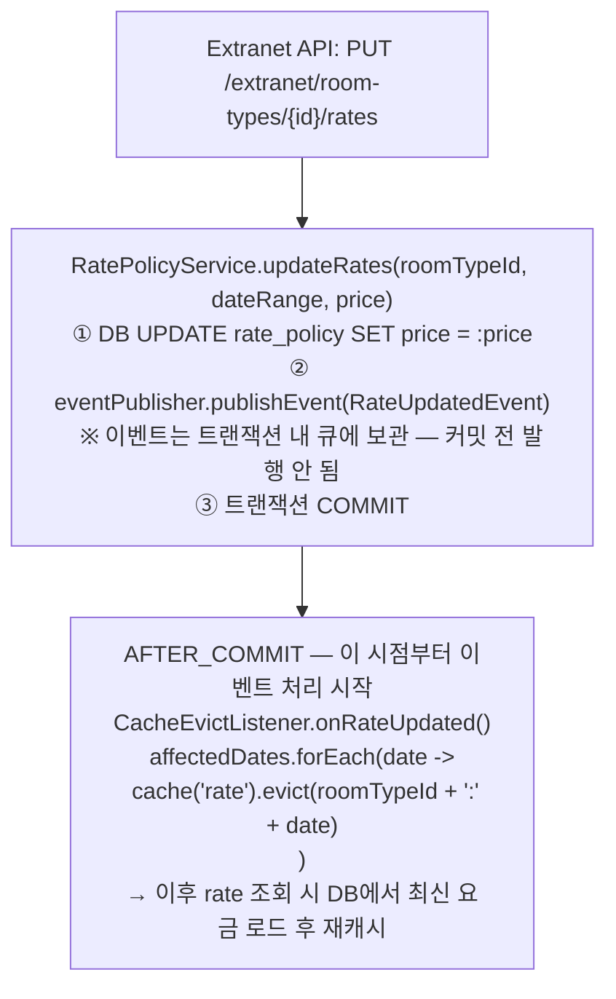
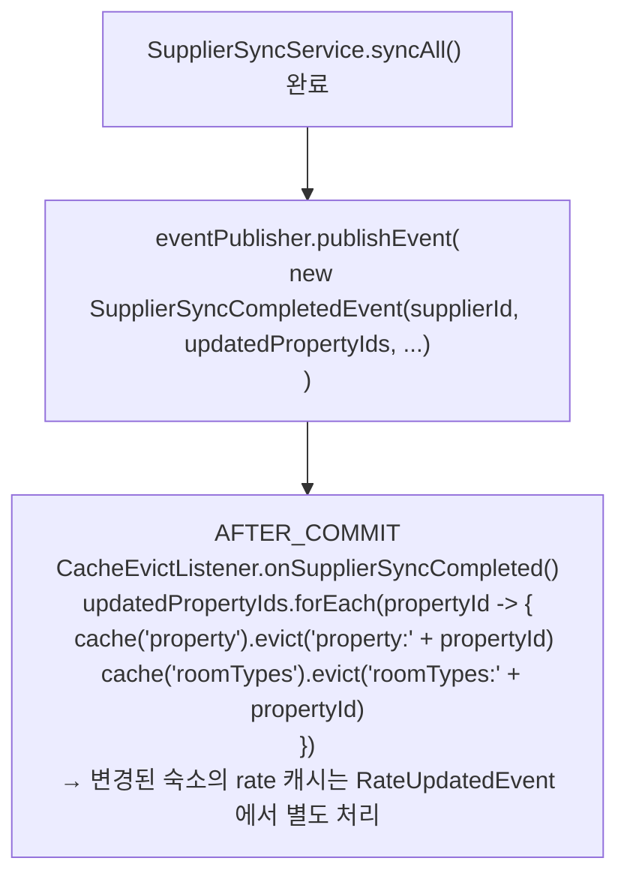
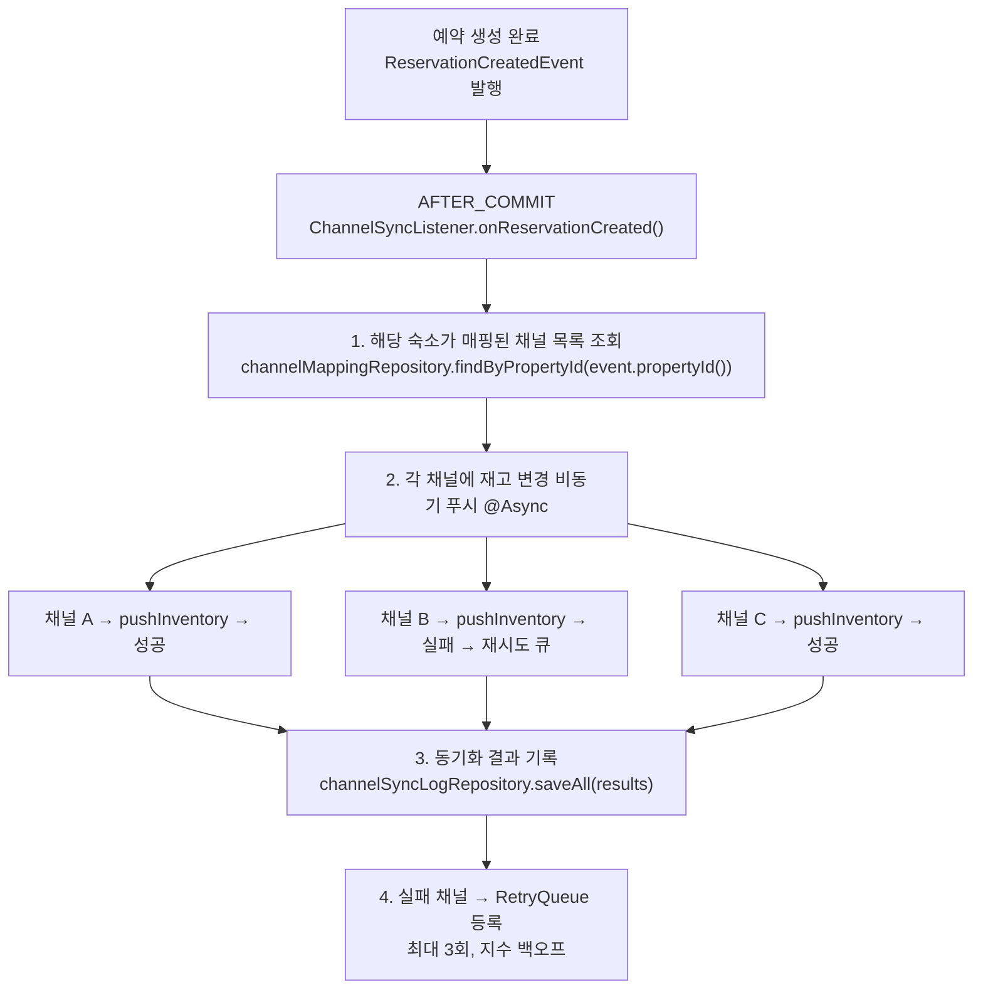
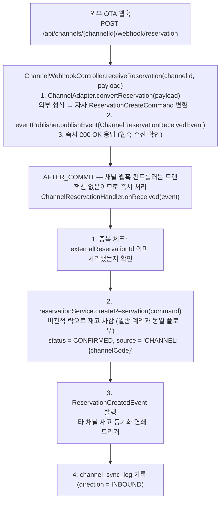

# 09. 이벤트 기반 아키텍처

> 관련 문서: [05-concurrency.md](./05-concurrency.md), [08-cache-strategy.md](./08-cache-strategy.md)

---

## 1. Spring ApplicationEvent 선택 근거

### 1.1 Kafka / RabbitMQ와의 비교

| 항목 | Spring ApplicationEvent (선택) | Kafka / RabbitMQ |
|------|-------------------------------|-----------------|
| 설치/운영 | 추가 인프라 없음 (JVM 내 동작) | 별도 브로커 서버 운영 필요 |
| 트랜잭션 연계 | `@TransactionalEventListener`로 DB 커밋과 원자적 연계 | Transactional Outbox Pattern 등 별도 구현 필요 |
| 메시지 순서 보장 | 발행 순서 = 처리 순서 (동기 처리 시) | 파티션 내 보장, 파티션 간 불보장 |
| 메시지 영속성 | 없음 (인메모리 — 처리 실패 시 유실 가능) | 있음 (브로커에 디스크 저장) |
| 멀티 인스턴스 이벤트 전파 | 발행한 인스턴스 내부에서만 처리 | 모든 소비자 인스턴스에 전파 |
| 본 프로젝트 환경 적합성 | 최적 | 본 프로젝트 범위 초과 |

단일 모듈, 단일 인스턴스 환경에서 Kafka를 도입하는 것은 과도한 복잡도다.

- Spring ApplicationEvent는 동일 JVM 내에서 느슨한 결합(이벤트 발행자가 구독자를 모름)을 구현하면서 DB 트랜잭션과 자연스럽게 연계된다

### 1.2 @TransactionalEventListener 선택 이유

일반 `@EventListener`는 트랜잭션 내에서 이벤트가 발행되면 트랜잭션이 아직 커밋되지 않은 상태에서 구독자 로직이 실행된다.

- 예약 생성 이벤트를 처리해 채널에 재고 변경을 알리는데, 만약 그 직후 트랜잭션이 롤백되면 채널에는 잘못된 재고 정보가 전달된 상태가 된다

`@TransactionalEventListener(phase = AFTER_COMMIT)`은 DB 커밋이 완료된 후에만 이벤트를 처리한다.

- 데이터가 확정된 후에 부수 효과(캐시 무효화, 채널 동기화 등)를 처리하므로, 커밋 전 롤백에 의한 불일치 문제를 원천 방지한다

```java
// 잘못된 패턴: 트랜잭션 중간에 처리되어 롤백 시 불일치 발생
@EventListener
public void onReservationCreated(ReservationCreatedEvent event) { ... }

// 올바른 패턴: 커밋 후 처리 보장
@TransactionalEventListener(phase = TransactionPhase.AFTER_COMMIT)
public void onReservationCreated(ReservationCreatedEvent event) { ... }
```

트랜잭션 롤백 시에는 이벤트 자체가 발행되지 않는다(AFTER_COMMIT이므로). 이는 의도된 동작이다.

---

## 2. 도메인 이벤트 목록

### 2.1 전체 이벤트 목록

| 이벤트 | 발행 주체 | 발행 시점 | 구현 여부 |
|--------|----------|----------|----------|
| `PropertyCreatedEvent` | PropertyService | 숙소 신규 등록 완료 | BUILD |
| `PropertyUpdatedEvent` | PropertyService | 숙소 정보 수정 완료 | BUILD |
| `RoomTypeUpdatedEvent` | RoomTypeService | 객실 유형 수정 완료 | BUILD |
| `RateUpdatedEvent` | RatePolicyService | 요금 변경 완료 | BUILD |
| `InventoryChangedEvent` | InventoryService | 재고 수량 변경 (예약/취소/파트너 수동 변경) | BUILD (캐시 부분) / DESIGN (채널 동기화) |
| `ReservationCreatedEvent` | ReservationService | 예약 CONFIRMED 생성 완료 | BUILD |
| `ReservationCancelledEvent` | ReservationService | 예약 취소 완료 | BUILD |
| `ChannelReservationReceivedEvent` | ChannelWebhookController | 외부 OTA 웹훅 수신 | DESIGN-ONLY |
| `SupplierSyncCompletedEvent` | SupplierSyncService | 배치 동기화 완료 | DESIGN-ONLY |

### 2.2 이벤트 클래스 설계

이벤트는 불변(immutable) record로 설계한다.

- ID만 담고 상세 데이터는 구독자가 필요 시 조회하는 방식도 있지만, 이벤트 발행 시점의 스냅샷 데이터를 포함하는 것이 구독자 처리에 유리하다

```java
// 숙소 수정 이벤트
public record PropertyUpdatedEvent(
    Long propertyId,
    Instant occurredAt
) {}

// 요금 변경 이벤트
public record RateUpdatedEvent(
    Long roomTypeId,
    Long propertyId,
    List<LocalDate> affectedDates,  // 변경된 날짜 목록 (범위를 펼쳐서 전달)
    Instant occurredAt
) {}

// 재고 변경 이벤트
public record InventoryChangedEvent(
    Long roomTypeId,
    Long propertyId,
    LocalDate date,
    int previousAvailable,
    int currentAvailable,
    ChangeReason reason,            // RESERVATION, CANCELLATION, MANUAL_ADJUSTMENT
    Instant occurredAt
) {}

// 예약 생성 이벤트
public record ReservationCreatedEvent(
    Long reservationId,
    Long roomTypeId,
    Long propertyId,
    LocalDate checkInDate,
    LocalDate checkOutDate,
    String reservationSource,       // DIRECT, CHANNEL:{code}
    Instant occurredAt
) {}

// 예약 취소 이벤트
public record ReservationCancelledEvent(
    Long reservationId,
    Long roomTypeId,
    Long propertyId,
    LocalDate checkInDate,
    LocalDate checkOutDate,
    Instant occurredAt
) {}

// 외부 채널 예약 수신 이벤트 (DESIGN-ONLY)
public record ChannelReservationReceivedEvent(
    String channelCode,
    String externalReservationId,
    JsonNode rawPayload,
    Instant occurredAt
) {}

// 공급자 동기화 완료 이벤트 (DESIGN-ONLY)
public record SupplierSyncCompletedEvent(
    Long supplierId,
    String supplierCode,
    List<Long> updatedPropertyIds,
    int totalSynced,
    int failCount,
    Instant occurredAt
) {}
```

---

## 3. 이벤트별 구독자 매핑

### 3.1 구독자 전체 매핑표

| 이벤트 | 구독자 | 처리 내용 | Phase |
|--------|--------|----------|-------|
| `PropertyCreatedEvent` | (현재 없음 — 확장 지점) | 향후 채널 배포 등록 등 | — |
| `PropertyUpdatedEvent` | `CacheEvictListener` | `property:{id}` 캐시 제거 | AFTER_COMMIT |
| `PropertyUpdatedEvent` | `ChannelSyncListener` (DESIGN) | 채널에 숙소 정보 변경 푸시 | AFTER_COMMIT |
| `RoomTypeUpdatedEvent` | `CacheEvictListener` | `roomTypes:{propertyId}`, `property:{propertyId}` 캐시 제거 | AFTER_COMMIT |
| `RateUpdatedEvent` | `CacheEvictListener` | `rate:{roomTypeId}:{date}` 캐시 제거 (범위) | AFTER_COMMIT |
| `RateUpdatedEvent` | `ChannelSyncListener` (DESIGN) | 채널에 요금 변경 푸시 | AFTER_COMMIT |
| `InventoryChangedEvent` | `ChannelSyncListener` (DESIGN) | 채널에 재고 변경 푸시 | AFTER_COMMIT |
| `ReservationCreatedEvent` | `ChannelSyncListener` (DESIGN) | 타 채널 재고 동기화 트리거 | AFTER_COMMIT |
| `ReservationCreatedEvent` | `NotificationListener` | 파트너/고객 예약 알림 (로그 출력) | AFTER_COMMIT |
| `ReservationCancelledEvent` | `InventoryRestoreListener` | 취소된 날짜 재고 복원 | AFTER_COMMIT |
| `ReservationCancelledEvent` | `ChannelSyncListener` (DESIGN) | 타 채널 재고 복원 동기화 | AFTER_COMMIT |
| `ChannelReservationReceivedEvent` | `ReservationService` (DESIGN) | 채널 예약을 자사 예약으로 생성 | AFTER_COMMIT |
| `SupplierSyncCompletedEvent` | `CacheEvictListener` (DESIGN) | 동기화된 숙소 캐시 전체 무효화 | AFTER_COMMIT |

### 3.2 구독자 구현 예시

```java
@Component
@RequiredArgsConstructor
public class InventoryRestoreListener {

    private final InventoryService inventoryService;

    @TransactionalEventListener(phase = TransactionPhase.AFTER_COMMIT)
    @Async  // 재고 복원은 비동기로 처리 (취소 응답 속도에 영향 주지 않도록)
    public void onReservationCancelled(ReservationCancelledEvent event) {
        inventoryService.restoreInventory(
            event.roomTypeId(),
            event.checkInDate(),
            event.checkOutDate().minusDays(1)
        );
    }
}
```

---

## 4. 캐시 무효화 이벤트 흐름

### 4.1 요금 변경 시 캐시 무효화 플로우



### 4.2 공급자 동기화 후 캐시 무효화 (DESIGN-ONLY)



---

## 5. 채널 매니저 동기화 이벤트 흐름 (DESIGN-ONLY)

### 5.1 재고 변경 OUTBOUND 흐름



### 5.2 외부 예약 수신 INBOUND 흐름 (DESIGN-ONLY)



### 5.3 채널 이벤트 처리 격리

채널 동기화 실패는 예약 정합성에 영향을 주지 않는다. `ChannelSyncListener`는 `@Async`로 처리되며, 예외 발생 시 `channel_sync_log`에 FAILED 기록 후 재시도 큐에 등록한다. 채널 동기화 실패가 예약 트랜잭션을 롤백시키지 않는다.

```java
@Component
@RequiredArgsConstructor
public class ChannelSyncListener {

    private final ChannelSyncService channelSyncService;

    @TransactionalEventListener(phase = TransactionPhase.AFTER_COMMIT)
    @Async("channelSyncExecutor")  // 별도 스레드풀
    public void onReservationCreated(ReservationCreatedEvent event) {
        // 예외가 발생해도 예약 트랜잭션에 영향 없음
        try {
            channelSyncService.syncInventoryToChannels(
                event.propertyId(),
                event.roomTypeId(),
                event.checkInDate(),
                event.checkOutDate()
            );
        } catch (Exception e) {
            // 채널 동기화 실패 → 로그 기록 + 재시도 큐 등록
            channelSyncService.enqueueRetry(event, e);
        }
    }
}
```

---

## 6. 이벤트 발행 패턴

### 6.1 도메인 서비스에서의 이벤트 발행

이벤트는 서비스 레이어에서 발행한다. 도메인 객체(Entity)에 이벤트 발행 로직을 두는 방식(DomainEvents 패턴)도 있지만, Spring의 `ApplicationEventPublisher`를 서비스에서 직접 사용하는 방식이 코드 가독성이 높고 트랜잭션 제어가 명확하다.

```java
@Service
@RequiredArgsConstructor
@Transactional
public class PropertyService {

    private final PropertyRepository propertyRepository;
    private final ApplicationEventPublisher eventPublisher;

    public PropertyDto updateProperty(Long propertyId, PropertyUpdateCommand command) {
        Property property = propertyRepository.findById(propertyId)
            .orElseThrow(() -> new PropertyNotFoundException(propertyId));

        property.update(command);
        propertyRepository.save(property);

        // 이벤트 큐에 추가 (트랜잭션 커밋 후 처리)
        eventPublisher.publishEvent(
            new PropertyUpdatedEvent(propertyId, Instant.now())
        );

        return PropertyDto.from(property);
    }
}
```

### 6.2 이벤트 처리 실패 대응

`@TransactionalEventListener(AFTER_COMMIT)`에서 처리 실패 시 이벤트가 재발행되지 않는다. 이는 캐시 무효화나 채널 동기화 같은 "최선(best-effort)" 처리에서 수용 가능한 동작이다.

캐시 무효화 실패: TTL이 2차 안전망 역할을 한다. 최대 TTL 시간 내에 캐시가 갱신된다.
채널 동기화 실패: 재시도 큐에 등록하여 지수 백오프(1분→5분→15분)로 재시도한다.

메시지 유실이 허용되지 않는 핵심 비즈니스 이벤트(예: 결제 처리)는 Transactional Outbox Pattern이 필요하지만, 현재 구현 범위에서는 적용하지 않는다.

---

## 7. 프로덕션 확장: Kafka / Spring Cloud Stream 전환 경로

### 7.1 전환이 필요한 시점

- 멀티 인스턴스 배포 (인스턴스 간 이벤트 전파 필요)
- 이벤트 영속성 요구 (재시작 후 미처리 이벤트 재처리)
- 이벤트 소비자가 외부 시스템(별도 마이크로서비스, 데이터 파이프라인 등)

### 7.2 전환 설계 원칙

현재 코드 구조가 전환을 용이하게 하도록 설계되어 있다. 이벤트 클래스(record)는 변경 없이 재사용 가능하며, 발행 측과 구독 측 모두 인터페이스로 추상화할 수 있다.

```
현재 (ApplicationEvent):

PropertyService → ApplicationEventPublisher → CacheEvictListener
                                            → ChannelSyncListener

전환 후 (Spring Cloud Stream + Kafka):

PropertyService → KafkaTemplate ("property-events" topic)
                                ↓
                    KafkaConsumer (CacheEvictConsumer)
                    KafkaConsumer (ChannelSyncConsumer)
```

### 7.3 Spring Cloud Stream 전환 시 변경 범위

| 항목 | 변경 전 | 변경 후 |
|------|--------|--------|
| 발행 | `ApplicationEventPublisher.publishEvent()` | `StreamBridge.send(topic, event)` |
| 구독 | `@TransactionalEventListener` | `@Bean Function<Event, Void>` |
| 설정 | Spring Cache 설정 | Kafka 바인딩 설정 |
| 트랜잭션 연계 | AFTER_COMMIT 자동 처리 | Transactional Outbox Pattern 필요 |

서비스 로직(캐시 무효화, 채널 동기화 처리)은 변경 없이 재사용된다. 발행/구독 메커니즘만 교체되는 구조다.

### 7.4 단계적 전환 시나리오

```
Phase 1 (현재): ApplicationEvent — 단일 인스턴스
Phase 2: ApplicationEvent + Redis Pub/Sub — 멀티 인스턴스, 캐시 정합성
Phase 3: Kafka — 이벤트 영속성 + 외부 시스템 연동 필요 시
```

Phase 2에서 캐시 무효화만 Redis Pub/Sub으로 전환하고, 나머지는 ApplicationEvent로 유지하는 혼합 전략도 유효하다. 전환 범위를 최소화하면서 멀티 인스턴스 캐시 정합성 문제를 해결할 수 있다.
