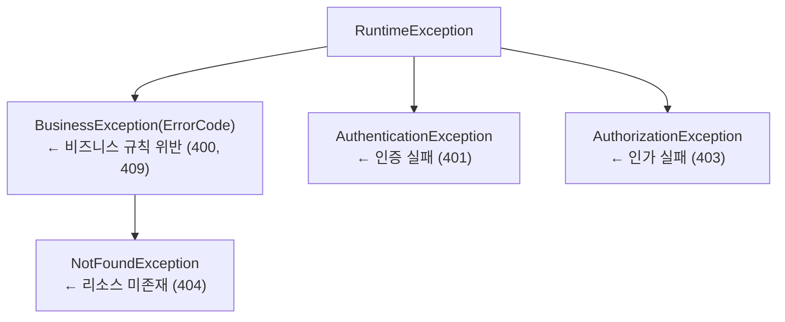

# 에러 처리 및 로깅 전략

> 작성일: 2026-03-28

---

## 1. 에러 처리 전략

### 설계 목표

에러 처리에서 가장 중요한 것은 일관성이다.

- 클라이언트가 어떤 API를 호출하든 응답 구조가 동일해야 한다
- 에러 코드만 보고도 어떤 상황인지 파악할 수 있어야 한다
- 서비스 계층에서 발생한 예외가 HTTP 상태 코드로 자연스럽게 매핑되어야 한다

---

### 예외 계층 구조

예외는 크게 "비즈니스 규칙 위반"과 "인증/인가 실패"로 나뉜다.

- 두 범주는 성격이 다르고 HTTP 상태 코드도 달라진다
- 별개의 계층으로 분리하여 `ApiControllerAdvice`에서 독립적으로 처리한다



#### BusinessException

비즈니스 규칙 위반의 최상위 예외다. `ErrorCode` enum을 필수로 받아, 에러 코드 없는 예외가 생성되는 것을 컴파일 타임에 방지한다.

```java
// common/exception/BusinessException.java
public class BusinessException extends RuntimeException {
    private final ErrorCode errorCode;

    public BusinessException(final ErrorCode errorCode) {
        super(errorCode.getMessage());
        this.errorCode = errorCode;
    }

    public BusinessException(final ErrorCode errorCode, final String detail) {
        super(detail);
        this.errorCode = errorCode;
    }

    public ErrorCode getErrorCode() { return errorCode; }
}
```

#### NotFoundException

리소스가 존재하지 않는 경우는 `BusinessException`의 하위 타입으로 별도 분리한다.

- `ApiControllerAdvice`에서 이 타입을 먼저 매칭하여 404로 응답한다
- 상위 `BusinessException`은 400으로 떨어진다
- 상속 구조를 활용한 예외 라우팅이다

```java
// common/exception/NotFoundException.java
public class NotFoundException extends BusinessException {
    public NotFoundException(final ErrorCode errorCode) {
        super(errorCode);
    }
}
```

#### AuthenticationException / AuthorizationException

인증과 인가는 비즈니스 로직과 성격이 다르다.

- Spring Security 필터 레벨에서도 발생할 수 있고, 서비스 레이어에서 명시적으로 던질 수도 있다
- `BusinessException`과 별개 계층으로 두어 `ApiControllerAdvice`에서 독립적으로 처리한다

```java
// common/exception/AuthenticationException.java
public class AuthenticationException extends RuntimeException {
    public AuthenticationException(final String message) {
        super(message);
    }
}

// common/exception/AuthorizationException.java
public class AuthorizationException extends RuntimeException {
    public AuthorizationException(final String message) {
        super(message);
    }
}
```

---

### ApiControllerAdvice

모든 예외를 한 곳에서 처리한다. 예외 타입에 따라 HTTP 상태 코드와 로그 레벨이 달라진다.

```java
// common/exception/ApiControllerAdvice.java
@RestControllerAdvice
@RequiredArgsConstructor
public class ApiControllerAdvice {

    private static final Logger log = LoggerFactory.getLogger(ApiControllerAdvice.class);

    // NotFoundException은 BusinessException보다 먼저 매핑되어야 하므로 위에 선언
    @ExceptionHandler(NotFoundException.class)
    public ResponseEntity<ApiBaseResponse<?>> handleNotFoundException(final NotFoundException e) {
        log.info("[{}] {}", e.getErrorCode().name(), e.getMessage());
        return ResponseEntity.status(HttpStatus.NOT_FOUND)
                .body(ApiBaseResponse.error(e.getErrorCode(), e.getMessage()));
    }

    @ExceptionHandler(BusinessException.class)
    public ResponseEntity<ApiBaseResponse<?>> handleBusinessException(final BusinessException e) {
        log.warn("[{}] {}", e.getErrorCode().name(), e.getMessage());
        final HttpStatus status = resolveBusinessStatus(e.getErrorCode());
        return ResponseEntity.status(status)
                .body(ApiBaseResponse.error(e.getErrorCode(), e.getMessage()));
    }

    @ExceptionHandler(AuthenticationException.class)
    public ResponseEntity<ApiBaseResponse<?>> handleAuthenticationException(final AuthenticationException e) {
        log.info("[AUTHENTICATION_FAILED] {}", e.getMessage());
        return ResponseEntity.status(HttpStatus.UNAUTHORIZED)
                .body(ApiBaseResponse.error(ErrorCode.UNAUTHORIZED, e.getMessage()));
    }

    @ExceptionHandler(AuthorizationException.class)
    public ResponseEntity<ApiBaseResponse<?>> handleAuthorizationException(final AuthorizationException e) {
        log.info("[AUTHORIZATION_FAILED] {}", e.getMessage());
        return ResponseEntity.status(HttpStatus.FORBIDDEN)
                .body(ApiBaseResponse.error(ErrorCode.FORBIDDEN, e.getMessage()));
    }

    @ExceptionHandler(MethodArgumentNotValidException.class)
    public ResponseEntity<ApiBaseResponse<?>> handleValidation(final MethodArgumentNotValidException e) {
        final String message = e.getBindingResult().getFieldErrors().stream()
                .map(fe -> fe.getField() + ": " + fe.getDefaultMessage())
                .collect(Collectors.joining(", "));
        log.info("[VALIDATION_ERROR] {}", message);
        return ResponseEntity.status(HttpStatus.BAD_REQUEST)
                .body(ApiBaseResponse.error(ErrorCode.VALIDATION_ERROR, message));
    }

    @ExceptionHandler(Exception.class)
    public ResponseEntity<ApiBaseResponse<?>> handleException(final Exception e) {
        log.error("[INTERNAL_SERVER_ERROR] {}", e.getMessage(), e);
        return ResponseEntity.status(HttpStatus.INTERNAL_SERVER_ERROR)
                .body(ApiBaseResponse.error(ErrorCode.INTERNAL_SERVER_ERROR, "서버 오류가 발생했습니다."));
    }

    private HttpStatus resolveBusinessStatus(final ErrorCode errorCode) {
        return switch (errorCode) {
            case DUPLICATE_RESERVATION -> HttpStatus.CONFLICT;              // 409
            default -> HttpStatus.BAD_REQUEST;                              // 400
        };
    }
}
```

예외 타입별 HTTP 상태 코드 매핑 요약

| 예외 타입 | HTTP 상태 | 로그 레벨 |
|----------|----------|---------|
| `NotFoundException` | 404 | INFO |
| `BusinessException` (일반) | 400 | WARN |
| `BusinessException` (중복 예약) | 409 | WARN |
| `AuthenticationException` | 401 | INFO |
| `AuthorizationException` | 403 | INFO |
| `MethodArgumentNotValidException` | 400 | INFO |
| `Exception` (fallback) | 500 | ERROR |

> 설계 결정: 비즈니스 예외의 기본 상태 코드를 400으로 두고, 충돌(DUPLICATE_RESERVATION)만 409로 분기했다.
> - 처음에는 에러 코드마다 HTTP 상태를 ErrorCode enum에 넣는 방식도 고려했으나, 그렇게 하면 ErrorCode가 HTTP 계층을 알게 된다
> - HTTP 상태 코드 결정은 presentation 계층의 관심사이므로 `ApiControllerAdvice`에 `resolveBusinessStatus()` 메서드로 격리했다

---

### ErrorCode enum (숙박 도메인)

`{DOMAIN}_{PROBLEM}` 형식으로 정의한다. 클라이언트가 에러 코드 문자열만 보고도 어떤 도메인의 어떤 상황인지 파악할 수 있도록 한다.

```java
// common/exception/ErrorCode.java
public enum ErrorCode {

    // Property
    PROPERTY_NOT_FOUND("숙소를 찾을 수 없습니다."),
    ROOM_TYPE_NOT_FOUND("객실 유형을 찾을 수 없습니다."),

    // Inventory
    INVENTORY_NOT_AVAILABLE("해당 날짜에 재고 정보가 없습니다."),
    INVENTORY_INSUFFICIENT("선택한 날짜에 객실이 매진되었습니다."),

    // Reservation
    RESERVATION_NOT_FOUND("예약을 찾을 수 없습니다."),
    RESERVATION_ALREADY_CANCELLED("이미 취소된 예약입니다."),
    DUPLICATE_RESERVATION("동일한 날짜에 중복 예약이 존재합니다."),

    // Partner
    PARTNER_NOT_FOUND("파트너를 찾을 수 없습니다."),
    PARTNER_SUSPENDED("정지된 파트너 계정입니다."),

    // Validation
    INVALID_DATE_RANGE("체크인 날짜는 체크아웃 날짜보다 이전이어야 합니다."),
    INVALID_GUEST_COUNT("유효하지 않은 인원 수입니다."),
    VALIDATION_ERROR("요청 파라미터가 유효하지 않습니다."),

    // Auth
    UNAUTHORIZED("인증이 필요합니다."),
    FORBIDDEN("접근 권한이 없습니다."),

    // System
    INTERNAL_SERVER_ERROR("서버 오류가 발생했습니다.");

    private final String message;

    ErrorCode(final String message) {
        this.message = message;
    }

    public String getMessage() { return message; }
}
```

도메인별 예외 사용 예시:

```java
// NotFoundException 계열 (404)
throw new NotFoundException(ErrorCode.PROPERTY_NOT_FOUND);
throw new NotFoundException(ErrorCode.RESERVATION_NOT_FOUND);

// BusinessException 계열 (400)
throw new BusinessException(ErrorCode.INVENTORY_INSUFFICIENT);
throw new BusinessException(ErrorCode.RESERVATION_ALREADY_CANCELLED);
throw new BusinessException(ErrorCode.INVALID_DATE_RANGE);

// BusinessException 계열 (409)
throw new BusinessException(ErrorCode.DUPLICATE_RESERVATION);
```

---

### ApiBaseResponse 구조

기존 프로젝트의 `ApiBaseResponse`를 참고했다.

- 핵심 구조인 `record ApiBaseResponse<T>(ResultType result, T data, ErrorMessage error)` 패턴은 그대로 가져왔다
- 단, `ErrorMessage`의 `translation` 필드는 제거했다
- 숙박 플랫폼은 단일 언어(한국어) 서비스이므로 다국어 번역 처리가 불필요하다
- 필드가 있으면 항상 `null`로 채워야 하는 노이즈가 생긴다

```java
// common/response/ResultType.java
public enum ResultType {
    SUCCESS, ERROR
}

// common/response/ErrorMessage.java
public record ErrorMessage(String code, String message) {
    public ErrorMessage(final ErrorCode errorCode, final String message) {
        this(errorCode.name(), message);
    }
}

// common/response/ApiBaseResponse.java
public record ApiBaseResponse<T>(ResultType result, T data, ErrorMessage error) {

    public static <T> ApiBaseResponse<T> success(final T data) {
        return new ApiBaseResponse<>(ResultType.SUCCESS, data, null);
    }

    public static ApiBaseResponse<Void> success() {
        return new ApiBaseResponse<>(ResultType.SUCCESS, null, null);
    }

    public static ApiBaseResponse<?> error(final ErrorCode errorCode, final String message) {
        return new ApiBaseResponse<>(ResultType.ERROR, null, new ErrorMessage(errorCode, message));
    }
}
```

성공 응답 예시

```json
{
  "result": "SUCCESS",
  "data": {
    "id": 1,
    "name": "한강뷰 호텔",
    "region": "서울"
  },
  "error": null
}
```

에러 응답 예시

```json
{
  "result": "ERROR",
  "data": null,
  "error": {
    "code": "INVENTORY_INSUFFICIENT",
    "message": "선택한 날짜에 객실이 매진되었습니다."
  }
}
```

> 고민 포인트: 11번 코드 컨벤션 문서의 `ApiResponse`는 `boolean success` 필드를 사용했는데, 이번 설계에서는 `ResultType` enum으로 변경했다. `boolean`은 성공/실패 두 가지 상태만 표현할 수 있지만, `ResultType` enum은 향후 `PARTIAL_SUCCESS` 같은 중간 상태를 추가할 수 있다는 확장성이 있다. 또한 클라이언트가 `"result": "SUCCESS"` 문자열로 분기하면 코드가 더 명시적이다.

---

## 2. 로깅 전략

### 설계 목표

로그는 두 가지 목적을 동시에 달성해야 한다.

- 개발 중: 디버깅을 위한 상세한 정보가 필요하다
- 운영 중: 장애 감지와 비즈니스 이벤트 추적이 목적이다
- 로그 레벨 정책과 구조화된 포맷으로 이 두 목적을 모두 충족한다

---

### 로그 레벨 정책

| 레벨 | 사용 기준 | 예시 |
|------|----------|------|
| ERROR | 시스템 장애, 예상치 못한 예외 (500) | DB 연결 실패, NPE, 외부 API 타임아웃 |
| WARN | 주의가 필요한 비즈니스 예외 | 재고 부족 빈발, 파트너 정지 계정 접근 시도 |
| INFO | 정상 비즈니스 플로우, 예상된 클라이언트 오류 | 예약 생성/취소/확정, 404/401/403 응답 |
| DEBUG | 상세 디버깅 정보 | 쿼리 파라미터, 캐시 히트/미스, 락 획득 대기 |

`ApiControllerAdvice`에서 예외 타입에 따라 로그 레벨을 결정하는 이유가 여기 있다.

- 404나 401은 클라이언트 실수이므로 INFO로 충분하다
- ERROR로 남기면 모니터링 알림이 오발령된다
- 반면 예상치 못한 `Exception`은 반드시 ERROR와 스택 트레이스를 남겨야 한다

---

### 구조화된 로깅 (Structured Logging)

#### MDC (Mapped Diagnostic Context)

요청별로 `traceId`와 `userId`를 MDC에 주입한다.

- 하나의 예약 요청이 여러 서비스 메서드를 거칠 때 모든 로그가 동일한 `traceId`를 공유한다
- 로그를 흐름 단위로 묶어볼 수 있다

```java
// common/filter/MdcLoggingFilter.java
@Component
@Order(Ordered.HIGHEST_PRECEDENCE)
public class MdcLoggingFilter extends OncePerRequestFilter {

    private static final String TRACE_ID = "traceId";
    private static final String USER_ID = "userId";

    @Override
    protected void doFilterInternal(final HttpServletRequest request,
                                    final HttpServletResponse response,
                                    final FilterChain filterChain) throws ServletException, IOException {
        try {
            MDC.put(TRACE_ID, UUID.randomUUID().toString().substring(0, 8));
            // JWT 파싱 후 userId 주입 (SecurityContext에서 추출)
            final String userId = extractUserId(request);
            if (userId != null) {
                MDC.put(USER_ID, userId);
            }
            filterChain.doFilter(request, response);
        } finally {
            MDC.clear();    // 반드시 정리: 스레드 풀 재사용 시 오염 방지
        }
    }
}
```

#### JSON 포맷 로그 (logback-spring.xml)

로그를 JSON으로 출력하면 ELK 스택이나 CloudWatch Logs Insights에서 필드별 쿼리가 가능해진다.

- 현재는 파일과 콘솔에 출력하지만, JSON 구조를 미리 갖춰두면 향후 중앙 로그 수집 도입이 설정 변경만으로 가능하다

```xml
<!-- src/main/resources/logback-spring.xml -->
<configuration>

    <!-- 로컬/테스트: 가독성 위주의 패턴 -->
    <springProfile name="local,test">
        <appender name="CONSOLE" class="ch.qos.logback.core.ConsoleAppender">
            <encoder>
                <pattern>%d{HH:mm:ss.SSS} [%thread] [%X{traceId}] %-5level %logger{36} - %msg%n</pattern>
            </encoder>
        </appender>
        <root level="DEBUG">
            <appender-ref ref="CONSOLE"/>
        </root>
    </springProfile>

    <!-- 운영: JSON 구조화 로그 -->
    <springProfile name="prod">
        <appender name="JSON_FILE" class="ch.qos.logback.core.rolling.RollingFileAppender">
            <file>logs/application.log</file>
            <rollingPolicy class="ch.qos.logback.core.rolling.TimeBasedRollingPolicy">
                <fileNamePattern>logs/application.%d{yyyy-MM-dd}.log</fileNamePattern>
                <maxHistory>30</maxHistory>
            </rollingPolicy>
            <encoder class="net.logstash.logback.encoder.LogstashEncoder">
                <!-- MDC 필드(traceId, userId)가 자동으로 JSON 필드에 포함됨 -->
                <includeMdcKeyName>traceId</includeMdcKeyName>
                <includeMdcKeyName>userId</includeMdcKeyName>
            </encoder>
        </appender>
        <root level="INFO">
            <appender-ref ref="JSON_FILE"/>
        </root>
    </springProfile>

</configuration>
```

운영 환경에서 출력되는 JSON 로그 예시:

```json
{
  "timestamp": "2026-03-28T14:23:45.123+09:00",
  "level": "WARN",
  "logger": "c.j.s.common.exception.ApiControllerAdvice",
  "message": "[INVENTORY_INSUFFICIENT] 선택한 날짜에 객실이 매진되었습니다.",
  "traceId": "a3f9b1c2",
  "userId": "42",
  "thread": "http-nio-8080-exec-3"
}
```

---

### 로그 포인트

어디서 로그를 남길 것인지 기준을 정한다.

- 과도한 로그는 노이즈가 된다
- 부족한 로그는 장애 대응을 어렵게 한다

#### API 요청/응답 (Filter)

`MdcLoggingFilter`에서 요청 메서드, URI, 응답 상태 코드를 INFO로 남긴다.

- 쿼리 파라미터나 요청 바디는 DEBUG 레벨에서만 남긴다
- 운영 환경에서 쿼리 파라미터 전체를 INFO로 남기면 개인정보가 로그에 노출될 수 있다

```
INFO  [a3f9b1c2] POST /api/reservations -> 201
INFO  [a3f9b1c2] POST /api/reservations/{id}/cancel -> 409 (DUPLICATE_RESERVATION)
DEBUG [a3f9b1c2] Request body: {"roomTypeId":5,"checkIn":"2026-04-01","checkOut":"2026-04-03"}
```

#### 비즈니스 이벤트

핵심 비즈니스 이벤트는 서비스 레이어에서 명시적으로 INFO 로그를 남긴다.

- 장애 대응 시 "예약 생성이 언제 됐는가"를 추적하는 감사 로그(audit log) 역할도 한다

```java
// BookingService.java
public ReservationResponse createReservation(...) {
    // 예약 처리 후
    log.info("[RESERVATION_CREATED] reservationId={}, userId={}, roomTypeId={}, checkIn={}, checkOut={}",
            reservation.getId(), userId, request.roomTypeId(), request.checkIn(), request.checkOut());
    return ReservationResponse.from(reservation);
}

public void cancelReservation(...) {
    // 취소 처리 후
    log.info("[RESERVATION_CANCELLED] reservationId={}, userId={}", reservationId, userId);
}
```

#### 동시성 충돌

재고 부족과 비관적 락 대기는 WARN으로 남긴다.

- 특정 날짜에 재고 부족 WARN이 빈발한다면 해당 객실의 수요가 높다는 신호다
- 비즈니스 의사결정(추가 재고 확보)에 활용할 수 있다

```java
// InventoryService.java
public void decreaseInventory(...) {
    if (inventory.getAvailableCount() <= 0) {
        log.warn("[INVENTORY_INSUFFICIENT] roomTypeId={}, date={}, requested={}",
                roomTypeId, date, requestedCount);
        throw new BusinessException(ErrorCode.INVENTORY_INSUFFICIENT);
    }
}
```

#### 캐시 히트/미스

Caffeine 캐시의 히트율은 검색 성능의 핵심 지표다. DEBUG 레벨로 남기고, 운영 환경에서는 Caffeine의 `recordStats()` 옵션으로 집계 통계를 얻는다.

```java
// SearchService.java
public PropertyResponse getProperty(final Long propertyId) {
    final PropertyResponse cached = cacheManager.getCache("property").get(propertyId, PropertyResponse.class);
    if (cached != null) {
        log.debug("[CACHE_HIT] property cache, propertyId={}", propertyId);
        return cached;
    }
    log.debug("[CACHE_MISS] property cache, propertyId={}", propertyId);
    // DB 조회 후 캐시 저장
}
```

#### 외부 API 호출

Channel Manager와 Supplier 연동 시 요청/응답 시간을 INFO로 남긴다. 외부 API 지연이 우리 API 응답 시간에 직접 영향을 주므로, 지연 추세를 로그로 파악할 수 있어야 한다.

```java
// channel/infrastructure/adapter/ChannelManagerAdapter.java
public void syncInventory(...) {
    final long start = System.currentTimeMillis();
    try {
        externalClient.pushInventory(payload);
        log.info("[CHANNEL_SYNC_SUCCESS] channelId={}, durationMs={}", channelId, System.currentTimeMillis() - start);
    } catch (Exception e) {
        log.error("[CHANNEL_SYNC_FAILED] channelId={}, durationMs={}", channelId, System.currentTimeMillis() - start, e);
        throw e;
    }
}
```

---

### 로그 포인트 요약

| 로그 포인트 | 레벨 | 위치 |
|-----------|------|------|
| API 요청/응답 (메서드, URI, 상태코드) | INFO | `MdcLoggingFilter` |
| API 요청 바디/파라미터 | DEBUG | `MdcLoggingFilter` |
| 예약 생성/취소/확정 | INFO | `BookingService` |
| 재고 부족 충돌 | WARN | `InventoryService` |
| 비즈니스 예외 처리 | WARN | `ApiControllerAdvice` |
| 인증/인가 실패, 404 | INFO | `ApiControllerAdvice` |
| 캐시 히트/미스 | DEBUG | `SearchService` |
| 외부 API 호출 성공/실패 | INFO / ERROR | Channel/Supplier Adapter |
| 예상치 못한 서버 오류 | ERROR | `ApiControllerAdvice` |

---

### AOP 요청/응답 로깅

`MdcLoggingFilter`는 URI와 상태 코드만 남긴다. 요청/응답 바디까지 로깅하려면 AOP를 활용한다.

```java
// common/aop/ApiLoggingAop.java
@Aspect
@Component
@Order(Ordered.HIGHEST_PRECEDENCE)
public class ApiLoggingAop {

    private static final Logger log = LoggerFactory.getLogger(ApiLoggingAop.class);
    private final ObjectMapper objectMapper;

    @Around("within(com.jemini.stayhost..presentation.controller..*)")
    public Object logApiCall(ProceedingJoinPoint joinPoint) throws Throwable {
        final String method = joinPoint.getSignature().toShortString();
        final Object[] args = joinPoint.getArgs();

        log.info("[API_REQUEST] {} args={}", method, maskSensitiveFields(args));

        final Object result = joinPoint.proceed();

        log.info("[API_RESPONSE] {} result={}", method, maskSensitiveFields(result));
        return result;
    }
}
```

- 모든 Controller 메서드에 자동 적용 (presentation.controller 패키지 대상)
- 요청/응답 바디를 JSON으로 직렬화하여 로깅
- 민감 필드는 마스킹 처리 (아래 개인정보 마스킹 참조)

---

### MdcTaskDecorator (비동기 MDC 전파)

채널 매니저의 `CompletableFuture` 병렬 처리, `@Async` 이벤트 리스너 등 별도 스레드에서 실행되는 작업은 부모 스레드의 MDC가 전파되지 않는다. `MdcTaskDecorator`로 해결한다.

```java
// common/config/MdcTaskDecorator.java
public class MdcTaskDecorator implements TaskDecorator {

    @Override
    public Runnable decorate(Runnable runnable) {
        Map<String, String> context = MDC.getCopyOfContextMap();
        return () -> {
            try {
                if (context != null) {
                    MDC.setContextMap(context);
                }
                runnable.run();
            } finally {
                MDC.clear();
            }
        };
    }
}
```

적용 대상:

- 채널 매니저 전용 스레드풀 (`channelExecutor`)
- 이벤트 리스너 스레드풀 (`@Async` 사용 시)
- 기타 비동기 작업 스레드풀

```java
// common/config/AsyncConfig.java
@Configuration
@EnableAsync
public class AsyncConfig {

    @Bean("channelExecutor")
    public Executor channelExecutor() {
        ThreadPoolTaskExecutor executor = new ThreadPoolTaskExecutor();
        executor.setCorePoolSize(5);
        executor.setMaxPoolSize(10);
        executor.setThreadNamePrefix("channel-");
        executor.setTaskDecorator(new MdcTaskDecorator()); // MDC 전파
        executor.initialize();
        return executor;
    }
}
```

MdcTaskDecorator가 없으면 채널 매니저 스레드에서 `traceId`가 비어있어 로그 추적이 불가능하다. 채널 동기화 실패 시 원인 요청을 역추적할 수 없게 된다.

---

### 비동기 Appender (neverBlock)

로그 I/O가 API 응답을 블로킹하지 않도록 `AsyncAppender`를 적용한다.

```xml
<!-- logback-spring.xml (prod 프로파일) -->
<springProfile name="prod">
    <appender name="JSON_FILE" class="ch.qos.logback.core.rolling.RollingFileAppender">
        <file>logs/application.log</file>
        <rollingPolicy class="ch.qos.logback.core.rolling.TimeBasedRollingPolicy">
            <fileNamePattern>logs/application.%d{yyyy-MM-dd}.log</fileNamePattern>
            <maxHistory>30</maxHistory>
        </rollingPolicy>
        <encoder class="net.logstash.logback.encoder.LogstashEncoder">
            <includeMdcKeyName>traceId</includeMdcKeyName>
            <includeMdcKeyName>userId</includeMdcKeyName>
        </encoder>
    </appender>

    <!-- 비동기 래퍼: 로그 I/O가 API 스레드를 블로킹하지 않음 -->
    <appender name="ASYNC_JSON" class="ch.qos.logback.classic.AsyncAppender">
        <neverBlock>true</neverBlock>
        <discardingThreshold>0</discardingThreshold>
        <appender-ref ref="JSON_FILE"/>
    </appender>

    <!-- 에러 전용 로그 분리 -->
    <appender name="ERROR_FILE" class="ch.qos.logback.core.rolling.RollingFileAppender">
        <file>logs/error.log</file>
        <filter class="ch.qos.logback.classic.filter.ThresholdFilter">
            <level>WARN</level>
        </filter>
        <rollingPolicy class="ch.qos.logback.core.rolling.TimeBasedRollingPolicy">
            <fileNamePattern>logs/error.%d{yyyy-MM-dd}.log</fileNamePattern>
            <maxHistory>30</maxHistory>
        </rollingPolicy>
        <encoder class="net.logstash.logback.encoder.LogstashEncoder"/>
    </appender>

    <appender name="ASYNC_ERROR" class="ch.qos.logback.classic.AsyncAppender">
        <neverBlock>true</neverBlock>
        <appender-ref ref="ERROR_FILE"/>
    </appender>

    <root level="INFO">
        <appender-ref ref="ASYNC_JSON"/>
        <appender-ref ref="ASYNC_ERROR"/>
    </root>
</springProfile>
```

- `neverBlock=true`: 큐가 가득 차도 API 스레드를 블로킹하지 않는다 (로그가 유실될 수 있지만 API 응답이 지연되는 것보다 낫다)
- `discardingThreshold=0`: 큐 여유가 있을 때는 모든 레벨의 로그를 유지한다
- `error.log`: WARN 이상만 별도 파일로 분리하여 장애 대응 시 빠르게 확인 가능

---

### 개인정보 마스킹

AOP 요청/응답 로깅 시 민감 필드가 로그에 노출되지 않도록 마스킹한다.

기본 원칙:
- 로그에는 식별자(userId, reservationId)만 남긴다
- 이름, 전화번호, 이메일 등은 로그에 포함하지 않는다
- AOP 로깅에서 요청/응답 바디를 직렬화할 때 민감 필드를 자동 마스킹한다

마스킹 방식: `@MaskField` 커스텀 어노테이션

```java
// common/logging/MaskField.java
@Retention(RetentionPolicy.RUNTIME)
@Target(ElementType.FIELD)
public @interface MaskField {}

// DTO에 적용
public record CreateReservationRequest(
    Long roomTypeId,
    LocalDate checkIn,
    LocalDate checkOut,
    @MaskField String guestName,    // 로그에서 "이**"로 마스킹
    @MaskField String guestPhone,   // 로그에서 "010-****-5678"로 마스킹
    int guestCount
) {}
```

마스킹 유틸:

```java
// common/logging/LogMaskingUtils.java
public class LogMaskingUtils {

    public static String maskName(String name) {
        if (name == null || name.length() <= 1) return name;
        return name.charAt(0) + "*".repeat(name.length() - 1);
    }

    public static String maskPhone(String phone) {
        if (phone == null || phone.length() < 8) return phone;
        return phone.substring(0, 3) + "-****-" + phone.substring(phone.length() - 4);
    }

    public static String maskEmail(String email) {
        if (email == null || !email.contains("@")) return email;
        String[] parts = email.split("@");
        return parts[0].charAt(0) + "***@" + parts[1];
    }
}
```

AOP에서 직렬화 시 `@MaskField`가 붙은 필드를 감지하여 마스킹된 값으로 교체한 후 로깅한다. 원본 객체는 변경하지 않는다.

---

### 고민 포인트

ELK 스택 / CloudWatch 중앙 로그 수집

ELK(Elasticsearch + Logstash + Kibana) 스택이나 AWS CloudWatch Logs를 도입하면 traceId로 전체 요청 흐름을 시각적으로 추적할 수 있고, 특정 에러 코드의 발생 빈도를 대시보드로 볼 수 있다. 그러나 이는 본 프로젝트 범위를 벗어나는 인프라 투자다.

대신 이번 설계에서 JSON 구조화 로그를 미리 적용해 두었다. 향후 Logstash나 CloudWatch Logs Agent를 연결하는 것은 logback 설정 변경만으로 가능하다.

`@TransactionalEventListener`와 로그 타이밍

예약 생성 후 `RESERVATION_CREATED` 이벤트를 발행하고 리스너에서 Channel Manager에 동기화하는 흐름에서, 트랜잭션 커밋 전과 후 중 어디서 로그를 남길 것인가를 고민했다. 결론은 커밋 후(`AFTER_COMMIT`)에 INFO 로그를 남기는 것이다. 트랜잭션이 롤백되면 예약이 실제로 생성된 것이 아니므로 `RESERVATION_CREATED` 로그가 있으면 오해의 소지가 있다.
